# Variation Groups

Summaries of related variations are grouped together. This page lists the groups with the images of variations in the groups. Click on the group name to go to the group, or an image to go to the variation it represents. (Not all variations have images, and some variations have more than one image.)

## [Attractors](attractors/attractors.md#Attractors)

These variations use the formulas for strange attractors.

[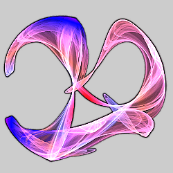](attractors/attractors.md#clifford_js)
[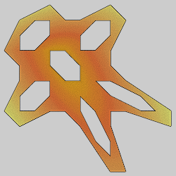](attractors/attractors.md#gingerbread_man)
[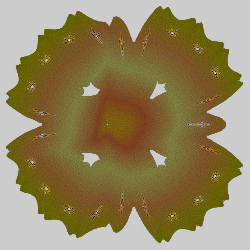](attractors/attractors.md#gumowski_mira)
[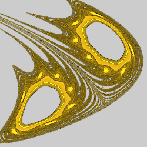](attractors/attractors.md#henon)
[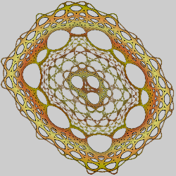](attractors/attractors.md#hopalong)
[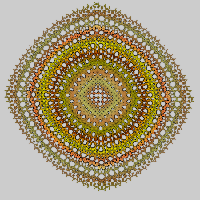](attractors/attractors.md#hopalong)
[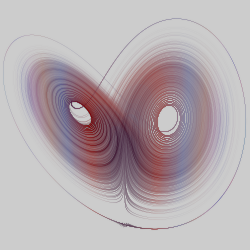](attractors/attractors.md#lorenz_js)
[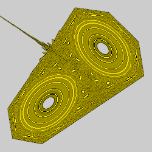](attractors/attractors.md#lozi)
[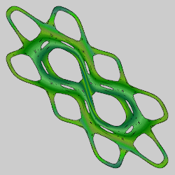](attractors/attractors.md#macmillan)
[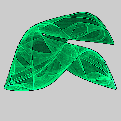](attractors/attractors.md#pdj)
[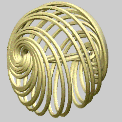](attractors/attractors.md#sattractor3D)
[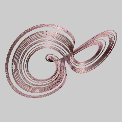](attractors/attractors.md#sattractor3D)
[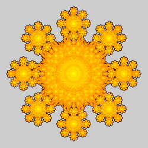](attractors/attractors.md#sattractor_js)
[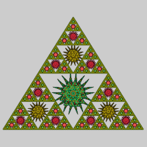](attractors/attractors.md#sattractor_js)
[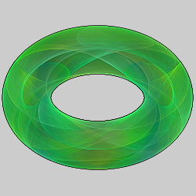](attractors/attractors.md#svensson_js)
[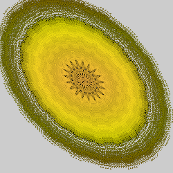](attractors/attractors.md#threeply)

## [Blurry](blurry/blurry.md#Blurry)
Variations that add different types of blurriness.

[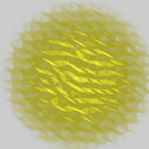](blurry/blurry.md#blur_linear)
[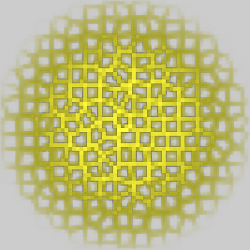](blurry/blurry.md#blur_pixelize)
[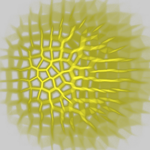](blurry/blurry.md#blur_zoom)
[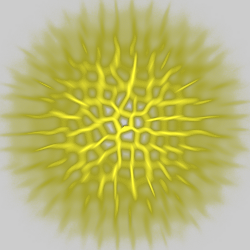](blurry/blurry.md#exblur)
[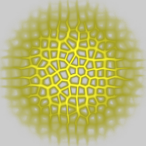](blurry/blurry.md#noise)

[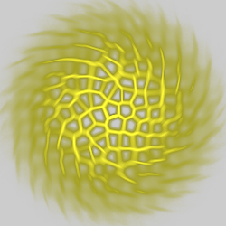](blurry/blurry.md#radial_blur)

## [Blurs](blurs/blurs.md#Blurs)

Variations that ignore the input and generate specific shapes.

[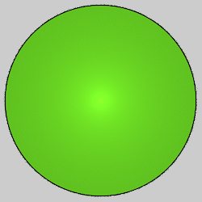](blurs/blurs.md#blur)

[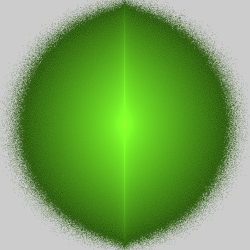](blurs/blurs.md#blur3D--pre_blur3D)
[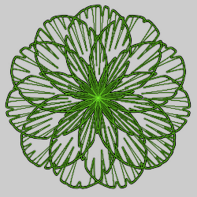](blurs/blurs.md#chrysanthemum)
[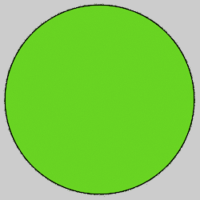](blurs/blurs.md#circleblur)
[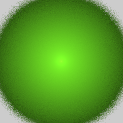](blurs/blurs.md#gaussian_blur)
[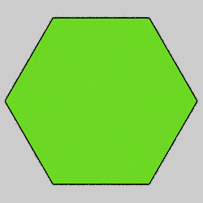](blurs/blurs.md#nBlur)
[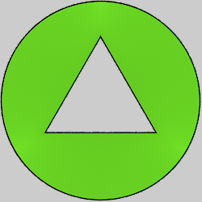](blurs/blurs.md#nBlur)
[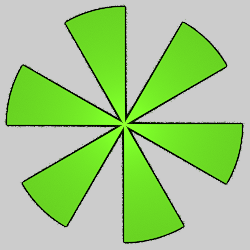](blurs/blurs.md#pie)

[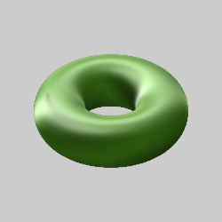](blurs/blurs.md#primitives_wf)
[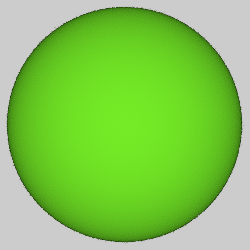](blurs/blurs.md#sineblur)
[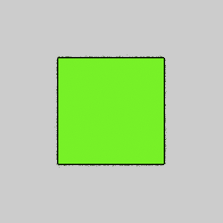](blurs/blurs.md#square)
[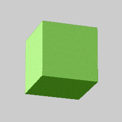](blurs/blurs.md#square3D)
[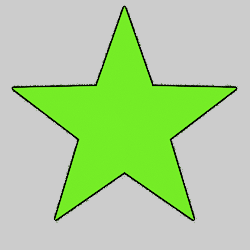](blurs/blurs.md#starblur)
[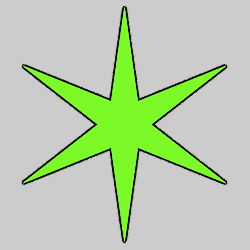](blurs/blurs.md#starblur)
[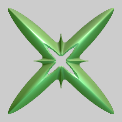](blurs/blurs.md#superShape3d)
[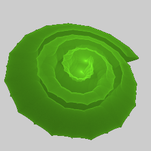](blurs/blurs.md#superShape3d)
[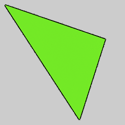](blurs/blurs.md#triangle)
[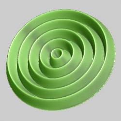](blurs/blurs.md#waveblur_wf)
[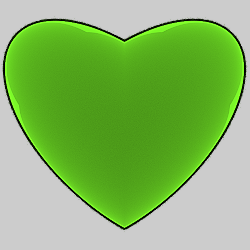](blurs/blurs.md#xheart_blur_wf)

## [Boarders](boarders/boarders.md#Boarders)

Divide the plane into squares or hexagons with borders.

[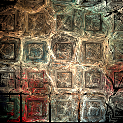](boarders/boarders.md#boarders2--pre_boarders2)
[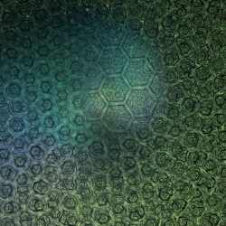](boarders/boarders.md#xtrb)

## [Complex Power](cpow/cpow.md#Complex-Power)

Treats 2D points as complex numbers and raises them to a complex power that can be specified in various ways.

[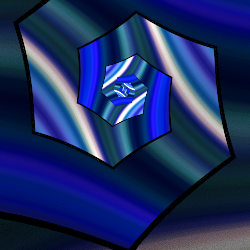](cpow/cpow.md#cpow3)
[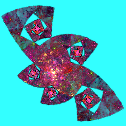](cpow/cpow.md#escher)

## [Half Blurs](halfblurs/halfblurs#Half-Blurs)
Variations that generate specific shapes using polar coordinates.

[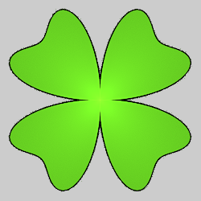](halfblurs/halfblurs.md#cloverleaf_wf)
[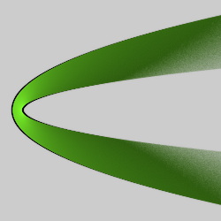](halfblurs/halfblurs.md#conic--conic2)
[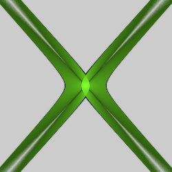](halfblurs/halfblurs.md#conic--conic2)
[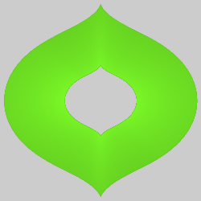](halfblurs/halfblurs.md#shape)
[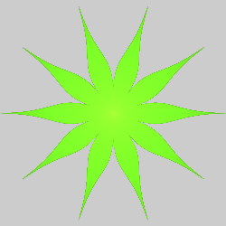](halfblurs/halfblurs.md#shape)

## [Inversion](inversion/inversion.md#Inversion)

Variations that invert across various shapes, such as the unit circle.

## [Julia](julia/julia.md#Julia)

Variations based on polynomial Julia sets.

## [Linear](linear/linear.md#Linear)

Variations that just copy the input, some with minor modification.

## [Maurer Lines](maurerlines/maurerlines.md#Maurer-Lines)

Maurer lines extend the Maurer rose with different types of curves, rendering methods, and coloring.

## [Plotting Variations](plotting/plotting.md#Plotting-variations)

These variations are all blurs that plot formulas in two or three dimensions. They allow entering custom formulas, but also come with presets for ease of use.

## [Rose Curve](rosecurve/rosecurve.md#Variations-Based-on-the-Rose-Curve)

Variations based on the rose or rhodonea curve.

