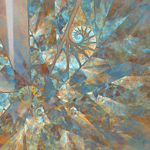
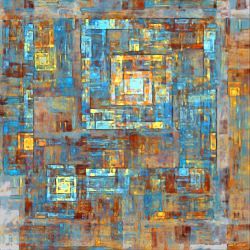
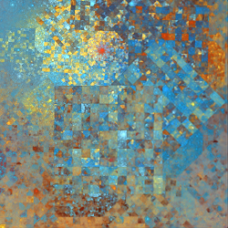
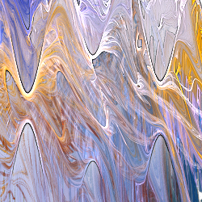

# Variation Groups

Summaries of related variations are grouped together. This page lists the groups with images of a few variations in each. Click on the group name to go to the group, or an image to go to the variation it represents.

## [Attractors](attractors/attractors.md#Attractors)

These variations use the formulas for strange attractors.

  

## [Blobs](blobs/blobs.md#Blobs)
Variations that deform the plane by pinching it towards the origin, making a blob-like shape.

  

## [Blurry](blurry/blurry.md#Blurry)
Variations that add different types of blurriness.

  

## [Boarders](boarders/boarders.md#Boarders)

Divide the plane into squares or hexagons with borders.

 

## [Complex Power](cpow/cpow.md#Complex-Power)

Treats 2D points as complex numbers and raises them to a complex power that can be specified in various ways.

  

## [Disc](disc/disc.md#Disc)

Variations that use polar coordinates and swap the ρ and θ values.

  

## [Flippers](filppers/flippers.md#Flippers)
Variations that divide up the plane in various ways and flip or rotate the parts.

  

## [Inversion](inversion/inversion.md#Inversion)

Variations that invert across various shapes, such as the unit circle.

  

## [Julia](julia/julia.md#Julia)

Variations based on polynomial Julia sets.

  

## [Linear](linear/linear.md#Linear)

Variations that just copy the input, some with minor modification.

  

## [L-Systems](lsystems/lsystems.md#L-Systems)

Variations that use L-Systems to generate shapes.

 

## [Maurer Lines](maurerlines/maurerlines.md#Maurer-Lines)

Maurer lines extend the Maurer rose with different types of curves, rendering methods, and coloring.

 

## [Meshes](meshes/meshes.md#Meshes)
Variations that generate meshes, three dimensional shapes made from connected triangles. These are all blur variations that ignore their inputs.

  

## [Plotting Variations](plotting/plotting.md#Plotting-variations)

These variations are all blurs that plot formulas in two or three dimensions. They allow entering custom formulas, but also come with presets for ease of use.

  

## [Polar](polar/polar.md#Polar)

Variations that switch between polar or log-polar and rectangular coordinates.

  

## [Polar Shapes](polarshapes/polarshapes.md#Half-Blurs)
Variations that generate specific shapes using polar coordinates.

  

## [Reshapers](reshapers/reshapers.md#Reshapers)

Variations that reshape the input (for example, turn a circle into a square or other polygon).

  

## [Rose Curve](rosecurve/rosecurve.md#Variations-Based-on-the-Rose-Curve)

Variations based on the rose or rhodonea curve.

  

## [Shapes](shapes/shapes.md#Shapes)

Variations that ignore the input and generate specific shapes.

     

## [Shredders](shredders/shredders.md#Shredders)

Variations that shred the plane in various ways.

  

## [Splitters](splitters/splitters.md#Splitters)

Variations that split the flame in various ways

  

## [Stamps](stamps/stamps#Stamps)

Variations that create colored stamps with interesting designs.

     

## [Synth](synth/synth.md#Synth)

Variations that emulate a number of other variations, adding wavy effects using a technique from audio synthesizers.

     

## [Waves](waves/waves.md#Waves)

Variations that add waves to x, y, and/or z. There are a lot of different variants on this theme, differing in the parameters available and how they are applied.

  [

## [Z Manipulation](zmanip/zmanip.md#Z-Manipulation)
Variations that manipulate only the z coordinate.

  
