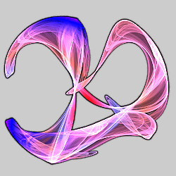
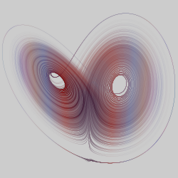
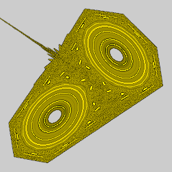
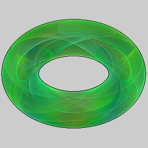

# Attractors
These variations use the formulas for strange attractors. They are mostly normal variations, not blurs, and will produce the actual attractor when used on a single transform by themselves with no affine transforms, as is done with all of the examples shown here. But their use is, of course, not restricted to this. The parameters mostly define the attractor and have no specific meaning.

## clifford_js
Strange attractor attributed to Cliff Pickover.

Type: 2D  
Author: Jesus Sosa  
Date:  4 Nov 2017  

| Parameter | Description |
| --- | --- |
| a - d | Variables that define the attractor |

http://paulbourke.net/fractals/clifford/  

## henon
Strange attractor discovered by Michel Hénon.

Type: 2D  
Author: Chris Johns (TyrantWave)  
Date: 6 Jun 2009

| Parameter | Description |
| --- | --- |
| a - c | Variables that define the attractor; set c to 1 for the classic Hénon map |

https://www.deviantart.com/tyrantwave/art/Henon-and-Lozi-Apo-Plugins-125039554  
https://mathworld.wolfram.com/HenonMap.html  
https://en.wikipedia.org/wiki/H%C3%A9non_map  

## lorenz_js
Strange attractor first studied by Edward Lorenz.

Type: 3D Direct Color  
Author: Jesus Sosa  
Date: 12 Dec 2017  

Lorenz uses Euler's method to solve the Lorenz system of ordinary differential equations. Coloring is based on the resulting x and y values.

| Parameter | Description |
| --- | --- |
| a - c | Variables that define the attractor; a is sometimes known as the Prandtl number and b the Rayleigh number |
| h | Step size for the Euler approximation |
| centerx, centery | Offset for direct coloring |
| scale | Scale for direct coloring |

http://paulbourke.net/fractals/lorenz/  
https://en.wikipedia.org/wiki/Lorenz_system  
https://en.wikipedia.org/wiki/Euler_method  

## lozi
Strange attractor discovered by René Lozi.

Type: 2D  
Author: Chris Johns (TyrantWave)  
Date: 6 Jun 2009

| Parameter | Description |
| --- | --- |
| a - c | Variables that define the attractor; set c to 1 for the classic Lozi map |

https://www.deviantart.com/tyrantwave/art/Henon-and-Lozi-Apo-Plugins-125039554  
http://padyn.wikidot.com/lozi-maps  
https://mathworld.wolfram.com/LoziMap.html  

## macmillan
Perturbed McMillan map (studied by Edwin McMillan)

Type: 2D blur
Author: Jesus Sosa
Date: 29 Mar 2018

| Parameter | Description |
| --- | --- |
| a - b | Variables that define the attractor |
| startx, starty | Starting point |

http://www.3d-meier.de/tut19/Seite158.html  

## pdj
Peter de Jong attractor

Type: 2D
Author: Scott Draves  
Date: Sept 2003  

| Parameter | Description |
| --- | --- |
| a - d | Variables that define the attractor |

http://paulbourke.net/fractals/peterdejong/  
https://www.algosome.com/articles/strange-attractors-de-jong.html  

## svensson_js
Johnny Svensson attractor

Type: 2D  
Author: Jesus Sosa  
Date: 12 Dec 2017  

A variation of the Peter de Jong attractor.

| Parameter | Description |
| --- | --- |
| a - d | Variables that define the attractor |

http://paulbourke.net/fractals/peterdejong/  
