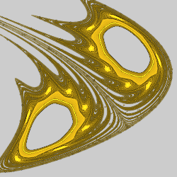
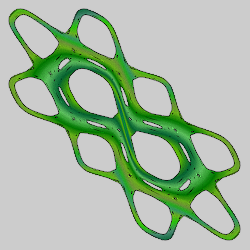
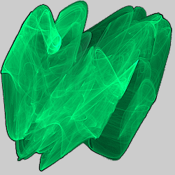
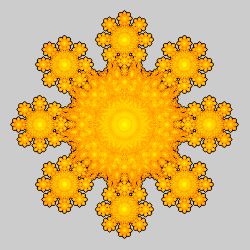
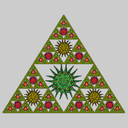
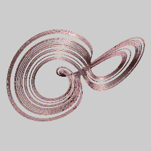

# Attractors
These variations use the formulas for strange attractors. They are mostly normal variations, not blurs, and will produce the actual attractor when used on a single transform by themselves with no affine transforms, as is done with all of the examples shown here. But their use is, of course, not restricted to this. The parameters mostly define the attractor and have no specific meaning.

## clifford_js
Strange attractor attributed to Cliff Pickover.

Type: 2D  
Author: Jesus Sosa  
Date:  4 Nov 2017  

| Parameter | Description |
| --- | --- |
| a - d | Variables that define the attractor |

[Description and examples by Paul Bourke](http://paulbourke.net/fractals/clifford/)  

## gingerbread_man
An attractor that resembles a gingerbread man.

Type: 2D Blur  
Author: Jesus Sosa  
Date: 7 May 2020  

[MathWorld description](https://mathworld.wolfram.com/GingerbreadmanMap.html)  

## gumowski_mira
The strange attractor of Gumowski-Mira.

Type: 2D Blur  
Author: Jesus Sosa  
Date: 7 May 2020  

[Processing sketch by David Burnett](https://www.openprocessing.org/sketch/195425/)  
[Wolfram interactive demonstration](https://demonstrations.wolfram.com/StrangeAttractorOfGumowskiMira/)  

## henon
Strange attractor discovered by Michel Hénon.

Type: 2D  
Author: Chris Johns (TyrantWave)  
Date: 6 Jun 2009

| Parameter | Description |
| --- | --- |
| a - c | Variables that define the attractor; set c to 1 for the classic Hénon map |

[Apophysis plugin](https://www.deviantart.com/tyrantwave/art/Henon-and-Lozi-Apo-Plugins-125039554)  
[MathWorld description](https://mathworld.wolfram.com/HenonMap.html)  
[Wikipedia description](https://en.wikipedia.org/wiki/H%C3%A9non_map)  

## hopalong
Hopalong attractor, also known as the Martin map.

Type: 2D Blur  
Author: Jesus Sosa  
Date: 7 May 2020  

 

| Parameter | Description |
| --- | --- |
| random | Setting random changes the other parameters to random values (the values will be the same for any value of random)
| a - c | Variables that define the attractor |
| startx, starty | Starting values for plotting the attractor

[Description at Fraktelwelt](http://www.fraktalwelt.de/myhome/simpiter2.html)  
[Video by Paul Nathan](https://www.youtube.com/watch?v=JhHugpABjDo)  

## lorenz_js
Strange attractor first studied by Edward Lorenz.

Type: 3D Direct Color  
Author: Jesus Sosa  
Date: 12 Dec 2017  

Lorenz uses Euler's method to solve the Lorenz system of ordinary differential equations. Coloring is based on the resulting x and y values.

| Parameter | Description |
| --- | --- |
| a - c | Variables that define the attractor; a is sometimes known as the Prandtl number and b the Rayleigh number |
| h | Step size for the Euler approximation |
| centerx, centery | Offset for direct coloring |
| scale | Scale for direct coloring |

[Description and examples by Paul Bourke](http://paulbourke.net/fractals/lorenz/)  
[Wikipedia description](https://en.wikipedia.org/wiki/Lorenz_system)  
[Euler method on Wikipedia](https://en.wikipedia.org/wiki/Euler_method)  

## lozi
Strange attractor discovered by René Lozi.

Type: 2D  
Author: Chris Johns (TyrantWave)  
Date: 6 Jun 2009

| Parameter | Description |
| --- | --- |
| a - c | Variables that define the attractor; set c to 1 for the classic Lozi map |

[Apophysis plugin](https://www.deviantart.com/tyrantwave/art/Henon-and-Lozi-Apo-Plugins-125039554)  
[Description on the Piecewise Affine Dynamics wiki](http://padyn.wikidot.com/lozi-maps)  
[MathWorld description](https://mathworld.wolfram.com/LoziMap.html)  

## macmillan
Perturbed McMillan map (studied by Edwin McMillan)

Type: 2D blur  
Author: Jesus Sosa  
Date: 29 Mar 2018  

| Parameter | Description |
| --- | --- |
| a - b | Variables that define the attractor |
| startx, starty | Starting point |

[Description by Jürgen Meier](http://www.3d-meier.de/tut19/Seite158.html) (German)  

## pdj
Peter de Jong attractor

Type: 2D
Author: Scott Draves  
Date: Sept 2003  

| Parameter | Description |
| --- | --- |
| a - d | Variables that define the attractor |

[Description and examples by Paul Bourke](http://paulbourke.net/fractals/peterdejong/)  
[Article by Greg Cope](https://www.algosome.com/articles/strange-attractors-de-jong.html)  

## pdj3D
Peter de Jong attractor with 3D extension

Type: 3D  
Author: Brad Stefanov  
Date: 7 Dec 2020

| Parameter | Description |
| --- | --- |
| a - d | Variables that define the 2D part of the attractor |
| e - h | Variables that define the 3D part of the attractor (flame must have some pitch or bank to see the effect) |

[Code on JWildfire forum](https://jwildfire-forum.overwhale.com/viewtopic.php?f=23&t=2904)  

## sattractor_js
A strange attractor attributed to Roger Bagula.

Type: 2D  
Author: Jesus Sosa  
Date: 21 Dec 2017

 

| Parameter | Description |
| --- | --- |
| m | Symmetry of the attractor, integer between 2 and 12 |

[Examples by Paul Bourke](http://paulbourke.net/fractals/henonattractor/)  

## sattractor3D
Generate a 3D mesh from differential equations.

Type: 3D mesh  
Author: Jesus Sosa  
Data: 21 Feb 2018

 

| Parameter | Description |
| --- | --- |
| xformula | The formula to use for dx for the attractor differential equation; it returns the value for dx, and can use "x", "y", "z", and "param_a" through "param_h" as well as constants and standard math functions. Changing presetId will overwrite it with the preset formula. |
| yformula | The formula to use for dy for the attractor differential equation |
| zformula | The formula to use for dz for the attractor differential equation |
| presetId | The preset to use; set to -1 to not use a preset [pdf index](sattractor3D-presets.pdf) 0: Aizawa Attractor 1: Anishchenko-Astakhov Attractor 2: Arneodo Attractor 3: Second Bouali Attractor 4: Bourke-Shaw Attractor 5: Chen Celikovsky Attractor 6: Chen Lee Attractor 7: Chua Attractor 8: Chen Attractor 9: Lotka Volterra Equations 10: Rikitake Attractor 11: Three Scroll Unified Chaotic System Attractor 1 (TSUCS 1) 12: Dequan Li Attractor 13: Halvorsen Attractor 14: Finnance Attractor 15: Newton Leipnik System 16: Nose-Hoover Attractor 17: Sprott-Linz Attractor 18: Thomas Attractor 19: Three Scroll Unified Chaotic System Attractor 2 (TSUCS 2) 20: Dadras Attractor |
| steps | Number of thousands of steps to use in the curve |
| radius | Thickness of the curve |
| stepTime | Delta time for computing the curve |
| facets | Number of sides in the attractor curve |
| start_x, start_y, start_z | Initial values for x, y, and z |
| warmup | Number of steps to skip before plotting the attractor |
| param_a - param_h | Value for param_a through param_h in the formulas |
| scale_x, scale_y, scale_z | Scale factors for x, y, and z |
| offset_x, offset_y, offset_z | Offset for the attractor curve |
| subdiv_level, subdiv_smooth_passes, subdiv_smooth_lambda, subdiv_smooth_mu | Not used |
| blend_colormap | Not used |
| displ_amount | Not used |
| blend_displ_map | Not used |
| receive_only_shadows | If set to 1, and solid rendering is enabled, the mesh will be invisible but will show shadows that fall on it (hard shadows must be enabled to see any) |

[JWildfire forum post](https://jwildfire-forum.overwhale.com/viewtopic.php?f=23&t=2607)  
[sattractor3D preset list](https://github.com/thargor6/JWildfire/blob/master/src/org/jwildfire/create/tina/variation/plot/sattractor3d_wf_presets.txt)  

## svensson_js
Johnny Svensson attractor, based on the Peter de Jong attractor.

Type: 2D  
Author: Jesus Sosa  
Date: 12 Dec 2017  

| Parameter | Description |
| --- | --- |
| a - d | Variables that define the attractor |

[Description](http://paulbourke.net/fractals/peterdejong/) (scroll to very bottom)  

## threeply
A strange attractor named Three Ply

Type: 2D Blur  
Author: Jesus Sosa  
Date: 7 May 2020  

 

| Parameter | Description |
| --- | --- |
| a - c | Variables that define the attractor |

[Description and Java applet by James Henstridge](http://www.jamesh.id.au/fractals/orbit/threeply.html)  
