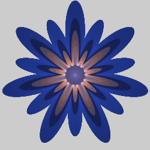
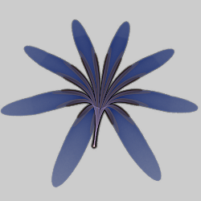
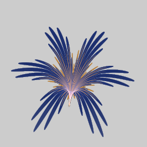

# Blobs
These variations deform the plane by pinching it towards the origin, making a blob-like shape. The math is similar to that of [rose curves](rosecurve/rosecurve.md), but these are standard variations, not blurs.

## blob
Pushes and pulls the plane using a radial sine wave to make it look like a blob.

Type: 2D  
Date: 4 Nov 2005

 

| Parameter | Description |
| --- | --- |
| low | Proportional height of the troughs of the waves. It is typically set less than 1, though this is not required. If less than 0, the blob will extend through the origin and out the other side, doubling the number of waves. |
| high | Proportional height of the crests of the waves. It is typically set a bit larger than 1, though this is not required. |
| waves | Number of waves. Normally an integer; if not, one of the waves will be cut off. |

The version built-in to Apophysis requires waves to be an integer. To avoid this, or for versions of Apophysis that do not include blob, use the blob_fl plugin.

Setting low and high to the same value will just scale the flame by that amount, with no deformation. Blob is the same as linear when low and high are both 1.

[Blob variation information at the JWildfire Sanctuary](https://www.jwfsanctuary.club/variation-information/blob/)  

## blob_fl
"Fluid" version of blob; allows fractional values for waves.

Type: 2D  
Author: Fred E (morphapoph)  
Date: 8 Sep 2010

| Parameter | Description |
| --- | --- |
| low | Proportional height of the troughs of the waves. It is typically set less than 1, though this is not required. If less than 0, the blob will extend through the origin and out the other side, doubling the number of waves. |
| high | Proportional height of the crests of the waves. It is typically set a bit larger than 1, though this is not required. |
| waves | Number of waves. Normally an integer; if not, one of the waves will be cut off. |

[Apophysis plugin](https://www.deviantart.com/morphapoph/art/Apo-Anim-friendly-Plugins-178559281)  

## blob2
Modulate a flame using radial sine waves.

Type: 2D  
Author: Anton Liasotskiy (zy0rg)  
Date: 26 Jul 2011  

 

| Parameter | Description |
| --- | --- |
| mode | The direction of the radial waves -1: inwards 0: both directions 1: outwards |
| n | Number of waves |
| radius | Minimum radius where waves start |
| prescale | Exponential scaling for the waves |
| postscale | Linear scaling for the waves |
| symmetry | Shifts the waves; negative for inwards, positive for outwards; range -1 to 1 |
| compensation | Compensation when scaling from symmetry and prescale is too big; range 0 (no compensation) to 1 |

Tips from the author:

* mode=1 works best for creating flower shapes
* use linear variation on the same xForm to see both inwards and outwards pointed waves (otherwise the inward-pointed waves are just "mirrored" from the 0.0 point)

[Apophysis plugin](https://www.deviantart.com/zy0rg/art/Blob2-244765425)  

## blob3D
A variant of blob that adds a 3D component.

Type: 3D (sets z)  
Author: Andreas Maschke (thargor6)  
Date: 2011  

 

| Parameter | Description |
| --- | --- |
| low | Proportional height of the troughs of the waves. It is typically set less than 1, though this is not required. If less than 0, the blob will extend through the origin and out the other side, doubling the number of waves. |
| high | Proportional height of the crests of the waves. It is typically set a bit larger than 1, though this is not required. |
| waves | Number of waves. Normally an integer; if not, one of the waves will be cut off. |

## flower_db
Reshape a flame into a 3D flower

Type: 3D  
Author: Luca G and Gregg Helt  
Date: 10 Jul 2014  

 

| Parameter | Description |
| --- | --- |
| petals | Number of petals |
| petal_split | Number of times to split each petal (resulting in petal_split+1 subpetals) |
| petal_spread | Spread factor for each petal >1: longer and thicker petals, coalescing towards the center 1: normal 0-1: petals are shorter and narrower, with additional petals sprouting between them 0: twice as many short petals <0: same as positive, but rotated |
| stem_thickness | Thickness of the "stem" that is formed by pulling points near the center down (or up if negative) |
| stem_length | Length of the "stem"; infinite when 0|
| petal_fold_strength | How much to fold the tips of the petals; positive values fold up, negative down |
| petal_fold_radius | How far from the center the petal fold starts |

[Variation post on JWildfire forum](https://jwildfire-forum.overwhale.com/viewtopic.php?f=18&t=1444)  
[Followup post on JWildfire forum](http://jwildfire-forum.overwhale.com/viewtopic.php?f=23&t=1759)  

## rose
Modulate a flame using the rose curve.

Type: 2D  
Author: Jessica Darling (FarDareisMai)  
Date: 3 Aug 2011  

 

| Parameter | Description |
| --- | --- |
| numer | Rose curve numerator |
| denom | Rose curve denominator |
| inner_scale | Scale factor for points inside the curve |
| outer_scale | Scale factor for points outside the curve |
| angle_in | Offset to the input angle, as a fraction of 180 degrees/pi radians |
| shear_x, shear_y | How much to shear x and y |
| turn_x, turn_y | How much to turn x and y, in radians |
| strength | Overall strength for the effect |

[Apophysis plugin](https://www.deviantart.com/fardareismai/art/Apophysis-Plugin-Rose-246324281)  
