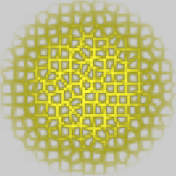
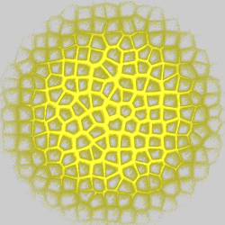

# Blurry
Variations that add different types of blurriness. Unlike blur transforms, they do not ignore their inputs or create shapes by themselves. Most are best used in conjunction with other variations on the same transform, although a few have an incorporated linear so this is not needed.

The examples on this page show the effect of the variations on a crackle design.

## blur_linear
Create a motion blur effect.

Type: 2D  
Author: Joel Faber  
Date: 22 Feb 2009  

Works as a standalone variation.

| Parameter | Description |
| --- | --- |
| length | How long to make the blur effect |
| angle | The angle for the blur effect in radians |

https://sourceforge.net/p/apo-plugins/code/HEAD/tree/  

## blur_pixelize
Averages colors in an area to make large square pixels.

Type: 2D  
Author: Joel Faber  
Date: 15 Mar 2009  

Works as a standalone variation.

| Parameter | Description |
| --- | --- |
| size | Size of the area to be averaged |
| scale | Relative size of the pixels; <1 puts space between them, >1 makes them overlap |

https://sourceforge.net/p/apo-plugins/code/HEAD/tree/  

## blur_zoom
Create a zoom blur effect.

Type: 2D  
Author: Joel Faber  
Date: 28 Feb 2009  

Works as a standalone variation.

| Parameter | Description |
| --- | --- |
| length | Length of the effect |
| x, y | The center point of the effect |

https://sourceforge.net/p/apo-plugins/code/HEAD/tree/  

## exblur
Blur effect radiating from a point.

Type: 3D  
Author: Branden Brown (zephyrtronium)  
Date: 11 July 2010

Works best when used with another variation on the same transform.

| Parameter | Description |
| --- | --- |
| dist | Strength of the blur relative to the distance from the origin; larger values reduce the blur close to the origin |
| r | Strength of the blur in side directions |
| x_origin, y_origin, z_origin | Origin of the blur effect |

https://www.deviantart.com/zephyrtronium/art/Exblur-Apophysis-Plugin-170961946  

## noise
Add noise as a blur effect.

Type: 2D  
Author: Scott Draves  
Date: Sept 2003  

Use with another variation on the same transform. Very effective for softening blur shapes.

## pixel_flow
Blur effect resembling flowing pixels.

Type: 2D with DC option  
Author: Zotya Dócs (bezo97)
Date: 15 Dec 2017

Use with another variation on the same transform.

| Parameter | Description |
| --- | --- |
| angle | Angle for the flow effect, in degrees |
| len | Length of the pixel flow |
| width | Controls the width of the pixels; larger values create thinner pixel flows |
| seed | Seed for the random number generator; change to create different flows |
| enable_dc | 1 to enable direct color; 0 to disable |

http://bezo97.tk/plugins.html  

## radial_blur
Blur effect rotating around the origin.

Type: 2D  

Works best when used with another variation on the same transform.
