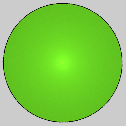

# Blurs
Variations that ignore the input and generate specific shapes.

## blur
Circle with a bright center.

Type: 2D blur  

## blur_circle
Circle with even coloring.

Type: 2D blur  
Author: Joel and Michael Faber  
Date: 15 Mar 2009  

Square blur followed by circlize. Same result as circleblur. An older version had a "hole" parameter which didn't work correctly and was later removed.

https://sourceforge.net/projects/apo-plugins/files/apo-plugins/80810/   
http://sourceforge.net/p/apo-plugins/code/HEAD/tree/   
https://fractalformulas.wordpress.com/flame-variations/blur/   
https://www.jwfsanctuary.club/variation-information/blur/   

## blur_heart
Creates a heart from two ellipses.

Type: 2D blur  
Author: Luca G (dark-beam)  
Date: 14 Nov 2011  

| Parameter | Description |
| --- | --- |
| p | Power: 1 will make a heart from two ellipses; smaller values make it more "curvey" and heart-like (to a point) |
| a | Shapes the ellipses; make it negative for the heart to be right-side-up |
| b | Shapes the ellipses; make it negative for a hollow heart |

Keep |a|≤|b| to keep the dimple below the zero point; if it goes below, the dimple will have some fill in it.

https://www.deviantart.com/dark-beam/art/Blur-heart-hearty-apoplugins-269015914   
http://www.mathematische-basteleien.de/heart.htm   
http://www.deviantart.com/art/BCs-BDs-Gnarly-Blur-Heart-Script-284934920   

## blur3D / pre_blur3D
Three dimensional Gaussian blur.

Type: 3D blur  

## circleblur
Circle with even coloring.

Type: 2D blur  
Author: Anton Liasotskiy (zy0rg)  
Date: 9 Jan 2013  

http://zy0rg.deviantart.com/art/Blur-Package-347648919   
https://fractalformulas.wordpress.com/flame-variations/blur/   
https://www.jwfsanctuary.club/variation-information/blur/   

## gaussian_blur
Fuzzy circle with a bright center, made from a Gaussian distribution.

Type: 2D blur  

https://fractalformulas.wordpress.com/flame-variations/blur/   
https://www.jwfsanctuary.club/variation-information/gaussian_blur/   

## nBlur
Polygon shaped blur

Type: 2D blur  
Author: FractalDesire  
Date: 21 Dec 2010  

 

| Parameter | Description |
| --- | --- |
| numEdges | Specifies number of edges of the polygon. Must be an integer 3 or greater. |
| numStripes | Number of stripes from the center to each side. Must be an integer. Negative values reverse the solid areas and spaces. |
| ratioStripes | The stripe thickness, given as a ratio of solid to space. Valid values are between 0.0 (stripes are lines) and 2.0 (stripes touch each other). Default 1.0 makes the stripes and spaces the same width. |
| ratioHole | Size of the hole in the center of the polygon. Ranges from 0.0 (no hole) to 1.0 (hole is the size of the polygon, so only the edge is visible. |
| circumCircle | Set to 1 to put a circle around the shape. If ratioHole is 0.0, this just shows a circle; increase that to make a polygon hole in the circle. |
| adjustToLinear | If 0, the variation value is the distance from center to corner. If 1, it is the distance from the center to the rightmost (and leftmost) corner. This facilitates horizontal tiling using a separate linear transform. Move the triangle for that transform twice the variation amount of the nBlur transform, and set this parameter to 1 to make the tiled nBlurs just touch.|
| equalBlur | If 0, the center will be denser, possibly making it brighter (depending on the color). If 1, the brightness will be equalized, giving a flat appearance. |
| exactCalc | If 0, the calculation will be interpolated to make the variation run faster. This will sometimes result in faint lines between the center and corners of the polygon, depending on the other settings and the color. If 1, calculation will be exact, but may take longer.|
| highlightEdges | This parameter provides an alternative to exactCalc to reduce the faint lines that sometimes appear between the center and corners of the polygon. The default value is 1; reduce it to darken and increase it to lighten these lines. It can also be used to highlight these edges if desired for special effect. The exactCalc and circumCircle values must both be 0 for this to have any effect. Any value is allowed, but the lowest effective value is 0.1.|

https://www.deviantart.com/fractaldesire/art/nBlur-plugin-190401515   
http://freerangeapophysis.wordpress.com/2011/01/01/first-play-with-nblur/   
http://zweezwyy.deviantart.com/art/nBlur-a-useful-tool-207495126   
https://fractalformulas.wordpress.com/flame-variations/nblur/   

## pie
A circle with wedges missing, like pieces of pie.

Type: 2D blur  
Author: Joel Faber  
Date: 16 Sep 2007  

| Parameter | Description |
| --- | --- |
| slices | The number of slices. Two slices will overlap if not an integer (some versions require this to be an integer). |
| rotation | Amount to rotate the shape, in radians. |
| thickness | The proportion of wedge to space, from 0 (wedges are lines) to 1 (no space). |

http://sourceforge.net/projects/apo-plugins/files/apo-plugins/80810/  
http://joelfaber.deviantart.com/art/A-Recipe-for-Plastic-Pie-35295850  

## pie_fl
Fluid version of pie, allows fractional value for slices.

Type: 2D blur  
Author: Fred E (morphapoph)  
Date: 8 Sep 2010  

Same as pie, but relaxes the restriction that slices is an integer.

https://www.deviantart.com/morphapoph/art/Apo-Anim-friendly-Plugins-178559281  

## pie3D
Three dimensional version of pie.

Type: 3D blur  
Author: Andreas Maschke (thargor6)  
Date: 21 Nov 2011

| Parameter | Description |
| --- | --- |
| slices | The number of slices. Two slices will overlap if not an integer. |
| rotation | Amount to rotate the shape, in radians. |
| thickness | The proportion of wedge to space, from 0 (wedges are lines) to 1 (no space). |

## pre_blur
Pre version of gaussian_blur.

Type: 2D blur  

## sineblur
A circle with a shading effect.

Type: 2D blur  
Author: Anton Liasotskiy (zy0rg)  
Date: 9 Jan 2013  

| Parameter | Description |
| --- | --- |
| power | Controls the shading effect. |

The appearance is greatly influnced by the background; the default of 1 works well for dark backgrounds, but a somewhat higher value (like 20) is better for light backgrounds. Very high values will have low density in the center. Values less than 1 will produce a smaller circle with a fuzzy edge.

https://www.deviantart.com/zy0rg/art/Blur-Package-347648919   
https://fractalformulas.wordpress.com/flame-variations/blur/   
https://www.jwfsanctuary.club/variation-information/blur/   

## sphereblur
3D version of sineblur

Type: 3D blur  
Author: Anton Liasotskiy (zy0rg)  
Date: 9 Jan 2013  

| Parameter | Description |
| --- | --- |
| power | Controls the shading effect. |

http://zy0rg.deviantart.com/art/Sphereblur-687844594   

## square
Square shaped blur

Type: 2D blur  
Author: Antonio Intieri (gygrazok)  

http://lu-kout.deviantart.com/art/Apophysis-Plugin-Pack-1-v0-4-59907275   

## square3D
Cube shaped blur

Type: 3D blur  

## starblur
Star shaped blur

Type: 2D blur  
Author: Anton Liasotskiy (zy0rg)  
Date: 9 Jan 2013  

 

| Parameter | Description |
| --- | --- |
| power | Number of points |
| range | Proportional distance of the inner angles |

Negative values are allowed for both parameters, and can generate interesting shapes.

https://www.deviantart.com/zy0rg/art/Blur-Package-347648919   

## waveblur_wf
Creates waves, like ripples in a pond.

Type: 3D blur  
Author: Andreas Maschke  
Date: 30 Jan 2015  

| Parameter | Description |
| --- | --- |
| count | Number of waves |
| phase | Wave phase; negative values leave hole in center, positive values make waves overlap in center |
| amplitude_z | Z amplitude |
| damping_z | Damping factor for successive waves; positive values make waves further from center smaller |
| direct_color | 0 for normal color, 1 for direct color |
| color_scale | Scale for color if using direct color |
| color_offset | Color offset if using direct color |

## xheart_blur_wf
Heart shaped blur

Type: 2D blur  
Author: Andreas Maschke  
Date: 30 Aug 2014  

Based on xheart (which is not a blur).

| Parameter | Description |
| --- | --- |
| angle | Angle of the lobes in radians (offset from π/4) |
| ratio | Stretch factor for the lobes |
