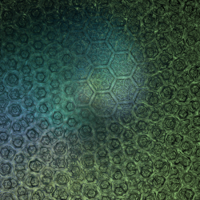

# Boarders
Divide the plane into squares or hexagons with borders.

## boarders
Original version.

Type: 2D   
Author: Joel and Michael Faber   
Date: 16 Sep 2007   

https://sourceforge.net/projects/apo-plugins/files/apo-plugins/80810/
http://tyrantwave.deviantart.com/art/Apophysis-3D-Baseforms-Pack-113871861

## boarders2 / pre_boarders2
Adds some parameters to boarders.

Type: 2D  
Author: Georg Kiehne (xyrus02)  
Date: 31 Jul 2010

To imitate boarders, set all parameters to 0.5.

| Parameter | Description |
| --- | --- |
| c | |
| left |  |
| right |  |

http://xyrus02.deviantart.com/art/Boarders2-plugin-for-Apophysis-173427128 (defunct)

## dc_boarders
Presumably, a direct color version of boarders, but it appears to be the same as boarders.

Type: 2D, direct color  
Author: Georg Kiehne (xyrus02)  
Date: 30 Jun 2010

http://xyrus-02.deviantart.com/art/DC-Collection-169594950 (defunct)
https://sourceforge.net/p/apo-plugins/code/HEAD/tree/personal/georgkiehne/

## tri_boarders2
Hexagon version of boarders. Source not found.

Type: 2D  
Author: Alexey Ermushev (eralex61)  
Date: Early 2008

Comment in xtrb source code:
"Some comments on TriBorders plugin structure. It builds dual tessellation
on triangle grid as Boarders variation does for square one and it uses
trilinear coordinates instead of usual Cartesian system (from where Tri Borders in plugin name)."

| Parameter | Description |
| --- | --- |
| radius |   |
| width |   |

https://eralex61.deviantart.com/art/Some-Plugins-76087119/ (defunct)
http://nightmares06.deviantart.com/art/Bubble-Triboarders-Tutorial-99317545
https://www.deviantart.com/djeaton3162/art/Glossy-TriBoarders-Script-76820857
https://www.deviantart.com/djeaton3162/art/Tiled-Tri-Boarders-Script-76868935

## xtrb
Modification of tri_boarders2 with extra parameters.

Type: 2D  
Author: Georg Kiehne (xyrus02)  
Date: 17 Nov 2012

To imitate tri_boarders2, set power, dist, a, and b to 1 and the amount to the square root of the tri_boarders2 amount.

| Parameter | Description |
| --- | --- |
| power |   |
| radius |   |
| width |   |
| dist |   |
| a |   |
| b |   |

Bug: The amount is multiplied twice, which may cause unexpected results. To work around, set the amount to the square root of what would normally be used.

http://xyrus02.deviantart.com/art/XTrb-Plugin-for-Apophysis-136800563 (defunct)
https://www.deviantart.com/bpclarke/art/BC-BDs-Spher-Loonie-Bwraps-Xtrb-Projective-Batch-2-310446818
