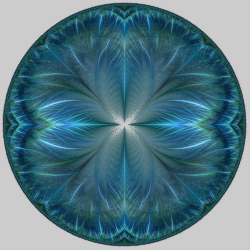

# Complex Functions
Variations that perform standard math functions using complex numbers. Most of the math functions don't need extra parameters. Some have been extended with parameters that don't have any particular mathematical significance, but can have interesting effects; just experiment with changing them. The default values make these variations work the same as the original variations.

## complex
Combination of cos2_bs, cosh2_bs, cot2_bs, coth2_bs, csc2_bs, csch2_bs, exp2_bs, sec2_bs, sech2_bs, sin2_bs, sinh2_bs, tan2_bs, and tanh2_bs.

Type: 2D  
Author: Brad Stefanov  
Date: 19 Nov 2017  

| Parameter | Description |
| --- | --- |
| cospow | Amount of cosine to include |
| cosx1, cosx2, cosy1, cosy2 | Change the cosine result if cospow is not 0 |
| coshpow | Amount of hyperbolic cosine to include |
| coshx1, coshx2, coshy1, coshy2 | Change the hyperbolic cosine result if coshpow is not 0 |
| cotpow | Amount of tangent to include |
| cotx1, cotx2, coty1, coty2 | Change the tangent result if cotpow is not 0 |
| cothpow | Amount of hyperbolic tangent to include |
| cothx1, cothx2, cothy1, cothy2 | Change the hyperbolic tangent result if cothpow is not 0 |
| cscpow | Amount of cosecant to include |
| cscx1, cscx2, cscy1, cscy2 | Change the cosecant result if cscpow is not 0 |
| cschpow | Amount of hyperbolic cosecant to include |
| cschx1, cschx2, cschy1, cschy2 | Change the hyperbolic cosecant result if cschpow is not 0 |
| exppow | Amount of exponential to include |
| expx1, expy1, expy2 | Change the exponential result if exppow is not 0 |
| secpow | Amount of secant to include |
| secx1, secx2, secy1, secy2 | Change the secant result if secpow is not 0 |
| sechpow | Amount of hyperbolic secant to include |
| sechx1, sechx2, sechy1, sechy2 | Change the hyperbolic secant result if sechpow is not 0 |
| sinpow | Amount of sine to include |
| sinx1, sinx2, siny1, siny2 | Change the sine result if sinpow is not 0 |
| sinhpow | Amount of hyperbolic sine to include |
| sinhx1, sinhx2, sinhy1, sinhy2 | Change the hyperbolic sine result if sinhpow is not 0 |
| tanpow | Amount of tangent to include |
| tanx1, tanx2, tany1, tany2 | Change the tangent result if tanpow is not 0 |
| tanhpow | Amount of hyperbolic tangent to include |
| tanhx1, tanhx2, tanhy1, tanhy2 | Change the hyperbolic tangent result if tanhpow is not 0 |

## cos
Complex cosine.

Type: 2D  
Author: Gregory Zitelli (cothe)  
Date: 27 Jan 2008  

[Apophysis plugin](https://www.deviantart.com/cothe/art/Complex-Functions-Plugin-Pack-75770912)  
[Wolfram Introduction to the Cosine Function](https://functions.wolfram.com/ElementaryFunctions/Cos/introductions/Cos/04/)  

## cos2_bs
Complex cosine with parameters.

Type: 2D  
Authors: Gregory Zitelli and Brad Stefanov  
Date: 30 May 2017  

| Parameter | Description |
| --- | --- |
| x1, x2, y1, y2 | Change the result (no particular mathematical significance) |

[Understanding Cos2_bs](https://www.youtube.com/watch?v=PkjGLWuZrhI) (video)  

## cosh
Complex hyperbolic cosine.

Type: 2D  
Author: Gregory Zitelli (cothe)  
Date: 27 Jan 2008  

[Apophysis plugin](https://www.deviantart.com/cothe/art/Complex-Functions-Plugin-Pack-75770912)  
[Wolfram Introduction to the Hyperbolic Cosine Function](https://functions.wolfram.com/ElementaryFunctions/Cosh/introductions/Cosh/04/)  

## cosh2_bs
Complex hyperbolic cosine with parameters.

Type: 2D  
Authors: Gregory Zitelli and Brad Stefanov  
Date: 30 May 2017  

| Parameter | Description |
| --- | --- |
| x1, x2, y1, y2 | Change the result (no particular mathematical significance) |

[Understanding Cos2h_bs](https://www.youtube.com/watch?v=wMw0fAwoDEM) (video)  

## cosine
Modified complex cosine.

Type: 2D  
Author: Scott Draves  
Date: 1 Dec 2004  

Like cos, but x is first multiplied by π.

## cot
Complex cotangent.

Type: 2D  
Author: Gregory Zitelli (cothe)  
Date: 27 Jan 2008  

[Apophysis plugin](https://www.deviantart.com/cothe/art/Complex-Functions-Plugin-Pack-75770912)  
[Wolfram Introduction to the Cotangent Function](https://functions.wolfram.com/ElementaryFunctions/Cot/introductions/Cot/04/)  

## cot2_bs
Complex cotangent with parameters.

Type: 2D  
Authors: Gregory Zitelli and Brad Stefanov  
Date: 30 May 2017  

| Parameter | Description |
| --- | --- |
| x1, x2, y1, y2 | Change the result (no particular mathematical significance) |

## coth
Complex hyperbolic cotangent.

Type: 2D  
Author: Gregory Zitelli (cothe)  
Date: 27 Jan 2008  

[Apophysis plugin](https://www.deviantart.com/cothe/art/Complex-Functions-Plugin-Pack-75770912)  
[Wolfram Introduction to the Hyperbolic Cotangent Function](https://functions.wolfram.com/ElementaryFunctions/Coth/introductions/Coth/04/)  

## coth2_bs
Complex hyperbolic cotangent with parameters.

Type: 2D  
Authors: Gregory Zitelli and Brad Stefanov  
Date: 30 May 2017  

| Parameter | Description |
| --- | --- |
| x1, x2, y1, y2 | Change the result (no particular mathematical significance) |

## csc
Complex cosecant.

Type: 2D  
Author: Gregory Zitelli (cothe)  
Date: 27 Jan 2008  

[Apophysis plugin](https://www.deviantart.com/cothe/art/Complex-Functions-Plugin-Pack-75770912)  
[Wolfram Introduction to the Cosecant Function](https://functions.wolfram.com/ElementaryFunctions/Csc/introductions/Csc/04/)

## csc2_bs
Complex cosecant with parameters.

Type: 2D  
Authors: Gregory Zitelli and Brad Stefanov  
Date: 30 May 2017  

| Parameter | Description |
| --- | --- |
| x1, x2, y1, y2 | Change the result (no particular mathematical significance) |

## csch
Complex hyperbolic cosecant.

Type: 2D  
Author: Gregory Zitelli (cothe)  
Date: 27 Jan 2008  

[Apophysis plugin](https://www.deviantart.com/cothe/art/Complex-Functions-Plugin-Pack-75770912)  
[Wolfram Introduction to the Hyperbolic Cosecant Function](https://functions.wolfram.com/ElementaryFunctions/Csch/introductions/Csch/04/)  

## csch2_bs
Complex hyperbolic cosecant with parameters.

Type: 2D  
Authors: Gregory Zitelli and Brad Stefanov  
Date: 30 May 2017  

| Parameter | Description |
| --- | --- |
| x1, x2, y1, y2 | Change the result (no particular mathematical significance) |

## post_trig
Combination of one or more complex trigonometric functions (post variation).

Type: 2D  
Author: Whittaker Courtney  
Date: 31 Jul 2020  

 

| Parameter | Description |
| --- | --- |
| reciprocalpow | Amount of complex reciprocal to include |
| log_dividepow | Amount of log((z+1)/(z-1)) to include |
| sqrtpow | Amount of complex square root to include |
| exppow | Amount of complex exponential to include |
| logpow | Amount of complex log to include |
| asinhpow | Amount of complex inverse hyperbolic sine to include |
| acoshpow | Amount of complex inverse hyperbolic cosine to include |
| atanhpow | Amount of complex inverse hyperbolic tangent to include |
| asinpow | Amount of complex inverse sine to include |
| acospow | Amount of complex inverse cosine to include |
| atanpow | Amount of complex inverse tangent to include |
| sinpow | Amount of complex sine to include |
| cospow | Amount of complex cosine to include |
| tanpow | Amount of complex tangent to include |
| sinhpow | Amount of complex hyperbolic sine to include |
| coshpow | Amount of complex hyperbolic cosine to include |
| tanhpow | Amount of complex hyperbolic tangent to include |

## sec
Complex secant.

Type: 2D  
Author: Gregory Zitelli (cothe)  
Date: 27 Jan 2008  

[Apophysis plugin](https://www.deviantart.com/cothe/art/Complex-Functions-Plugin-Pack-75770912)  
[Wolfram Introduction to the Secant Function](https://functions.wolfram.com/ElementaryFunctions/Sec/introductions/Sec/04/)  

## sec2_bs
Complex secant with parameters.

Type: 2D  
Authors: Gregory Zitelli and Brad Stefanov  
Date: 30 May 2017  

| Parameter | Description |
| --- | --- |
| x1, x2, y1, y2 | Change the result (no particular mathematical significance) |

## sech
Complex hyperbolic secant.

Type: 2D  
Author: Gregory Zitelli (cothe)  
Date: 27 Jan 2008  

[Apophysis plugin](https://www.deviantart.com/cothe/art/Complex-Functions-Plugin-Pack-75770912)  
[Wolfram Introduction to the Hyperbolic Secant Function](https://functions.wolfram.com/ElementaryFunctions/Sech/introductions/Sech/04/)  

## sech2_bs
Complex hyperbolic secant with parameters.

Type: 2D  
Authors: Gregory Zitelli and Brad Stefanov  
Date: 30 May 2017  

| Parameter | Description |
| --- | --- |
| x1, x2, y1, y2 | Change the result (no particular mathematical significance) |

## sin
Complex sine.

Type: 2D  
Author: Gregory Zitelli (cothe)  
Date: 27 Jan 2008  

[Apophysis plugin](https://www.deviantart.com/cothe/art/Complex-Functions-Plugin-Pack-75770912)  
[Wolfram Introduction to the Sine Function](https://functions.wolfram.com/ElementaryFunctions/Sin/introductions/Sin/04/)  

## sin2_bs
Complex sine with parameters.

Type: 2D  
Authors: Gregory Zitelli and Brad Stefanov  
Date: 30 May 2017  

| Parameter | Description |
| --- | --- |
| x1, x2, y1, y2 | Change the result (no particular mathematical significance) |

## sinh
Complex hyperbolic sine.

Type: 2D  
Author: Gregory Zitelli (cothe)  
Date: 27 Jan 2008  

[Apophysis plugin](https://www.deviantart.com/cothe/art/Complex-Functions-Plugin-Pack-75770912)  
[Wolfram Introduction to the Hyperbolic Sine Function](https://functions.wolfram.com/ElementaryFunctions/Sinh/introductions/Sinh/04/)  

## sinh2_bs
Complex hyperbolic sine with parameters.

Type: 2D  
Authors: Gregory Zitelli and Brad Stefanov  
Date: 30 May 2017  

| Parameter | Description |
| --- | --- |
| x1, x2, y1, y2 | Change the result (no particular mathematical significance) |

## tan
Complex tangent.

Type: 2D  
Author: Gregory Zitelli (cothe)  
Date: 27 Jan 2008  

[Apophysis plugin](https://www.deviantart.com/cothe/art/Complex-Functions-Plugin-Pack-75770912)  
[Wolfram Introduction to the Tangent Function](https://functions.wolfram.com/ElementaryFunctions/Tan/introductions/Tan/04/)  

## tan2_bs
Complex tangent with parameters.

Type: 2D  
Authors: Gregory Zitelli and Brad Stefanov  
Date: 30 May 2017  

| Parameter | Description |
| --- | --- |
| x1, x2, y1, y2 | Change the result (no particular mathematical significance) |

## tanh
Complex hyperbolic tangent.

Type: 2D  
Author: Gregory Zitelli (cothe)  
Date: 27 Jan 2008  

[Apophysis plugin](https://www.deviantart.com/cothe/art/Complex-Functions-Plugin-Pack-75770912)  
[Wolfram Introduction to the Hyperbolic Tangent Function](https://functions.wolfram.com/ElementaryFunctions/Tanh/introductions/Tanh/04/)  

## tanh2_bs
Complex hyperbolic tangent with parameters.

Type: 2D  
Authors: Gregory Zitelli and Brad Stefanov  
Date: 30 May 2017  

| Parameter | Description |
| --- | --- |
| x1, x2, y1, y2 | Change the result (no particular mathematical significance) |
