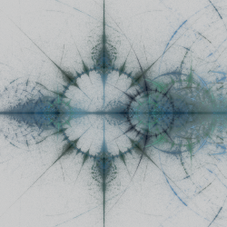
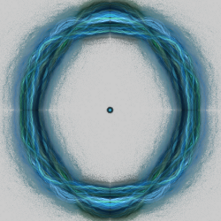

# Complex Functions
Variations that perform standard math functions using complex numbers. Most of the math functions don't need extra parameters. Some have been extended with parameters that don't have any particular mathematical significance, but can have interesting effects; just experiment with changing them. The default values make these variations work the same as the original variations.

## cos
Complex cosine.

Type: 2D  
Author: Gregory Zitelli (cothe)  
Date: 27 Jan 2008  

[Apophysis plugin](https://www.deviantart.com/cothe/art/Complex-Functions-Plugin-Pack-75770912)

## cos2_bs
Complex cosine with parameters.

Type: 2D  
Authors: Gregory Zitelli and Brad Stefanov  
Date: 30 May 2017  

| Parameter | Description |
| --- | --- |
| x1, x2, y1, y2 | Change the result (no particular mathematical significance) |

[Understanding Cos2_bs](https://www.youtube.com/watch?v=PkjGLWuZrhI) (video)  

## cosh
Complex hyperbolic cosine.

Type: 2D  
Author: Gregory Zitelli (cothe)  
Date: 27 Jan 2008  

[Apophysis plugin](https://www.deviantart.com/cothe/art/Complex-Functions-Plugin-Pack-75770912)

## cosh2_bs
Complex hyperbolic cosine with parameters.

Type: 2D  
Authors: Gregory Zitelli and Brad Stefanov  
Date: 30 May 2017  

| Parameter | Description |
| --- | --- |
| x1, x2, y1, y2 | Change the result (no particular mathematical significance) |

[Understanding Cos2h_bs](https://www.youtube.com/watch?v=wMw0fAwoDEM) (video)  

## cot
Complex cotangent.

Type: 2D  
Author: Gregory Zitelli (cothe)  
Date: 27 Jan 2008  

[Apophysis plugin](https://www.deviantart.com/cothe/art/Complex-Functions-Plugin-Pack-75770912)

## cot2_bs
Complex cotangent with parameters.

Type: 2D  
Authors: Gregory Zitelli and Brad Stefanov  
Date: 30 May 2017  

| Parameter | Description |
| --- | --- |
| x1, x2, y1, y2 | Change the result (no particular mathematical significance) |

## coth
Complex hyperbolic cotangent.

Type: 2D  
Author: Gregory Zitelli (cothe)  
Date: 27 Jan 2008  

[Apophysis plugin](https://www.deviantart.com/cothe/art/Complex-Functions-Plugin-Pack-75770912)

## coth2_bs
Complex hyperbolic cotangent with parameters.

Type: 2D  
Authors: Gregory Zitelli and Brad Stefanov  
Date: 30 May 2017  

| Parameter | Description |
| --- | --- |
| x1, x2, y1, y2 | Change the result (no particular mathematical significance) |

## csc
Complex cosecant.

Type: 2D  
Author: Gregory Zitelli (cothe)  
Date: 27 Jan 2008  

[Apophysis plugin](https://www.deviantart.com/cothe/art/Complex-Functions-Plugin-Pack-75770912)

## csc2_bs
Complex cosecant with parameters.

Type: 2D  
Authors: Gregory Zitelli and Brad Stefanov  
Date: 30 May 2017  

| Parameter | Description |
| --- | --- |
| x1, x2, y1, y2 | Change the result (no particular mathematical significance) |

## csch
Complex hyperbolic cosecant.

Type: 2D  
Author: Gregory Zitelli (cothe)  
Date: 27 Jan 2008  

[Apophysis plugin](https://www.deviantart.com/cothe/art/Complex-Functions-Plugin-Pack-75770912)

## csch2_bs
Complex hyperbolic cosecant with parameters.

Type: 2D  
Authors: Gregory Zitelli and Brad Stefanov  
Date: 30 May 2017  

| Parameter | Description |
| --- | --- |
| x1, x2, y1, y2 | Change the result (no particular mathematical significance) |

## sec
Complex secant.

Type: 2D  
Author: Gregory Zitelli (cothe)  
Date: 27 Jan 2008  

[Apophysis plugin](https://www.deviantart.com/cothe/art/Complex-Functions-Plugin-Pack-75770912)

## sec2_bs
Complex secant with parameters.

Type: 2D  
Authors: Gregory Zitelli and Brad Stefanov  
Date: 30 May 2017  

| Parameter | Description |
| --- | --- |
| x1, x2, y1, y2 | Change the result (no particular mathematical significance) |

## sech
Complex hyperbolic secant.

Type: 2D  
Author: Gregory Zitelli (cothe)  
Date: 27 Jan 2008  

[Apophysis plugin](https://www.deviantart.com/cothe/art/Complex-Functions-Plugin-Pack-75770912)

## sech2_bs
Complex hyperbolic secant with parameters.

Type: 2D  
Authors: Gregory Zitelli and Brad Stefanov  
Date: 30 May 2017  

| Parameter | Description |
| --- | --- |
| x1, x2, y1, y2 | Change the result (no particular mathematical significance) |

## sin
Complex sine.

Type: 2D  
Author: Gregory Zitelli (cothe)  
Date: 27 Jan 2008  

[Apophysis plugin](https://www.deviantart.com/cothe/art/Complex-Functions-Plugin-Pack-75770912)

## sin2_bs
Complex sine with parameters.

Type: 2D  
Authors: Gregory Zitelli and Brad Stefanov  
Date: 30 May 2017  

| Parameter | Description |
| --- | --- |
| x1, x2, y1, y2 | Change the result (no particular mathematical significance) |

## sinh
Complex hyperbolic sine.

Type: 2D  
Author: Gregory Zitelli (cothe)  
Date: 27 Jan 2008  

[Apophysis plugin](https://www.deviantart.com/cothe/art/Complex-Functions-Plugin-Pack-75770912)

## sinh2_bs
Complex hyperbolic sine with parameters.

Type: 2D  
Authors: Gregory Zitelli and Brad Stefanov  
Date: 30 May 2017  

| Parameter | Description |
| --- | --- |
| x1, x2, y1, y2 | Change the result (no particular mathematical significance) |

## tan
Complex tangent.

Type: 2D  
Author: Gregory Zitelli (cothe)  
Date: 27 Jan 2008  

[Apophysis plugin](https://www.deviantart.com/cothe/art/Complex-Functions-Plugin-Pack-75770912)

## tan2_bs
Complex tangent with parameters.

Type: 2D  
Authors: Gregory Zitelli and Brad Stefanov  
Date: 30 May 2017  

| Parameter | Description |
| --- | --- |
| x1, x2, y1, y2 | Change the result (no particular mathematical significance) |

## tanh
Complex hyperbolic tangent.

Type: 2D  
Author: Gregory Zitelli (cothe)  
Date: 27 Jan 2008  

[Apophysis plugin](https://www.deviantart.com/cothe/art/Complex-Functions-Plugin-Pack-75770912)

## tanh2_bs
Complex hyperbolic tangent with parameters.

Type: 2D  
Authors: Gregory Zitelli and Brad Stefanov  
Date: 30 May 2017  

| Parameter | Description |
| --- | --- |
| x1, x2, y1, y2 | Change the result (no particular mathematical significance) |
