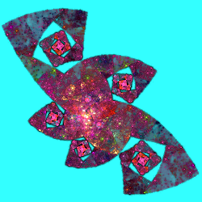

# Complex Power
Treats 2D points as complex numbers and raises them to a complex power that can be specified in various ways.

## cpow
Raise input point to a complex power specified by its real and imaginary parts.

Type: 2D  
Author: Joel Faber  
Date: 10 Aug 2008  

| Parameter | Description |
| --- | --- |
| r | Real part of the power |
| i | Imaginary part of the power |
| power | Divides the complex power by this amount. This also shrinks the result, which is then replicated radially this many times to fill the vacated space (aka julian). |

The plugins restrict power to be an integer; JWildfire does not.

https://sourceforge.net/projects/apo-plugins/files/apo-plugins/80810/   
http://guagapunyaimel.deviantart.com/art/cpow-ring2-tutorial-192002748   
https://fractalformulas.wordpress.com/flame-variations/cpow-and-escher/   

## cpow2
Raise input point to a complex power specified in polar coordinates.

Type: 2D  
Author: Peter Sdobnov (Zueuk)  
Date: 13 Mar 2009  

| Parameter | Description |
| --- | --- |
| r | Magnitude of the power; normally positive |
| a | Angle of the power between -2 and 2 (neither radians nor degrees) |
| divisor | Divides the complex power by this amount. This also shrinks the result, which is then replicated radially this many times to fill the vacated space (aka julian). |
| range | Controls the number of values beyond the principal value that are included; must be an integer at least 1. |

http://phoenixkeyblack.deviantart.com/art/cpow2-141045125   
http://sourceforge.net/p/apo-plugins/code/HEAD/tree/personal/petersdobnov/   
https://fractalformulas.wordpress.com/flame-variations/cpow-and-escher/   

## cpow3
Raise input point to a complex power to produce a spiral

Type: 2D  
Author: Anton Liasotskiy (zy0rg)  
Date: March 2013  

This variation was never released by its author, but has been frequently shared in fractal chat rooms and forums. It is included in the Essential Plugin Pack at http://bezo97.tk/plugins.html, and has been implemented in JWildfire starting with version 3.21.

| Parameter | Description |
| --- | --- |
| r | Rotation; the fraction of a circle that 360° is mapped to, so 1 means the output spiral matches the shape of the input and smaller values wind the spiral more tightly. |
| d | Distance; the proportional distance between successive rotations of the spiral. If the input is a shape with a hole that takes 75% of the shape, setting d to 0.75 will make the successive rotations fit in the hole. The direction of the spiral is reversed when d is negative. |
| divisor | Divides the complex power by this amount. This also shrinks the result, which is then replicated radially this many times to fill the vacated space (aka julian). |
| spread | Controls the number of values beyond the principal value that are included. The default value of 1 will dynamically adjust the number of values used based on the r and d values, and will normally not need to be increased. However it may be decreased to reduce the number of values down to a minimum of 0, which includes 1 value on each side of the principal value. |

https://fractal2cry.deviantart.com/art/Cpow3-fractal-360743627   
https://pillemaster.deviantart.com/art/Cauliflower-374228018   
https://tatasz.deviantart.com/art/Cpow3-without-overlaps-710419456   
https://fractalformulas.wordpress.com/flame-variations/cpow-and-escher/   

## cpow3_wf
Attempt to port cpow2 to JWildfire that "by happy accident became something else".

Type: 2D  
Author: Gregg Helt (cozyg)  
Date: 11 Mar 2015  

This variation is the result of a serendipitous mistake the author made while attempting to implement cpow2 in JWildfire. He liked the results, so released this variation. It was originally added to JWildfire with the name "cpow3", but  it was renamed to "cpow3_wf" when the above cpow3 was added in JWildfire version 3.21.

http://jwildfire.org/forum/viewtopic.php?f=23&t=1743   

## droste
Implements Escher's map using logarithms; same effect as escher.

Type: 2D  
Author: Joel Faber (unreleased)  

Droste was "test code that [the author] forgot to delete" when he first released the plugin package containing escher. It was deleted from later versions, but still made its way into plugin collections. It does the same thing as escher

| Parameter | Description |
| --- | --- |
| r1, r2 | The ratio r2/r1 determines the power |

http://www.josleys.com/article_show.php?id=82   
http://www.deviantart.com/art/BD-s-2-New-Scripts-80636384   
http://www.deviantart.com/art/BD-s-Droste-Plastic-script-76392380   

## escher
Implements Escher’s Map by treating each point of the flame as a complex number and raising it to a power determined by the variable beta.

Type: 2D  
Author: Joel Faber  
Date: 21 Oct 2007  

| Parameter | Description |
| --- | --- |
| beta | Controls the power. The effective range is -π to π, though values near the extremes are not very useful. |

Setting beta to 0 makes escher behave like linear.

https://sourceforge.net/projects/apo-plugins/files/apo-plugins/80810/   
http://mathworld.wolfram.com/EschersMap.html   
http://satania.deviantart.com/art/Tutorial-Escher-StainedGlass-202130216   
http://www.deviantart.com/art/BDs-Escher-Series-119834243   
https://fractalformulas.wordpress.com/flame-variations/cpow-and-escher/   
