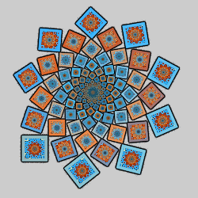

# Crop
Variations that crop the flame in various ways. This is tricky to do because of the way flames are generated: a sequence of points is computed and each is plotted to produce the flame. So when is point is outside the cropped area, what is the next point in the sequence? Some don't set it to a particular value, which makes it (0,0) and produces an annoying dot at the origin (which is often scattered by subsequent iterations, producing lots of dots all over the image). Others map it to the edge of the cropped area to produce a border. JWildfire has a "doHide" setting that hides cropped points; this prevents them from being visible, but can also waste iterations computing points that won't appear in the final flame. There is no perfect solution, so crop variations can be very useful but difficult to use.

## chunk / post_chunk / pre_chunk
Crop the flame to an ellipse or hyperbola.

Type: 2D crop  
Author: Branden Brown (zephyrtronium)  
Date: 11 Oct 2010  

 

This variation uses the general equation for conic sections: $ax^2 + bxy + cy^2 + dx + ey + f = 0$. The cropping area will be an ellipse if a and c are both positive, a horizontal hyperbola if a is negative and c is positive, or a vertical hyperbola if a is positive and c is negative.

Note: The variation amount is ignored; use the post-affine transform to adjust the output size.

| Parameter | Description |
| --- | --- |
| a | Controls horizontal size; smaller values increase size |
| b | Controls rotation |
| c | Controls vertical size; smaller values increase size |
| d | Controls horizontal position |
| e | Controls vertical position |
| f | Controls overall size |

[Apophysis plugin](https://www.deviantart.com/zephyrtronium/art/Chunk-Apophysis-Plugin-Pack-182375397)  

## circlecrop / post_circlecrop / pre_circlecrop
Crop the flame to a circle

Type: 2D crop  
Author: Georg Kiehne (xyrus02)  
Date: 7 Nov 2010  

| Parameter | Description |
| --- | --- |
| radius | Radius of cropping area |
| x, y | Center point of cropping area |
| scatter_area | Size of border where cropped points are mapped; positive to go inward, negative to go outward |
| zero | 0: Map cropped points to the border of the cropped area 1: Map cropped points to the origin; in JWildfire, hide them |

[Understanding Circle Crop](https://www.youtube.com/watch?v=fKZeVyR3CQk) (video)

## crob
Crop the flame to a rectangle or square with added blur.

Type: 2D crop  
Author: FractalDesire  
Date: 25 Sep 2011  

Note: The variation amount is ignored; use the post-affine transform to adjust the output size.

| Parameter | Description |
| --- | --- |
| top | Top side of cropping area |
| bottom | Bottom side of cropping area |
| left | Left side of cropping area |
| right | Right side of cropping area |
| blur | 0: Map cropped points to the origin 1: Map cropped points randomly to the border of the cropped area |
| ratioBlur | Thickness of the blur frame from 0.0 to 1.0 (0% to 100%) if blur is 1 |
| directBlur | Controls the density of the blur frame if blur is 1, between 0.0 and 2.0; 1.0 makes the density even, less than 1.0 makes the density higher towards the center, more than 1.0 makes the density higher towards the edge |

[Apophysis plugin](https://www.deviantart.com/fractaldesire/art/crob-plugin-260173724)  

## crop / post_crop / pre_crop
Crop the flame to a rectangle or square.

Type: 2D crop  
Author: Georg Kiehne (xyrus02)  
Date: 3 Jul 2010  

| Parameter | Description |
| --- | --- |
| left | Left side of cropping area |
| right | Right side of cropping area |
| top | Top side of cropping area |
| bottom | Bottom side of cropping area |
| scatter_area | Size of border where cropped points are mapped; positive to go inward, negative to go outward |
| zero | 0: Map cropped points to the border of the cropped area 1: Map cropped points to the origin; in JWildfire, hide them |

[Splits-Crop Tutorial](https://www.deviantart.com/guagapunyaimel/art/Splits-Crop-Tutorial-177103913)  
[The Secret of Empty Half-Planes](https://www.deviantart.com/fractaldesire/art/Tutorial-The-secret-of-empty-half-planes-312544779)  

## crop_box / post_crop_box
Crop the flame to a rectangle or square.

Type: 2D crop  
Author: Jesus Sosa  
Date: 3 Feb 2020  

| Parameter | Description |
| --- | --- |
| width | Width of cropping box |
| height | Height of cropping box |
| invert | 0: Crop out the outside of the box 1: Crop out the inside of the box |

[Exploring New Crops video](https://www.youtube.com/watch?v=ib1x2B9iCi0)  
[Making a Frame--Double Crop Method](https://www.jwfsanctuary.club/tutorial/how-to/making-a-frame-double-crop-method/)  

## crop_cross / post_crop_cross
Crop the flame to a cross shape.

Type: 2D crop  
Author: Jesus Sosa  
Date: 3 Feb 2020  

| Parameter | Description |
| --- | --- |
| width | Overall width of the cross to crop to |
| Size | Width of the arms of the cross (if Size > width, the functions are switched) |
| round | Controls the roundness of the corners; effective values are -1.31 to +1.31, 0.0 for square corners. |
| invert | 0: Crop out the outside of the cross 1: Crop out the inside of the cross |

## crop_polygon / post_crop_polygon
Crop the flame to a circle, pentagon, hexagon, octagon, or hexagram.

Type: 2D crop  
Author: Jesus Sosa  
Date: 3 Feb 2020  

| Parameter | Description |
| --- | --- |
| type | Polygon shape: 0: Circle 1: Pentagon 2: Hexagon 3: Octagon 4: Hexagram |
| radius | Size of the polygon |
| invert | 0: Crop out the outside of the polygon 1: Crop out the inside of the polygon |

## crop_rhombus / post_crop_rhombus
Crop the flame to a rhombus (diamond shape).

Type: 2D crop  
Author: Jesus Sosa  
Date: 3 Feb 2020  

| Parameter | Description |
| --- | --- |
| width | Width of the cropping rhombus |
| height | Height of the cropping rhombus |
| invert | 0: Crop out the outside of the rhombus 1: Crop out the inside of the rhombus |

## crop_stars / post_crop_stars
Crop the flame to a star shape.

Type: 2D crop  
Author: Jesus Sosa  
Date: 3 Feb 2020  

| Parameter | Description |
| --- | --- |
| radius | Size of the cropping star |
| n | Number of points for the cropping star |
| r2 | Pointiness of the cropping star, between 0 and 1; higher values make a more pointy star |
| invert | 0: Crop out the outside of the star 1: Crop out the inside of the star |

[Exploring New Crops video](https://www.youtube.com/watch?v=ib1x2B9iCi0)  

## crop_trapezoid / post_crop_trapezoid
Crop the flame to a trapezoid/trapezium.

Type: 2D crop  
Author: Jesus Sosa  
Date: 3 Feb 2020  

The cropping trapezoid has parallel horizontal edges and a line of symmetry. It is called a trapezoid in American English or a trapezium in British English and other European languages.

| Parameter | Description |
| --- | --- |
| Base Sup. | Width of the top (superior) side of the cropping trapezoid |
| Base Inf. | Width of the bottom (inferior) side of the cropping trapezoid |
| height | Height of the trapezoid |
| invert | 0: Crop out the outside of the trapezoid 1: Crop out the inside of the trapezoid |

## crop_triangle / post_crop_triangle
Crop the flame to a triangle shape.

Type: 2D crop  
Author: Jesus Sosa  
Date: 3 Feb 2020  

When setting the coordinates of the triangle, remember that positive y is down in flame programs.

| Parameter | Description |
| --- | --- |
| x1, y1 | Coordinates of the first corner of the cropping triangle |
| x2, y2 | Coordinates of the second corner of the cropping triangle |
| x3, y3 | Coordinates of the third corner of the cropping triangle |

## crop_vesica / post_crop_vesica
Crop the flame to a symmetric lens shape.

Type: 2D crop  
Author: Jesus Sosa  
Date: 3 Feb 2020  

In geometry, a symmetric lens is formed by the intersection of two disks with the same radius. The particular case when the center of each disk lies on the arc of the other, the lens formed is called a vesica piscis, which gives the name of this variation.

| Parameter | Description |
| --- | --- |
| width | Controls the ratio of the width to height of the lens shape; 0.2 for a vesica piscis (ratio of square root of 3) and -0.8 for a circle (ratio of 1) |
| height | Controls the radius of the two disks that form the symmetric lens; larger values make the cropped area bigger |
| invert | 0: Crop out the outside of the lens shape 1: Crop out the inside of the lens shape |

## crop_x / post_crop_x
Crop the flame to an 'X' shape.

Type: 2D crop  
Author: Jesus Sosa  
Date: 3 Feb 2020  

| Parameter | Description |
| --- | --- |
| radius | Width of the arms of the 'X' shape |
| w | Length of the arms of the 'X' shape; limited to the range 0.0-1.0 |
| invert | 0: Crop out the outside of the 'X' shape 1: Crop out the inside of the 'X' shape |

## post_smartcrop
Crop the flame to a polygon, with advanced options

Type: 2D crop  
Author: Anton Liasotskiy (zy0rg)  
Date: 3 Nov 2011  

 

| Parameter | Description |
| --- | --- |
| power | Number of sides in the cropped shape |
| radius | Size of the cropped shape; negative to crop the inside instead of the outside |
| roundstr | Rounding strength, 0.0 for no rounding, 1.0 for normal rounding; larger values create dimples |
| roundwidth | Rounding width if roundstr is not 0.0; affects how rounding is done; negative values make points |
| distortion | Distorts the shape; 1 for normal, 0 for circle |
| edge | Makes the border "smoother"; small values work best |
| scatter | Size of border where cropped points are mapped; positive to go inward, negative to go outward |
| offset | Offset for the border |
| rotation | Rotates the border clockwise; the amount depends on power, with a rotation value of 1.0 rotating the border to the next angle in the shape (not present in all versions of post_smartcrop) |
| cropmode | Cropping mode: 0: Map cropped points to the origin (but edge, scatter, offset still apply) 1: Map cropped points to the border of the cropped area 2: Scatter cropped points among the uncropped ones; may cause color changes |
| static | Set to 2 for normal operation or 3 for outline only (not all versions support 3). There are other options in the code, but they don't follow the rules for post_ variations so may produce inconsistent results, especially when multiple post_ variations are used. For reference, here are the descriptions provided by the author for these options: -1: Only inner (not cropped) part is affected by other variations 0: Both inner and outer parts are affected 1: Only outer (cropped) part is affected. |

[Apophysis plugin](https://www.deviantart.com/zy0rg/art/SmartCrop-267036043)  
[About Smartcrop](https://www.deviantart.com/tatasz/journal/About-smartcrop-608552223)  
