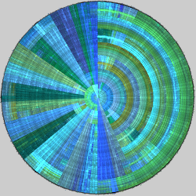
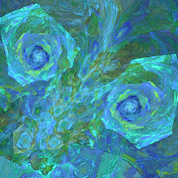
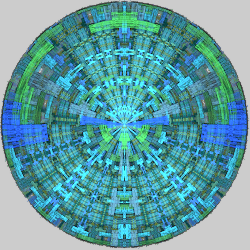

# Disc
Variations that use polar coordinates and swap the ρ and θ values. This converts wedges centered at the origin to half-rings and vice versa.

## disc
Swap polar coordinates ρ and θ.

Type: 2D  
Author: Ronald Hordijk  
Date: Sep 2003  

[Disc variation information at the JWildfire Sanctuary](https://www.jwfsanctuary.club/variation-information/disc/)  
[Disc Spiral Tutorial](https://www.deviantart.com/michaelfaber/art/Disc-Spiral-Tutorial-38694865)  
[Disc-Julian tutorial](https://www.deviantart.com/fiery-fire/art/Apo-Tuto-Disc-Julian-136175631)  
[Flipped Disc tutorial](https://www.deviantart.com/joelfaber/art/Flipped-Disc-46412471)  
[Spherical-Disc tutorial](https://www.deviantart.com/heavenriver/art/Apophysis-Spherical-Disc-Tut-181823644)  
[Disc Tutorial 1](https://www.deviantart.com/f--l--a--r--k/art/Apophysis-Disc-Tutorial-1-146554569)  
[Hole/Disc Technique video tutorial](https://www.youtube.com/watch?v=HGw8VDxcf5s)  
[Apophysis Base Forms pack](https://www.deviantart.com/tyrantwave/art/Apophysis-Base-Forms-Pack-103671251)  
[Modified Flipped Disc Apophsis script](https://www.deviantart.com/shortgreenpigg/art/Modified-Flipped-Disk-Script-101338327)  
[Linear Disc Apophysis script](https://www.deviantart.com/cabintom/art/Linear-Disc-Script-65402947)  

## disc2
Swap polar coordinates ρ and θ, but using Manhattan distance instead of Euclidean.

Type: 2D  
Author: Antonio Intrieri (gygrazok)  
Date: 9 Feb 2007  

It actually doesn't quite use the Manhattan distance. It uses *x+y*; the Manhattan distance is *|x|+|y|*.

| Parameter | Description |
| --- | --- |
| rot | Scales the input (which rotates the result) |
| twist | Separates the left and right halves |

## disc3
Swap polar coordinates ρ and θ, with parameters.

Type: 2D  
Author: Brad Stefanov (snicker02)  
Date: 28 Jul 2018  

| Parameter | Description |
| --- | --- |
| a-h | |

[JWildfire forum post on disc3](https://jwildfire-forum.overwhale.com/viewtopic.php?f=23&t=2617)  

## disc3d
Swap 2D polar coordinates ρ and θ and transforms z according to the distance from the origin.

Type: 3D  
Author: Keeps Spencer (gossamer-light)  
Date: 10 Dec 2007  

| Parameter | Description |
| --- | --- |
| pi | Scale factor for ρ and θ; 𝜋 is the value used for disc, but disc3d allows it to be changed. |

## edisc
Swap elliptic coordinates μ and ν.

Type: 2D  
Author: Joel and Michael Faber  
Date: 21 Oct 2007  

[Apophysis plugin](https://sourceforge.net/projects/apo-plugins/files/apo-plugins/80810/)  
[eTech tutorial](https://www.deviantart.com/cabintom/art/eTech-Tutorial-78745374)  
[eTech Apophysis scripts](https://www.deviantart.com/cabintom/art/eTech-Scripts-72980263)  
[Apophysis Base Forms pack](https://www.deviantart.com/tyrantwave/art/Apophysis-Base-Forms-Pack-103671251)  

## fdisc
Swap polar coordinates ρ and θ, first taking the reciprocal of ρ; scales by 2𝜋 instead of 𝜋.

Type: 2D  
Author: Michael Faber  
Date: 14 Jul 2009  

Gregg Helt (CozyG) added some parameters to fdisc when he ported it to JWildfire.

| Parameter | Description |
| --- | --- |
| ashift | Shift amount for θ |
| rshift | Shift amount for ρ |
| xshift | Phase shift for x |
| yshift | Phase shift for y |
| term1-term4 | Weights for four different terms producing the result; term1 is normal fdisc and term4 is linear |

## idisc
Swap polar coordinates ρ and θ, first taking the reciprocal of ρ.

Type: 2D  
Author: Michael Faber  
Date: 17 Sep 2011  

Taking the reciprocal is intended to prevent the overlap often seen with disc. See wdisc.

[Apophysis plugin](https://www.deviantart.com/michaelfaber/art/The-Lost-Variations-258913970)  

## pre_disc
Swap polar coordinates ρ and θ.

Type: 2D  
Author: Keeps Spencer (gossamer-light)  
Date: 10 Dec 2007  

A pre_ version of disc.

## pre_disc3d
Swap 2D polar coordinates ρ and θ and transforms z according to the distance from the origin.

Type: 3D  
Author: Keeps Spencer (gossamer-light)  
Date: 10 Dec 2007  

A pre_ version of disc3d.

| Parameter | Description |
| --- | --- |
| pi | Scale factor for ρ and θ; 𝜋 is the value used for disc, but disc3d allows it to be changed. |

## wdisc
Swap polar coordinates ρ and θ, first taking the reciprocal of ρ, afterwards flipping the bottom half.

Type: 2D  
Author: Michael Faber  
Date: 17 Sep 2011  

Taking the reciprocal is intended to prevent the overlap often seen with disc. See idisc.

[Apophysis plugin](https://www.deviantart.com/michaelfaber/art/The-Lost-Variations-258913970)  
