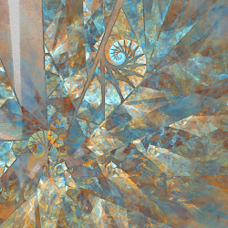
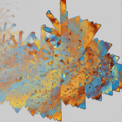
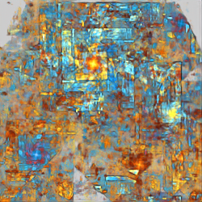
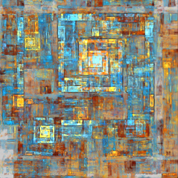
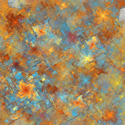
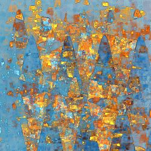
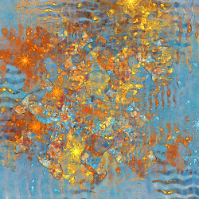
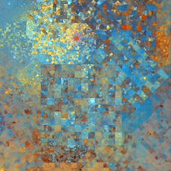
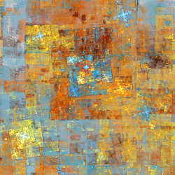
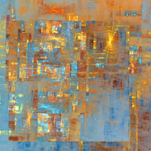

# Flippers
Variations that divide up the plane in various ways and flip or rotate the parts.

## fan
Divides the plane into pie shaped wedges and rotates them (dependent variation).

Type: 2D  
Date: 8 Mar 2005

Fan is an older "dependent variation" that depends on the affine coefficients of the transform instead of parameters. Of course, changing the affine coefficients affects the flame too, making dependent variations more difficult to use than the newer "parametric variations" that use parameters, such as fan2.

Note: Due to a bug in the implementation, fan also flips the plane diagonally. This is fixed in fan2.

| Parameter | Description |
| --- | --- |
| c, O1, or c20 | Sets the size of the wedges; smaller values create smaller (and thus more) wedges |

## fan2
Divides the plane into pie shaped wedges and rotates them.

Type: 2D  
Date: 4 Nov 2005  

| Parameter | Description |
| --- | --- |
| x | Sets the size of the wedges; smaller values create smaller (and thus more) wedges. Specifically, there will be *4 / x^2* wedges; for example, x=0.5 will make 16 wedges. |
| y | Controls the wedge rotation. When y is 0, wedges on the left side are rotated left and wedges on the right are rotated alternately. Increasing y makes more wedges rotate alternately and decreasing y makes more rotate the same direction. |

## flipcircle
Flips the points inside a circle centered at the origin top to bottom.

Type: 2D  
Author: Michael Faber  
Date: 30 Jun 2011  

The radius of the circle is determined by the variation amount (which also scales the result as usual).

https://www.deviantart.com/michaelfaber/art/Flip-216005432  

## flipy
Flips the points on the right side of the y-axis top to bottom.

Type: 2D  
Author: Michael Faber  
Date: 30 Jun 2011  

https://www.deviantart.com/michaelfaber/art/Flip-216005432  

## glitchy1
Mix of [lazysensen](#lazysensen) (divide flame into strips and flip them) and [pixel_flow](../blurry/blurry.md#pixel_flow) (blur to resemble flowing pixels).

Type: 3D  
Authors: Brad Stefanov and Rick Sidwell, with thanks to Luca G (dark-beam)  and Zotya Dócs (bezo97)   
Date: 19 May 2020  

| Parameter | Description |
| --- | --- |
| scale_x, scale_y, scale_z | Control the size of the lazysensen strips perpendicular to each axis (same as in lazysensen) |
| shift_x, shift_y, shift_z | Offsets for the lazysensen flipping |
| n_x, n_y, n_z | Swap counts; glitchy1 swaps every n strips; 2 gives lazysensen behavior |
| width | Controls the size of the shards; larger values make smaller pieces |
| seed | Random number generator seed; change to create different patterns |
| angle | Sharding angle, in degrees |
| u, v, w | Control the shard randomization in three angles |

https://jwildfire-forum.overwhale.com/viewtopic.php?f=23&t=2871  

## lazysensen
Divide the flame into strips and flip them.

Type: 3D  
Author: Zotya Dócs (bezo97) from an idea by Senzune   
Date: 24 May 2018  

| Parameter | Description |
| --- | --- |
| scale_x | Controls the size of the vertical stripes (perpendicular to the x axis); larger values create thinner stripes (reflected across the x axis) |
| scale_y | Controls the size of the horizontal stripes (perpendicular to the y axis); larger values create thinner stripes (reflected across the y axis) |
| scale_z | Controls the size of stripes perpendicular to the z axis; larger values create thinner stripes (reflected across the z axis) |

https://bezo97.tk/plugins  

## minkowscope
Flip the plane in a wave shape based on the Minkowsky question-mark function across the origin.

Type: 2D  
Author: Luca G (dark-beam)  
Date: 5 Aug 2017  

| Parameter | Description |
| --- | --- |
| separation | Specifies how far apart the top and bottom parts are separated from each other; when equal to amplitude, the top and bottom halves barely touch; when higher, there is space between the halves |
| frequencyx | Frequency of the main question-mark wave; higher values give more waves |
| frequencyy | Frequency of the pertubation sine wave |
| amplitude | Height of the wave |
| perturbation | Amount of horizontal perturbation to add |
| damping | Amount to dampen each side of the wave (reduce its amplitude as it gets further from the origin); 0 for no damping; negative values increase the amplitude |

https://www.deviantart.com/dark-beam/art/Old-plugins-reloaded-for-Apo7x-in-32-and-64-bit-701559850  

## oscilloscope
Flip the plane in a sine wave shape across the x axis.

Type: 2D  
Author: Michael Faber  
Date: 16 Sep 2007  

| Parameter | Description |
| --- | --- |
| separation | Specifies how far apart the top and bottom parts are separated from each other; when equal to amplitude, the top and bottom halves barely touch; when higher, there is space between the halves |
| frequency | Frequency of the sine wave; higher values give more waves |
| amplitude | Height of the sine wave |
| damping | Amount to dampen each side of the wave (reduce its amplitude as it gets further from the origin); 0 for no damping; negative values increase the amplitude |

https://www.deviantart.com/nightmares06/art/Bubble-Variation-Tutorial-89801629  
https://www.deviantart.com/tyrantwave/art/Apophysis-3D-Baseforms-Pack-113871861  

## oscilloscope2
Flip the plane in a sine wave shape across the origin with perturbation.

Type: 2D  
Author: Luca G (dark-beam)  
Date: 4 Jul 2014  

| Parameter | Description |
| --- | --- |
| separation | Specifies how far apart the top and bottom parts are separated from each other; when equal to amplitude, the top and bottom halves barely touch; when higher, there is space between the halves |
| frequencyx | Frequency of the main sine wave; higher values give more waves |
| frequencyy | Frequency of the pertubation sine wave |
| amplitude | Height of the sine wave |
| perturbation | Amount of horizontal perturbation to add |
| damping | Amount to dampen each side of the wave (reduce its amplitude as it gets further from the origin); 0 for no damping; negative values increase the amplitude |

https://www.deviantart.com/dark-beam/art/Old-plugins-reloaded-for-Apo7x-in-32-and-64-bit-701559850  

## rectangles
Divide the plane into rectangles and flip each horizontally and vertically.

Type: 2D  
Author: Michael Faber  
Date: 31 Dec 2006  

| Parameter | Description |
| --- | --- |
| x | Horizontal rectangle size; if 0, the plane is divided into horizontal stripes and flipped only vertically |
| y | Vertical rectangle size; if 0, the plane is divided into vertical stripes and flipped only horizontally |

https://www.deviantart.com/nestalgica/art/Using-Rectangle-and-Curl-47813401  
http://www.deviantart.com/art/Rectangle-and-Curl-Script-71519219  
https://www.deviantart.com/cabintom/art/Windows-Script-59966267  

## scrambly
Divide the central square into subsquares and scramble them.

Type: 2D  
Author: Luca G (dark-beam)  
Date: 27 Jun 2014  

| Parameter | Description |
| --- | --- |
| l | Number of subsquares per side the central square is divided into, integer between 3 and 25 |
| seed | Random number generator seed, an integer; if between 0 and 50, the squares are scrambled in a "more predictable way" |
| byrows | 0: Scramble the subsquares among the entire square 1: Scramble the subsquares within each row separately |
| cellsize | Size of the central square (the default of 0.1 is very small) |

https://www.deviantart.com/dark-beam/art/Scrambly-463910011  

## split
Split the plane into horizontal and vertical strips and flip alternate strips across the x and y axes.

Type: 2D  
Author: Joel Faber  
Date: 21 Jun 2007  

Don't confuse with similarly named variation splits.

| Parameter | Description |
| --- | --- |
| xsize | Controls the size of the vertical strips that are flipped across the x axis; higher values produce more strips |
| ysize | Controls the size of the horizontal strips that are flipped across the y axis; higher values produce more strips |

## tqmirror
Divide the plane into four regions using right angles; shift one region and flip or rotate the others.

Type: 2D  
Authors: Nic Anderson (chronologicaldot) and Brad Stefanov  
Date: 15 Aug 2015  

The variation name means "three quarter mirror". It uses four vertical lines and four horizontal lines to divide the plane into four regions. Here are the base values for the lines (amount is the variation amount, letters other than x and y are parameter values):

| Vertical Line | Preset 0 | General |
| --- | --- | --- |
| Line 1 | *x = -amount* | *x = l - amount * d* |
| Line 2 | *x = 0* (*y*-axis) | *x = n* |
| Line 3 | *x = amount* | *x = amount - q* |
| Line 4 | *x = -amount* (same as Line 1) | *x = l - amount * b* |

| Horizontal Line | Preset 0 | General |
| --- | --- | --- |
| Line a | *y = -amount* | *y = m - amount * e* |
| Line b | *y = 0* (*x*-axis) | *y = o* |
| Line c | *y = amount* | *y = amount * a* |
| Line d | *y = -amount* (same as Line a) | *y = p - amount * c* |

Given these lines, here is a description of the four regions and what happens to each. In JWildfire, the major diagonal runs from top left to bottom right, and the minor diagonal runs from top right to bottom left. "Scale by (u,v)" means multiply the resulting x by u and y by v. Note that many combinations of parameters will result in overlaps and gaps.

| Region | Boundaries | Action |
| --- | --- | --- |
| A | Left of line 1 or above line a | Type 0: Flip across the major diagonal, then scale by (r,s) Type 1: Just scale by (r,s) |
| B | Left of line 2 and above line b, but not in region A | Shift right by amount * f and down by amount * g |
| C | Left of line 3, right of line 4, above line c, and below line d, but not in region A or B | Mode 0: Flip across the minor diagonal, then scale by (h,i) Mode 1: Same as mode 0 Mode 2: Rotate 90° clockwise, then scale by (h,i) |
| D | Everything not in regions A, B, or C | Mode 0: Scale by (j,k) Mode 1: Flip across the minor diagonal, then scale by (j,k) Mode 2: Flip across *x*-axis, then scale by (j,k)

Finally, here is a summary of the parameters:
| Parameter | Description |
| --- | --- |
| (amount) | The variation amount specifies the base size for the region boundaries; unlike most variations, the amount does not scale the result |
| preset | Sets the letter parameters to specific values that work nicely; there are currently three presets: 0 through 2 |
| a | Scale for line c (bottom of region C) |
| b | Scale for line 4 (left side of region C) |
| c | Scale for line d (top of region C)
| d | Scale for line 1 (right side of region A) |
| e | Scale for line a (bottom of region A) |
| f | Scale for region B horizontal shift amount |
| g | Scale for region B vertical shift amount |
| h | Scale for x in region C |
| i | Scale for y in region C |
| j | Scale for x in region D |
| k | Scale for y in region D |
| l | Offset for lines 1 and 4 (right side of region A, left side of region C) |
| m | Offset for line a (bottom of region A) |
| n | Offset for line 2 (right side of region B) |
| o | Offset for line b (bottom of region B) |
| p | Offset for line d (top or region C) |
| q | Offset for line 3 (right side of region C) |
| r | Scale for x in region A |
| s | Scale for y in region A |
| type | 0: Flip region A; 1: Don't flip region A |
| mode | Action for regions C and D (see table above) |

https://jwildfire-forum.overwhale.com/viewtopic.php?f=23&t=1893  
