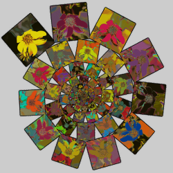
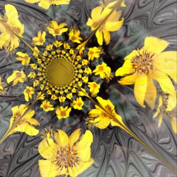
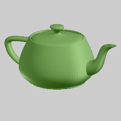
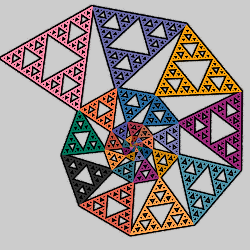
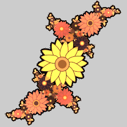
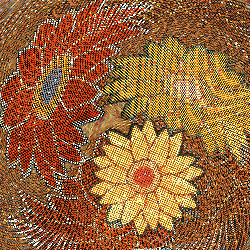
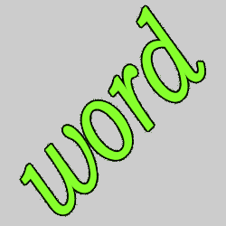

# Importers
Variations that import a flame, image, etc. from elsewhere.

## colormap_wf / post_colormap_wf
Load colors from an external image.

Type: Sets z and color  
Author: Andreas Maschke (thargor6)   
Date: 28 Feb 2012  

 

Colormap_wf sets the color of the input point from an external image, but it doesn't pass the (x,y) coordinates of the input point to the output so it can't be used on a transform by itself; at least one other variation is needed to set the output point coordinates. (The same is true of post_colormap_wf, but post_ variations always need another variation.)

One common way to use this variation is to use a transform with some shape variation such as square or primitives_wf, then add post_colormap_wf as a second variation. This will map the image onto the shape. Other transforms can then be added to turn the colored shape into a nice flame. The first example above uses this technique; the image of a flower mapped to a square is replicated using a transform with linear3D to make a spiral (coloring type CYCLIC is used to vary the colors in each copy).

Another way to use it is to add colormap_wf to a transform of an existing flame to add (often distorted) copies of the image to the flame. In the second image above, the built-in script Oily_Rev3 was used to create an oily style flame. Then colormap_wf was used to color it with a flower image.

This variation can add bump mapping based on the brightness of the image point. It is scaled by the scale_z parameter (the default is 0, so it needs to be changed to enable bump-mapping).

When used with 3D flames, set the reset_z parameter to 0 to preserve the flame z values. Orthographic projection is used to map the 2D image to the XY plane, so the colors will smear along the z-axis.  

| Parameter | Description |
| --- | --- |
| image_filename | Set the filename for the image to import. The flame is then dependent on that file existing in the same place. If you want to share the flame with others (or don't want to worry about keeping the image separate), use inlined_image instead. |
| inlined_image | Load the image from a file, then keep the image encoded in the flame. This makes it easier to share flames with others, but it also makes the flame very large. |
| image_desc_src | Can be used to store the URL of the web page containing the image, but not used by the variation |
| image_src | Can be used to store the URL of the image, but not used by the variation |
| scale_x, scale_y | Scale factors for x and y |
| scale_z | Scale factor for bump mapping, typically set to between -0.3 and 0.3; 0 to disable bump mapping |
| offset_x, offset_y | Adjust the horizontal and vertical position of the image |
| offset_z | The base level for the bump map |
| tile_x | 1 to tile the image horizontally; 0 to disable tiling |
| tile_y | 1 to tile the image vertically; 0 to disable tiling |
| reset_z | 0 to preserve the flame z values; 1 to flatten the image before bump mapping |
| dc_color | 0 to use the actual RGB image color; 1 to use a gradient color. Gradient colors are limited, so there won't be an exact match (use the "Create from image" gradient option with the same image to make it closer). The advantage of using a gradient color is that the color index gets set and can be manipulated normally by other transforms. |
| blend_colormap | 1 to blend the colormap colors; 0 to disable blending (this only makes a difference when using low resolution colormaps) |
| with_alpha | 1 to hide points that map to transparent colormap pixels; 0 to disable |
| is_sequence | 0 for a single image; 1 for a sequence of images (used for animation; image_filename must be the first image in the sequence) |
| sequence_start | Starting sequence number |
| sequence_digits | Number of digits in the sequence numbers (for example, 4 means sequence numbers are 0001, 0002, etc.) |

[Image used for above examples](flower.png)  
[Image mapping on fractal flames tutorial](http://www.andreas-maschke.de/java/jwildfire_tutorial05.pdf)  
[Texture Mapping in JWildfire Tutorial](https://www.jwfsanctuary.club/tutorial/how-to/how-to-use-texture-mapping-in-jwildfire-ex1/)  
[Understanding Colormap video](https://www.jwfsanctuary.club/tutorial/how-to/how-to-use-texture-mapping-in-jwildfire-ex1/)  

## obj_mesh_wf
Load a 3D mesh from an OBJ format file.

Type: 3D mesh  
Author: Andreas Maschke (thargor6)   
Date: 29 Nov 2016  

The OBJ object file format was developed by Wavefront Technologies but is open and supported by many 3D graphics programs. It defines the XYZ position of each vertex and the faces that make each polygon in the mesh as a list of vertices. It can optionally define UV texture map coordinates for each face, used to map a 2D image to the mesh's surface. These are used by the color and displacement map features. If the OBJ file does not include texture map coordinates, the color and displacement maps are ignored.

| Parameter | Description |
| --- | --- |
| obj_filename | The file containing the mesh; set the default path with the preference tinaMeshPath |
| colormap_filename | The file containing a color map to apply to the mesh |
| displ_map_filename | The file containing the displacement map |
| scale_x, scale_y, scale_z | Scale factors for x, y, and z |
| offset_x, offset_y, offset_z | Shift the mesh in the x, y, and z directions |
| subdiv_level | The number of levels of subdivision to perform; it must be an integer between 0 (to disable smoothing) and 6. Note each level used will dramatically increase both render time and memory needed. |
| subdiv_smooth_passes | The number of Taubin smoothing passes to apply to each subdivision level; it must be an integer between 0 and 24. |
| subdiv_smooth_lambda | The lambda value used for the first step of each pass; it should be a positive number between 0 and 1. |
| subdiv_smooth_mu | The mu value used for the second step of tach pass; it should be a negative number between 0 and -1, and is usually a bit less than -lambda). |
| blend_colormap | Whether to blend colormap colors with surrounding colors (color_mode 0 only) 0: Don't blend colors 1: Blend colors |
| displ_amount | Scaling for the displacement map; 0 to disable displacement |
| blend_displ_map | Whether to blend values from the displacement map 0: Don't blend values 1: Blend values |
| receive_only_shadows | If set to 1, and solid rendering is enabled, the mesh will be invisible but will show shadows that fall on it (hard shadows must be enabled to see any) |

[Teapot mesh](teapot.obj) used for above example.  
[Working with Mesh Objects video tutorial](https://www.youtube.com/watch?v=j470dOB4ksM)  

## subflame_wf
Use a flame as a shape.

Type: 3D blur  
Author: Andreas Maschke (thargor6)  
Date: 22 Jan 2012  

Subflame_wf includes a flame (the subflame) inside another flame (the main flame). Transforms in the main flame can manipulate the subflame, but don't affect the subflame itself.

To set the flame, select the flame parameter and click the gear icon to its right. Then delete the existing flame text and paste in the desired flame. Alternatively, select the flame_filename parameter, click the gear icon to its right, and select the file containing the desired flame.

Subflame_wf supports animation. The easiest way to include animated subflames in an animated flame is to use motion curves when preparing the subflame. An alternate method is to use the JWildfire Easy move maker to save an animated flame as a sequence of flames (select FLAMES as the output type). Then set flame_filename to the first flame in the sequence, set flame_is_sequence to 1, and set the other flame_sequence parameters.

| Parameter | Description |
| --- | --- |
| flame | The flame to import as a subflame (copy the flame to the clipboard, edit the flame parameter by clicking the gear icon, delete the existing flame, and paste the new flame) |
| flame_filename | An alternate to flame, the name of the file containing the subflame (or first flame in a sequence of flames) |
| scale | Adjust the size of the subflame |
| angle | Adjust the rotation angle of the subflame in degrees |
| offset_x, offset_y, offset_z | Adjust the position of the subflame |
| colorscale_z | Multiply the flame's gradient index by this and add to z (like [colorscale_wf](../zmanip/zmanip.md#colorscale_wf)) |
| color_mode | How to treat subflame colors: -2: True color - Use the original subflame colors -1: Ignore subflame colors (use the coloring type of the transform containing subflame_wf) 0: Direct color; use the gradient index of the subflame, but the gradient of the main flame 1: Red - set the gradient index to the amount of red in the subflame 2: Green - set the gradient index to the amount of green in the subflame 3: Blue - set the gradient index to the amount of blue in the subflame 4: Brightness - set the gradient index to the brightness of the subflame
| flame_is_sequence | 0 for a single flame, 1 for a sequence of flames (flame_filename must be set to the first file in the sequence) |
| flame_sequence_start | Starting sequence number |
| flame_sequence_end | Ending sequence number (0 for none) |
| flame_sequence_repeat | Sequence number to start repeating at after flame_sequence_end is reached |
| flame_sequence_digits | Number of digits in the sequence numbers (for example, 4 means sequence numbers are 0001, 0002, etc.) |

[Subflame tutorial](http://www.andreas-maschke.de/java/jwildfire_tutorial05.pdf)  
[Description on Fractal Formulas](https://fractalformulas.wordpress.com/flame-variations/subflame/)  
[Subflame tutorial on JWildfire Sanctuary](https://fractalformulas.wordpress.com/flame-variations/subflame/)  
[JWildfire subflame cylinder technique video](https://www.youtube.com/watch?v=PmVlSLAmi30)  

## svg_wf
Import a Scalable Vector Graphics (SVG) file.

Type: 2D blur  
Author: Andreas Maschke (thargor6)  
Date: 2 Jun 2013  

 

A Scalable Vector Graphics (SVG) file stores graphics as objects (lines, circles, etc.) instead of pixels, which allows them retain high quality when being scaled to different sizes. They can be created using programs such as Inkscape. The svg_wf variation allows using SVG graphics in flames. It works by first rendering the SVG file as a grid of dots, then returning one of the dots for each flame iteration that uses it.

| Parameter | Description |
| --- | --- |
| svg | The SVG file to use |
| antialias_radius | Controls the size of the dots returned by svg_wf; larger values make the dots larger, which can help reduce aliasing (but can also make the result blurry) |
| resolution_multiplier | Controls the resolution of the grid of dots used to render the SVG file; increase this value to reduce pixelation or aliasing; decrease it for special effects, as in the second example |
| true_color | 1: Use the colors specified in the SVG file 0: Use similar colors from the gradient |
| pre_antialias | 1: Use antialiasing when rendering the SVG graphic to a grid of dots 0: Disable this antialiasing |
| scale_x, scale_y | Adjust the horizontal and vertical scale of the graphic |
| offset_x, offset_y | Adjust the horizontal and vertical position of the graphic |

[Flower SVG](Sunflower.svg) used for the examples ([source](https://commons.wikimedia.org/wiki/File:Sunflower_clip_art.svg))
[Understanding and Creating SVG Tutorial](https://www.jwfsanctuary.club/tutorial/how-to/how-to-create-your-own-fractal-svg-files/)   

## text_wf
A line of arbitrary text

Type: 2D blur  
Author: Andreas Maschke (thargor6)  
Date: 24 Dec 2012  

| Parameter | Description |
| --- | --- |
| text | The line of text to use (line breaks are ignored) |
| font_name | The font to use, including style (bold/italic), but the size is ignored (use scale_x and scale_y) |
| font_size | The size of the grid used to rasterize the text; increase to reduce aliasing, but JWildfire can hang if it is too large; most users will want it under 1500. Small values will result in text made from dots.
| antialias | Controls the size of the dots in the raster; larger values make the dots larger, which can help reduce aliasing |
| scale_x, scale_y | Scale factors for x and y |
| offset_x, offset_y | Moves the text horizontally and vertically |
| baseline | Not used (it specifies the spacing between lines, but since the text is put on a single line, it is ignored |

[Tutorial](https://jwildfire-forum.overwhale.com/viewtopic.php?f=12&t=1308)  
[Variation information at the JWildfire Sanctuary](https://www.jwfsanctuary.club/variation-information/text_wf/)  
