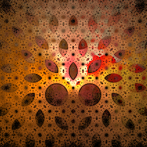
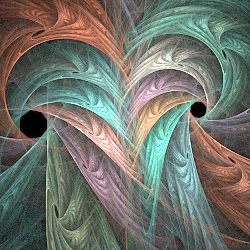

# Inversion
Variations that invert across various shapes, such as the unit circle.

## d_spherical
Combines spherical and linear.

Type: 2D  
Author: Tatyana Zabanova (tatasz)  
Date: 5 Jun 2017

| Parameter | Description |
| --- | --- |
| d_spher_weight | Weight of spherical vs linear; 0 is all linear, 1 is all spherical, 0.5 is half and half; should be between 0 and 1

[Apophysis plugin](https://www.deviantart.com/tatasz/art/Utilities-Plugin-Pack-684337906)

## inversion
Generalizes 2D circle inversion; same as spherical with the default parameters.

Type: 2D  
Author: Gregg Helt (CozyG)  
Date: 2017  

Like spherical, but adds five additional features: shapes besides the standard circle, restricted inversion, alternative p-norms, including the inversion shape and/or original points in the result, and direct coloring.

| Parameter | Description |
| --- | --- |
| scale | How much the shape is scaled; for a standard circle (shape 0), this is the radius of the inversion |
| rotation | How much the shape is rotated; 0.5 for 90°, 1 for 180°, etc. |
| shape | The shape to invert across, one of the following:  0: circle 1: ellipse 2: hyperbola 3: regular polygon 4: rhodonea 5: superellipse 6: supershape |
| imode | Restricted inversion mode: 0: standard (not restricted) 1: invert only external points (outside the shape) 2: invert only internal points (inside the shape) |
| hide_uninverted | Hide uninverted points if 1 (true) (has no effect when imode is 0) |
| a - f | Parameters to control the selected shape (depends on shape): circle: (not used) ellipse: a, b (x and y radii) hyperbola: a, b (x and y radii) regular polygon: n (number of sides) rhodonea: numerator of k, denominator of k, c superellipse: a, b, n supershape: a, b, m, n1, n2, n3 |
| ring_mode |Restrict inversion to a ring: 0: no ring restriction 1: invert only points inside the ring 2: invert only points outside the ring |
| ring_scale | Controls the size of the restriction ring. It must be something besides 1 to enable ring mode. If scale ≥ 1, set smaller than 1; smaller values increase ring size. If scale ≤ 1, set larger than 1; larger values increase ring size. |
| pnorm_point | The p-norm for the input point (2 for standard Euclidean distance) |
| pnorm_shape | The p-norm for the shape boundary point (2 for standard Euclidean distance) |
| pnorm_pmod | Modifier for the input point; it changes the width of the inversion. Smaller values make it thicker, smaller values thinner. Normally between 0 and 2. |
| pnorm_smod | Modifier for the shape boundary point; it changes the distance of the inversion from the shape. Smaller values put it further away, larger values bring it closer (possibly past the boundary). |
| draw_shape | Relative density of shape outline to the inversion, between 0 (don't draw shape at all) and 1 (draw only the shape; no inversion) |
| shape_thickness | Thickness of the drawn shape in hundreths of units. Ignored if draw_shape is 0. |
| passthrough | Allows passing through a portion of the uninverted points; passthrough is the relative density of inverted point to original points, between 0 (result contains only inverted points) and 1 (result contains only original points; no inversion) |
| guides_enabled | Not used in this version of the variation |
| color_measure | Measure to use for direct color: 0: none; don't use direct color 1: distance of destination point from boundary 2: distance of source point from boundary 3: distance between source and destination points 4: distance of destination point from standard circle inversion |
| color_gradient | How to apply direct color (not used if color_measure is 0) 1: clamp values less than color_low_threshold to the leftmost gradient color and values greater than color_high_threshold to the rightmost gradient color 2: wrap values outside the range color_low_threshold to color_high_threshold to values inside this range; the result is the same as if the gradient was repeated indefinitely to the left and right. |
| color_low_threshold | Distance value for the leftmost gradient color |
| color_high_threshold | Distance value for the rightmost gradient color |

#### Special Considerations
There are two anomalies with shape points (when draw_shape ≠ 0) and passthrough points (when passthrough ≠ 0). First, the variation amount is not used so should be set to 1 when these features are enabled. Second, they don't honor the Preserve Z setting; the workaround is to disable Preserve Z and add zscale to each transform with 2D variations.

Ring mode has some quirks. First, ring_scale must be something other than 1 for it to work, which causes a glitch when ring_mode is 1 and ring_scale is moved gradually to or from 1. Second, it doesn't work correctly for some values of scale. To ensure proper operation, set ring_scale smaller than 1 when scale ≥ 1 and larger than 1 when scale ≤ 1.

#### Links
[Inversive Diversions and Diversive Inversions paper by inversion author](http://archive.bridgesmathart.org/2017/bridges2017-467.html)   

## octagon
Divide the flame into two parts using a rounded cuboid, and invert them separately and differently; includes splits capability.

Type: 3D  
Author: TJ Anderson (FracFx)  
Date: 18 Jul 2010  

| Parameter | Description |
| --- | --- |
| x | Split amount for x |
| y | Split amount for y |
| z | Split amount for z |
| mode | Specify how to do the inverting; see below. Versions without the mode parameter use mode 1 if JWildfire, otherwise mode 0. |

When the octagon variation was added to JWildfire, there was a bug (a brace was misplaced), making the behavior different from the original variation. But the new behavior was useful, so instead of "fixing" it, a mode parameter was added to select between them. Then additional modes were added to give even more variety.

Octagon is based on two shapes, shown below. Shape A is a rounded cuboid, and shape B is a 3D version of an astroid that looks like an octahedron with concave sides.

Octagon divides the flame into two parts using one of the shapes. It then inverts the inside and outside areas separately, sometimes adding linear (like d_spherical). This is controlled by the mode parameter, as described in the following table; mode 0 operates like the original variation and mode 1 operates like the original JWildfire implementation. In addition, the inverted inside points are split as with the splits variation (with mode 1, all inverted points are split).

| Mode | Division | Inside | Outside |
| --- | --- | --- | --- |
| 0 | Shape A | Shape B + linear | Shape A |
| 1 | Shape A | Shape B + linear | Shape A + Shape B |
| 2 | Shape A | Shape B + linear | Shape A + linear |
| 3 | Shape A | Shape B | Shape A |
| 4 | Shape A | Shape A | Shape A |
| 5 | Shape B | Shape B | Shape A |
| 6 | Shape B | Shape B + linear | Shape A + linear |

[Apophysis plugin](https://www.deviantart.com/fracfx/art/FracFx-Plugin-Pack-171806681)  

## ovoid
Spherical with x and y scaling.

Type: 2D  
Author: Rob Richards (piritipany)  
Date: 21 Feb 2009  

| Parameter | Description |
| --- | --- |
| x | Scale factor for x |
| y | Scale factor for y |

[Apophysis plugin](https://www.deviantart.com/piritipany/art/Ovoid-and-Ovoid3d-Plugins-113635970)   

## ovoid3D
Spherical with x, y, and z scaling.

Type: 3D  
Author: Rob Richards (piritipany)  
Date: 21 Feb 2009  

| Parameter | Description |
| --- | --- |
| x | Scale factor for x |
| y | Scale factor for y |
| z | Scale factor for z |

[Apophysis plugin](https://www.deviantart.com/piritipany/art/Ovoid-and-Ovoid3d-Plugins-113635970)   

## spherical
Reflects the plane across the unit circle. Also post_spherical and pre_spherical.

Type: 2D  
Author: Scott Draves  
Date: Sept 2003  

[Inversion description at MathWorld](http://mathworld.wolfram.com/Inversion.html)   
[Sphericals tutorial](http://fiery-fire.deviantart.com/art/Apo-Tuto-Sphericals-146647576)   
[A guide to Spherical Fractals](http://taser-rander.deviantart.com/art/Spherical-Fractal-Tutorial-47533316)   
[Spherical/Bubble Gloss tutorial](http://fiery-fire.deviantart.com/art/Apo-Tuto-Spherical-Bubbles-127911026)   
[Spherical/Disc tutorial](http://heavenriver.deviantart.com/art/Apophysis-Spherical-Disc-Tut-181823644)   
[Spherical Jscope for the Xaos-Phobic](http://plangkye.deviantart.com/art/Tutorial-Spherical-Jscope-for-the-Xaos-Phobic-362538919)   
[Apophysis Swirl tutorial](https://web.archive.org/web/20150504015835/http://mfcreative.co.uk/apophysisswirltutorial/) (Wayback Machine)   
[Spherical Plants tutorial](http://c-91.deviantart.com/art/Spherical-Plants-Apophysis-Tutorial-347919168)   
[Understanding Spherical Variations](https://www.deviantart.com/universalkinase/art/Understanding-Spherical-Transforms-Apophysis-Tut-506110933)   
[Inverting Things with Spherical](http://tatasz.deviantart.com/art/Inverting-Things-with-Spherical-570650125)   
[Spherical variation information at JWildfire Sanctuary](https://www.jwfsanctuary.club/variation-information/spherical/)   

## spherical3D
A 3D version of spherical

Type: 3D  
Author: Chris Johns (TyrantWave)  
Date: 24 Dec 2008  

[Apophysis plugin](https://www.deviantart.com/tyrantwave/art/Spherical3D-Plugin-107283662)   
[Xenophilia tutorial](http://alien-dreams.deviantart.com/art/Xenophilia-Tutorial-264350378)   
[Apophysis 3D Baseforms pack](http://tyrantwave.deviantart.com/art/Apophysis-3D-Baseforms-Pack-113871861)   

## spherical3D_wf
Another 3D version of spherical

Type: 3D  
Author: Andreas Maschke (thargor6)  
Date 7 Mar 2012  

| Parameter | Description |
| --- | --- |
| invert |   |
| exponent |  |
