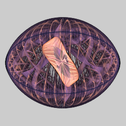
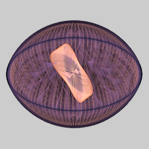
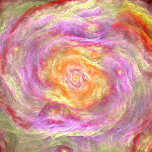
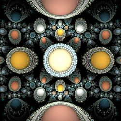
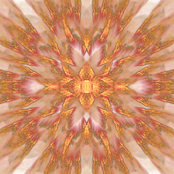

# Julia
Variations based on polynomial Julia sets. For escape time fractals, the formula is $z → z^n + c$. For flames, the mapping is reversed and the $+c$ part is done by the affine transform, so these variations basically take the root of the input taken as a complex number, returning one of the results at random.

## eJulia
Polynomial Julia sets in elliptic coordinates

Type: 2D
Author: Michael Faber
Date: 24 Jun 2012

| Parameter | Description |
| --- | --- |
| power | The power for the polynomial; 2 for quadratic. Must be an integer. Negative values are allowed and return the reciprocal. |

https://www.deviantart.com/michaelfaber/art/eSeries-306044892  
http://platinus.deviantart.com/art/eJuliaTut-310065706  

## julia
Classic quadratic Julia set (obsolete; use julian with power=2).

Type: 2D  
Author: Scott Draves  
Date: 1 Feb 2004  

The original Julia implementation, it has a bug: it swaps x and y. This was never fixed because doing so would break earlier flames. The workaround is to use julian with power set to 2.

## julia3D
Classic polynomial Julia set with 3D extrusion.

Type: 3D  
Author: Joel Faber  

| Parameter | Description |
| --- | --- |
| power | The power for the polynomial; 2 for quadratic. Must be an integer. Negative values are allowed and return the reciprocal. |

## julia3Dq
Julia set using a rational power with 3D extrusion. Also post_julia3Dq.

Type: 3D  
Author: Peter Sdobnov (Zueuk)  
Date: 2 Dec 2012

| Parameter | Description |
| --- | --- |
| power | The numerator of the polynomial power. Must be an integer. Negative values are allowed and return the reciprocal. |
| divisor | The denominator of the polynomial power. |

https://www.deviantart.com/zueuk/art/juliaq-Apophysis-plugins-340813357

## julia3Dz
Classic polynomial Julia set with 3D extrusion.

Type: 3D  

| Parameter | Description |
| --- | --- |
| power | The power for the polynomial; 2 for quadratic. Must be an integer. Negative values are allowed and return the reciprocal. |

## juliac
Julia set using a complex power.

Type: 2D  
Author: David Young (Sc0t0ma)  
Date: 9 Sep 2008  

| Parameter | Description |
| --- | --- |
| re | The real part of the complex power. Negative values are allowed and return the reciprocal. |
| im | The imaginary part of the complex power. |
| dist | Distortion factor; increase to stretch the result and help fill in the hole normally left in the middle. Negative values do an inversion (aka spherical). |

https://www.deviantart.com/sc0t0ma/art/Juliac-97512904  

## julian
Classic polynomial Julia set

Type: 2D  
Author: Scott Draves  
Date: 15 Apr 2006  

 

| Parameter | Description |
| --- | --- |
| power | The power for the polynomial; 2 for quadratic. Must be an integer. Negative values are allowed and return the reciprocal. |
| dist | Distortion factor; increase to stretch the result and help fill in the hole normally left in the middle. Negative values do an inversion (aka spherical). |

https://www.jwfsanctuary.club/variation-information/julian/  
http://fiery-fire.deviantart.com/journal/JULIANS-Fractal-Styles-216748198  
http://jp-talma.deviantart.com/art/JP-Talmq-Apophysis-Tutorial-5-309109720  
http://clairejones.deviantart.com/art/Julia-Uncovered-v-2-2-49167519  
http://nemopaice.deviantart.com/art/Julian-Tutorial-By-nemopaice-36434472  
https://www.deviantart.com/apophysis/art/Julian-Tutorial-Log-50944789  
http://fiery-fire.deviantart.com/art/Apo-Spiked-3D-Julian-tuto-130523681  
http://www.mfcreative.co.uk/julianringstutorial/  
http://lindelokse.deviantart.com/art/LazyJulian-Apophysis-Tutorial-169056797  
http://clairejones.deviantart.com/art/The-Rings2-and-Julian-Guide-62854687  
http://cygx1.deviantart.com/art/Wire-Tube-Fractals-Tutorial-39470081  
http://tyrantwave.deviantart.com/art/Apophysis-3D-Baseforms-Pack-113871861  
http://tyrantwave.deviantart.com/art/Apophysis-Base-Forms-Pack-103671251  
http://cosmic-cuttlefish.deviantart.com/art/Tutorial-Fractal-Stars-315456570   
https://chronologicaldot.wordpress.com/2014/04/05/how-julia-transforms-work/  
https://www.deviantart.com/meckie/art/Simple-3D-Julian-and-DOF-Tut-77364026  

## julian2
Julian with an integrated affine transform. Also post_julian2.

Type: 2D  
Author: Georg Kiehne (xyrus02)  
Date: 11 Sep 2009

| Parameter | Description |
| --- | --- |
| power | The power for the polynomial; 2 for quadratic. Must be an integer. Negative values are allowed and return the reciprocal. |
| dist | Distortion factor; increase to stretch the result and help fill in the hole normally left in the middle. Negative values do an inversion (aka spherical). |
| a - f | Affine coefficients: $(x,y) → (ax+by+e, cx+dy+f)$ |

https://xyrus02.deviantart.com/art/JuliaN2-Plugin-for-Apophysis-136717838 (Defunct)

## julian3Dx
Julian2 with 3D wave effect

Type: 3D  
Author: Georg Kiehne (xyrus02)  
Date: 21 May 2014  

| Parameter | Description |
| --- | --- |
| power | The power for the polynomial; 2 for quadratic. Must be an integer. Negative values are allowed and return the reciprocal. |
| dist | Distortion factor; increase to stretch the result and help fill in the hole normally left in the middle. Negative values do an inversion (aka spherical). |
| a - f | Affine coefficients: $(x,y) → (ax+by+e, cx+dy+f)$ |

http://xyrus-02.deviantart.com/art/julian3Dx-Plugin-for-Apophysis-455502519 (Defunct)

## juliaq
Julia set using a rational power. Also post_juliaq.

Type: 2D  
Author: Peter Sdobnov (Zueuk)  
Date: 2 Dec 2012

| Parameter | Description |
| --- | --- |
| power | The numerator of the polynomial power. Must be an integer. Negative values are allowed and return the reciprocal. |
| divisor | The denominator of the polynomial power. |

https://www.deviantart.com/zueuk/art/juliaq-Apophysis-plugins-340813357

## phoenix_julia
Julian with extra distortion parameters.

Type: 2D  
Author: Chris Johns (TyrantWave)
Date: 2 May 2009

| Parameter | Description |
| --- | --- |
| power | The power for the polynomial; 2 for quadratic. Non-integer values are allowed. Negative values are allowed and return the reciprocal. |
| dist | Distortion factor; increase to stretch the result and help fill in the hole normally left in the middle. Negative values do an inversion (aka spherical). |
| x_distort | Distortion factor for x. |
| y_distort | Distortion factor for y. |

https://www.deviantart.com/tyrantwave/art/PhoenixJulia-Apophysis-Plugin-121246658  
