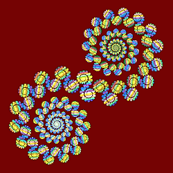

# Linear
Variations that just copy the input, some with minor modification.

## bi_linear
Swap x and y.

Type: 2D   
Author: Shortgreenpigg   
Date: 16 Nov 2010   

[Apophysis plugin](https://www.deviantart.com/shortgreenpigg/art/Bi-Linear-Plugin-186437236)   

## dc_linear
Direct color version of linear3D.

Type: 3D  
Author: Georg Kiehne (xyrus02)  
Date: 30 Jun 2010

 

| Parameter | Description |
| --- | --- |
| offset | Amount to shift gradient |
| angle | Gradient rotation in radians |
| scale | Gradient scale factor |

[Archive of Apophysis plugin](https://web.archive.org/web/20120819054425/https://xyrus02.deviantart.com/art/DirectColoring-plugins-for-7x-169594950) (Wayback Machine)     

## linear
Copy the input (x and y only)

Type: 2D  
Author: Scott Draves  
Date: Sept 2003  

In Apophysis 7X15C and later, linear is actually linear3D. In JWildfire, linear is the same as linear3D when Preserve Z is set.

[Linear Tutorial lesson 1](http://cmptrwhz.deviantart.com/art/Linear-Tutorial-lesson-1-144094046) (spirals)  
[Linear Tutorial lesson 2](http://cmptrwhz.deviantart.com/art/Linear-Tutorial-lesson-2-144188770) (tiling)   
[Painting a Fractal](http://chaosfissure.deviantart.com/art/Painting-a-Fractal-Part-1-291811936)   
[Pythagoras Trees tutorial](http://ideviant.deviantart.com/art/Pythagoras-trees-156363182)   
[Linear Tile Tutorial](http://tatasz.deviantart.com/art/Linear-Tile-Tutorial-357305585)   
[Tiles Tutorial](http://fiery-fire.deviantart.com/art/Apo-Tiles-Tuto-136679008)   
[Developing a Linear Fractal](https://www.deviantart.com/physivic/art/Developing-a-Linear-Fractal-106935198)   
[Learning Apophysis - Tiling](http://learningapophysis.wordpress.com/2011/10/22/tiling/)   
[Linear Triangles tutorial](http://chaosfissure.deviantart.com/art/Apophysis-Linear-Triangles-343705290)   
[Apophysis Base Forms Pack](http://tyrantwave.deviantart.com/art/Apophysis-Base-Forms-Pack-103671251)   
[Description at Fractal Formulas](https://fractalformulas.wordpress.com/flame-variations/linear-and-linear3d/)   
[Linear variation information at the JWildfire Sanctuary](https://www.jwfsanctuary.club/variation-information/linear/)   

## linear3D
Copy the input (x, y, and z).

Type: 3D  
Author: Georg Kiehne (xyrus02)  
Date: Oct 2007  

Chaotica is only 2D, but supports linear3D for compatibility.

See links under linear above.

## linearT
Tweak of linear, adding an exponent for x and y.

Type: 2D  
Author: FractalDesire  
Date: 28 Mar 2011  

Parameter values between 0 and 2 make the most sense. Same as linear when both are 1.

| Parameter | Description |
| --- | --- |
| powX | Exponent for x |
| powY | Exponent for y |

[Apophysis plugin](https://www.deviantart.com/fractaldesire/art/linearT-plugin-202668974)   

## linearT3D
Tweak of linear3D, adding an exponent for x, y, and z.

Type: 3D  
Author: FractalDesire  
Date: 28 Mar 2011  

Parameter values between 0 and 2 make the most sense. Same as linear3D when all are 1.

| Parameter | Description |
| --- | --- |
| powX | Exponent for x |
| powY | Exponent for y |
| powZ | Exponent for z |

[Apophysis plugin](https://www.deviantart.com/fractaldesire/art/linearT-plugin-202668974)   
