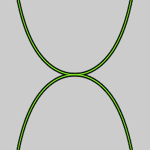
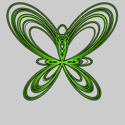
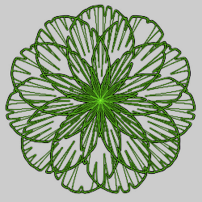
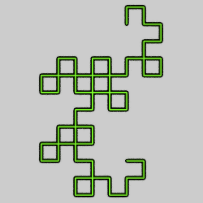
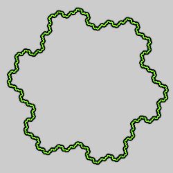
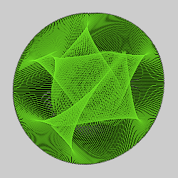
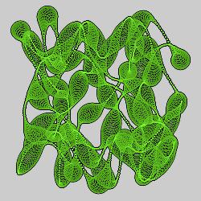
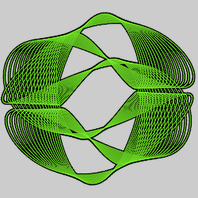
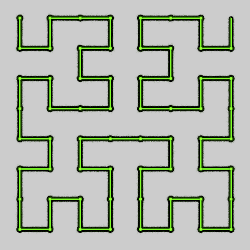

# Line Shapes
Shape variations made from lines. Like all shape variations, they ignore the input. Some are generated using parametric equations. Other use algorithmic techniques.

## arch
A double arch.

Type: 2D blur  
Author: Antonio Intrieri (gygrazok)  
Date: 9 Feb 2007  

The variation amount controls the extent of the arches. Use 2 for a full double arch; 1 gives the right half.

## butterfly_fay
A butterfly shaped curve discovered by Temple H Fay in 1989.

Type: 2D blur  
Author: Gregg Helt (cozyg)  
Date: 24 May 2015  

| Parameter | Description |
| --- | --- |
| offset | Value added to ρ (the distance from the origin) for each point; it expands some parts of the curve while contracting others (the points where ρ is negative) |
| unified_inner_outer | Whether "inner" and "outer" points should be treated the same: 0: Treat inner and outer points separately 1: Treat all points as outer points (inner parameters will have no effect) |
| outer_mode | Spread mode for outer points; 0 for no spread (outer_spread is ignored); 1, 2, 3, 4, or 5 for different spread effects |
| inner_mode | Spread mode for inner points; 0 for no spread (inner_spread is ignored); 1, 2, 3, 4, or 5 for different spread effects |
| outer_spread | Amount of spread for outer points (all points if unified_inner_outer is 1) |
| inner_spread | Amount of spread for inner points (ignored if unified_inner_outer is 1) |
| outer_spread_ratio | Ratio of horizontal to vertical spreading for outer points; 1 to spread evenly both directions |
| inner_spread_ratio | Ratio of horizontal to vertical spreading for inner points; 1 to spread evenly both directions |
| spread_split | Adjusts the threshold for distinguishing outer and inner points. For some modes, it also changes the spread. |
| cycles | Number of cycles to plot; 0 to calculate automatically |
| fill | Amount of fill to add; 0 for none |

[Wikipedia description](https://en.wikipedia.org/wiki/Butterfly_curve_%28transcendental%29)  
[Mathworld description](https://mathworld.wolfram.com/ButterflyCurve.html)  
[Description and examples by Paul Bourke](http://paulbourke.net/geometry/butterfly/)  

## chrysanthemum
Chrysanthemum flower shaped curve.

Type: 2D blur  
Author: Jesus Sosa  
Date: 1 Feb 2018  

[Description and examples by Paul Bourke](http://paulbourke.net/geometry/chrysanthemum/)  

## dragon_js
Draws a Heighway dragon curve.

Type: 2D blur  
Author: Jesus Sosa  
Date: 17 Oct 2017  

| Parameter | Description |
| --- | --- |
| level | The number of levels to draw; higher values make more complex curves |
| line_thickness | Thickness of the lines |

[Wikipedia description](https://en.wikipedia.org/wiki/Dragon_curve)  

## gosper_js
Draws a Gosper island curve, also known as a flowsnake.

Type: 2D blur  
Author: Jesus Sosa  
Date: 17 Oct 2017  

| Parameter | Description |
| --- | --- |
| level | The number of levels to draw; higher values make more complex curves |
| line_thickness | Thickness of the lines |

[Wolfram MathWorld description](https://mathworld.wolfram.com/GosperIsland.html)  

## hamid_js
Figures made from lines and circles based on works by Iranian mathematician Hamid Naderi Yeganeh.

Type: 2D blur  
Author: Jesus Sosa  
Date: 29 Mar 2018  

 

| Parameter | Description |
| --- | --- |
| presetId | The type of figure to draw; 0-9 use lines and 10-19 use circles |
| number_lines/circles | The number of lines or circles to draw in the figure |
| filled circles | 1 for filled circles, 0 for outlines (only applies to figures made from circles) |
| a-p | Parameters that change the appearance of the figure, depending on the preset (not all presets use all of the parameters) |

[Mathematical Concepts Illustrated by Hamid Naderi Yeganeh](http://www.ams.org/publicoutreach/math-imagery/yeganeh)  

## harmonograph_js
Figures that might be made from a swinging pendulum on a harmonograph.

Type: 2D blur  
Author: Jesus Sosa  
Date: 8 Dec 2018  

There are many types of harmonium devices. This variation uses four independent oscillators: 1 and 2 control *x*; 3 and 4 control *y*.

| Parameter | Description |
| --- | --- |
| seed | The seed for generating random values for the other parameters; change the seed to generate new values (but the new values, although changed, don't appear immediately; you need to go to another transform and come back to see the new values) |
| time | The amount of "time" to run the harmonium; larger values create more loops, as if the harmonium was run for a longer time |
| a1, a2, a3, a4 | The amplitudes for oscillators 1, 2, 3, and 4; set to 0 to disable a specific oscillator |
| f1, f2, f3, f4 | The frequencies of oscillators 1, 2, 3, and 4 |
| p1, p2, p3, p4 | The phases of oscillators 1, 2, 3, and 4, in degrees |
| d1, d2, d3, d4 | The damping factors of oscillators 1, 2, 3, and 4; typically very small: 0 to disable damping positive for normal damping (amplitude diminishes over time) negative for reverse damping (amplitude increases over time) |

[Wikipedia description](https://en.wikipedia.org/wiki/Harmonograph)  
[Harmonographs: A Subtle Artform](https://www.instructables.com/Harmonographs-a-Subtle-Artform/)  
[Author's description in the JWildfire forum](https://jwildfire-forum.overwhale.com/viewtopic.php?f=23&t=2569)  

## hilbert_js
Draws a Hilbert curve, a fractal space-filling curve.

Type: 2D blur  
Author: Jesus Sosa  
Date: 21 Dec 2017  

| Parameter | Description |
| --- | --- |
| level | The number of levels to draw; higher values make more complex curves |
| show_lines | 1 to show the lines; 0 to hide them |
| line_thickness | Thickness of the lines (if shown) |
| show_points | 1 to show endpoints of the lines; 0 to hide them |
| point_thickness | Thickness of the points (if shown) |

[Wikipedia description](https://en.wikipedia.org/wiki/Hilbert_curve)  

## Z_arch
A double arch.

Type: 2D blur  
Author: Antonio Intrieri (gygrazok) and Gregory Zitelli (cothe)  
Date: 1 Aug 2007  

Z_arch is just like arch, except that it uses a parameter to control the arch extant instead of the variation amount.

| Parameter | Description |
| --- | --- |
| weight | The extent of the arches; 2 for a full double arch; 1 gives the right half |
