# Line Shapes
Shape variations made from lines. Like all shape variations, they ignore the input. Some are generated using parametric equations. Others use algorithmic techniques.

## arch
A double arch.

Type: 2D blur  
Author: Antonio Intrieri (gygrazok)  
Date: 9 Feb 2007  

The variation amount controls the extent of the arches. Use 2 for a full double arch; 1 gives the right half.

## butterfly_fay
A butterfly shaped curve discovered by Temple H Fay in 1989.

Type: 2D blur  
Author: Gregg Helt (cozyg)  
Date: 24 May 2015  

| Parameter | Description |
| --- | --- |
| offset | Value added to ρ (the distance from the origin) for each point; it expands some parts of the curve while contracting others (the points where ρ is negative) |
| unified_inner_outer | Whether "inner" and "outer" points should be treated the same: 0: Treat inner and outer points separately 1: Treat all points as outer points (inner parameters will have no effect) |
| outer_mode | Spread mode for outer points; 0 for no spread (outer_spread is ignored); 1, 2, 3, 4, or 5 for different spread effects |
| inner_mode | Spread mode for inner points; 0 for no spread (inner_spread is ignored); 1, 2, 3, 4, or 5 for different spread effects |
| outer_spread | Amount of spread for outer points (all points if unified_inner_outer is 1) |
| inner_spread | Amount of spread for inner points (ignored if unified_inner_outer is 1) |
| outer_spread_ratio | Ratio of horizontal to vertical spreading for outer points; 1 to spread evenly both directions |
| inner_spread_ratio | Ratio of horizontal to vertical spreading for inner points; 1 to spread evenly both directions |
| spread_split | Adjusts the threshold for distinguishing outer and inner points. For some modes, it also changes the spread. |
| cycles | Number of cycles to plot; 0 to calculate automatically |
| fill | Amount of fill to add; 0 for none |

[Wikipedia description](https://en.wikipedia.org/wiki/Butterfly_curve_%28transcendental%29)  
[Mathworld description](https://mathworld.wolfram.com/ButterflyCurve.html)  
[Description and examples by Paul Bourke](http://paulbourke.net/geometry/butterfly/)  

## chrysanthemum
Chrysanthemum flower shaped curve.

Type: 2D blur  
Author: Jesus Sosa  
Date: 1 Feb 2018  

[Description and examples by Paul Bourke](http://paulbourke.net/geometry/chrysanthemum/)  

## dragon_js
Draws a Heighway dragon curve.

Type: 2D blur  
Author: Jesus Sosa  
Date: 17 Oct 2017  

| Parameter | Description |
| --- | --- |
| level | The number of levels to draw; higher values make more complex curves |
| line_thickness | Thickness of the lines |

[Wikipedia description](https://en.wikipedia.org/wiki/Dragon_curve)  

## gosper_js
Draws a Gosper island curve, also known as a flowsnake.

Type: 2D blur  
Author: Jesus Sosa  
Date: 17 Oct 2017  

| Parameter | Description |
| --- | --- |
| level | The number of levels to draw; higher values make more complex curves |
| line_thickness | Thickness of the lines |

[Wolfram MathWorld description](https://mathworld.wolfram.com/GosperIsland.html)  

## hamid_js
Figures made from lines and circles based on works by Iranian mathematician Hamid Naderi Yeganeh.

Type: 2D blur  
Author: Jesus Sosa  
Date: 29 Mar 2018  

 

| Parameter | Description |
| --- | --- |
| presetId | The type of figure to draw; 0-9 use lines and 10-19 use circles ([pdf index](hamid-presets.pdf)) |
| number_lines/circles | The number of lines or circles to draw in the figure |
| filled circles | 1 for filled circles, 0 for outlines (only applies to figures made from circles) |
| a-p | Parameters that change the appearance of the figure, depending on the preset (not all presets use all of the parameters) |

[Mathematical Concepts Illustrated by Hamid Naderi Yeganeh](http://www.ams.org/publicoutreach/math-imagery/yeganeh)  

## harmonograph_js
Figures that might be made from a swinging pendulum on a harmonograph.

Type: 2D blur  
Author: Jesus Sosa  
Date: 8 Dec 2018  

There are many types of harmonograph devices. This variation uses four independent oscillators: 1 and 2 control *x*; 3 and 4 control *y*.

| Parameter | Description |
| --- | --- |
| seed | The seed for generating random values for the other parameters; change the seed to generate new values (but the new values, although changed, don't appear immediately; you need to go to another transform and come back to see the new values) |
| time | The amount of "time" to run the harmonograph; larger values create more loops, as if the harmonograph was run for a longer time |
| a1, a2, a3, a4 | The amplitudes for oscillators 1, 2, 3, and 4; set to 0 to disable a specific oscillator |
| f1, f2, f3, f4 | The frequencies of oscillators 1, 2, 3, and 4 |
| p1, p2, p3, p4 | The phases of oscillators 1, 2, 3, and 4, in degrees |
| d1, d2, d3, d4 | The damping factors of oscillators 1, 2, 3, and 4; typically very small: 0 to disable damping positive for normal damping (amplitude diminishes over time) negative for reverse damping (amplitude increases over time) |

[Wikipedia description](https://en.wikipedia.org/wiki/Harmonograph)  
[Harmonographs: A Subtle Artform](https://www.instructables.com/Harmonographs-a-Subtle-Artform/)  
[Author's description in the JWildfire forum](https://jwildfire-forum.overwhale.com/viewtopic.php?f=23&t=2569)  

## hilbert_js
Draws a Hilbert curve, a fractal space-filling curve.

Type: 2D blur  
Author: Jesus Sosa  
Date: 21 Dec 2017  

| Parameter | Description |
| --- | --- |
| level | The number of levels to draw; higher values make more complex curves |
| show_lines | 1 to show the lines; 0 to hide them |
| line_thickness | Thickness of the lines (if shown) |
| show_points | 1 to show endpoints of the lines; 0 to hide them |
| point_thickness | Thickness of the points (if shown) |

[Wikipedia description](https://en.wikipedia.org/wiki/Hilbert_curve)  

## htree_js
Draws an H-tree (made from lines in the shape of the letter H).

Type: 2D blur  
Author: Jesus Sosa  
Date: 17 Oct 2017  

[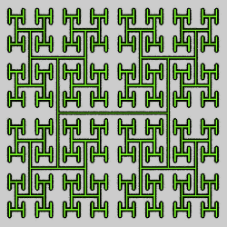](htree_js-1.flame)

| Parameter | Description |
| --- | --- |
| level | The number of levels to draw; higher values make more intricate shapes |
| size | Sets the size of the H-tree |
| show_lines | 1 to show the lines; 0 to hide them |
| line_thickness | Thickness of the lines (if shown) |
| show_points | 1 to show endpoints of the lines; 0 to hide them |
| point_thickness | Thickness of the points (if shown) |

[Wikipedia description](https://en.wikipedia.org/wiki/H_tree)  

## koch_js
Draws a Koch curve.

Type: 2D blur  
Author: Jesus Sosa  
Date: 17 Oct 2017  

[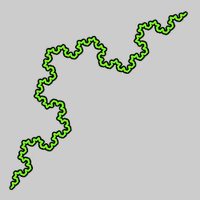](koch_js-1.flame)

| Parameter | Description |
| --- | --- |
| level | The number of levels to draw; higher values make more complex curves |
| show_lines | 1 to show the lines; 0 to hide them |
| line_thickness | Thickness of the lines (if shown) |
| show_points | 1 to show points at the corners of each square; 0 to hide them |
| point_thickness | Thickness of the points (if shown) |

[Larry Riddle's Koch Curve page](https://larryriddle.agnesscott.org/ifs/kcurve/kcurve.htm)  

## line
A straight line.

Type: 3D blur  
Author: Nic Anderson (chronologicaldot)  
Date: 5 Mar 2014  

[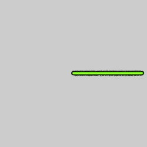](line-1.flame)

A line that starts at the origin with a length specified by the variation amount. The direction is determined by the parameters.

| Parameter | Description |
| --- | --- |
| delta | The angle of the line in the XY plane; 0 is positive x, 0.5 is positive y (down), -0.5 is negative y (up), 1 or -1 is negative x |
| phi | The angle of the line in the XZ plane; 0 is positive x, 0.5 is positive z, -0.5 is negative z, 1 or -1 is negative x |

## lissajous
A Lissajous curve (named for Jules-Antoine Lissajous, who studied them).

Type: 2D blur  
Author: Jed Kelsey (Lu-Kout)  
Date: 16 Jul 2007  

[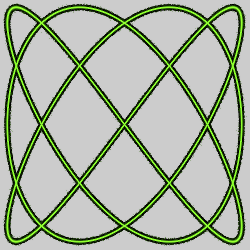](lissajous-1.flame) [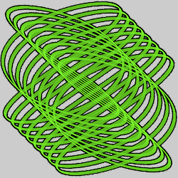](lissajous-2.flame)

| Parameter | Description |
| --- | --- |
| tmin, tmax | The minimum and maximum values for the parametric equation parameter, which determines the endpoints for the curve; typically -π to +π |
| a, b | The frequencies of the x and y components; the shape of the curve is determined by their ratio. They are normally integers, but this is not required. |
| c | The amount of diagonal movement, 0 for a standard Lissajous curve; set to a small amount and increase the range of tmin to tmax to repeat the curve along the diagonal |
| d | The phase difference between the x and y frequencies, in radians, between -π and π; the most common values are 0 and π/2 (1.5708) |
| e | The thickness of the line used to draw the curve; 0 for a line |

[Apophysis plugin](https://www.deviantart.com/lu-kout/art/Apophysis-Plugin-Pack-1-v0-4-59907275)
[Description at Fractal Formulas](https://fractalformulas.wordpress.com/flame-variations/lissajous/)  
[MathWorld description](https://mathworld.wolfram.com/LissajousCurve.html)  
[Wikipedia description](https://en.wikipedia.org/wiki/Lissajous_curve)  
[Mathcurve description](https://mathcurve.com/courbes2d.gb/lissajous/lissajous.shtml)  

## rsquares_js
Draws a pattern of recursively placed squares.

Type: 2D blur  
Author: Jesus Sosa  
Date: 17 Oct 2017  

[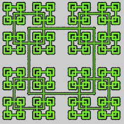](rsquares_js-1.flame)

| Parameter | Description |
| --- | --- |
| level | The number of levels to draw; higher values make more complex curves |
| show_lines | 1 to show the lines; 0 to hide them |
| line_thickness | Thickness of the lines (if shown) |
| show_points | 1 to show points at the corners of each square; 0 to hide them |
| point_thickness | Thickness of the points (if shown) |

## spirograph
A Spirograph figure (epitrochoid or hypotrochoid).

Type: 2D blur  
Author: Jed Kelsey (Lu-Kout)  
Date: 16 Jul 2007  

[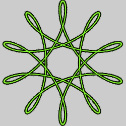](spirograph-1.flame) [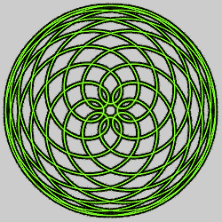](spirograph-2.flame) [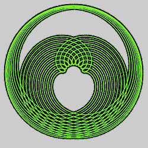](spirograph-3.flame)

The Spirograph toy has a plastic gear with multiple holes for a pen that is rotated around either the outside of another fixed disc or the inside of a fixed ring. Mathematically, the figures are called, respectively, epitrochoids or hypotrochoids. [Samples (pdf)](spirograph-samples.pdf).

| Parameter | Description |
| --- | --- |
| a | The radius of the fixed disk, which should be positive and relatively small (the default value of 3 is much too large); as a rule of thumb, the sum of a and b should be around 1 |
| b | The radius of the rotating disk; make it positive for an epitrochoid (rotating around the outside of the fixed disk) or negative for a hypotrochoid (rotating around the inside). It is typically smaller than a (the default value of 2 is too large) and must not be 0.
| c1, c2 | These are normally equal and positive, representing the distance from the center of the rotating disk where the pen is located; they may be different to achieve special effects (the default values of 0 will result in a circle) |
| d | Normally set to 0 (the default); other values modify the figure, but not in a way that creates something new which can't be obtained by modifying the other parameters |
| tmin, tmax | The minimum and maximum values for t, the parametric equation parameter; reasonable values are 0 and 1000 (the default values of -1 and 1 do not give it enough range) |
| ymin, ymax | Control the line thickness; set both to 0 for a normal line, or set ymin to a very small negative value (like -0.01) and ymax to the corresponding positive value for a ribbon effect (the default values of -1 and 1 result in a very thick line) |

[Apophysis plugin](https://www.deviantart.com/lu-kout/art/Apophysis-Plugin-Pack-1-v0-4-59907275)
[Description at Fractal Formulas](https://fractalformulas.wordpress.com/flame-variations/spirograph/)  
[Wikipedia description](https://en.wikipedia.org/wiki/Spirograph)  
[Spirograph Tutorial](https://www.deviantart.com/esintu/art/Spirograph-Tutorial-60652570)  
[Floral Celebration Tutorial](https://www.deviantart.com/lightaesthetic/art/Floral-Celebration-Tutorial-60857715)  
[JWildfire Blue Stew or Julian Meets Spirograph Tutorial](https://www.dropbox.com/sh/bt7se699hhfcx8v/AAAR4i1BvGsG7ecRyAzu6WXMa/JWILDFIRE%20BLUE%20STEW%20OR%20JULIA%20N%20MEETS%20SPIROGRAPH%20TUTORIAL.pdf?dl=0)

There is also a different [Apophysis plugin](https://www.deviantart.com/rosros-3/art/Spirograph-391696676) named spirograph, but it doesn't seem to work correctly (I think the formulas get sin and cos confused).

## spirograph3D
A 3D Spirograph figure.

Type: 3D blur  
Author: Rick Sidwell  
Date: 19 Jun 2017  

[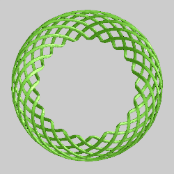](spirograph3D-1.flame) [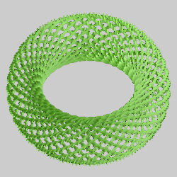](spirograph3D-2.flame)

| Parameter | Description |
| --- | --- |
| a | Size of the fixed circle |
| b | Size of the moving circle that goes around the fixed circle; positive to go around the outside (making an epitrochoid) or negative to go around the inside (making a hypotrochoid) |
| c | Distance from the center of the moving circle where the "pen" goes |
| width | Pen width; keep it small (like 0.03) |
| mode | Pen mode; only effect if pen width is not 0 0: ribbon 1: twisted ribbon 2: wire 3: gaussian 4: double pen (two lines width apart) |
| direct_color | 0 for normal, 1 to use direct color |

## tree_js
Draws a fractal tree.

Type: 2D blur  
Author: Jesus Sosa  
Date: 17 Oct 2017  

[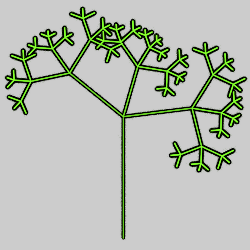](tree_js-1.flame)

| Parameter | Description |
| --- | --- |
| level | The number of levels to draw; higher values make more intricate shapes |
| show_lines | 1 to show the lines; 0 to hide them |
| line_thickness | Thickness of the lines (if shown) |
| bend_angle | Bend angle for the tree, clockwise in degrees |
| branch_angle | Branch angle, in degrees |
| branch_ratio | Ratio of the side branches to the main branch; 0.5 to make them equal |
| show_points | 1 to show endpoints of the lines; 0 to hide them |
| point_thickness | Thickness of the points (if shown) |

## Z_arch
A double arch.

Type: 2D blur  
Author: Antonio Intrieri (gygrazok) and Gregory Zitelli (cothe)  
Date: 1 Aug 2007  

Z_arch is just like arch, except that it uses a parameter to control the arch extant instead of the variation amount.

| Parameter | Description |
| --- | --- |
| weight | The extent of the arches; 2 for a full double arch; 1 gives the right half |
