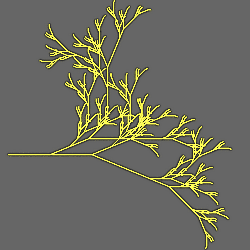

# L-Systems

Variations that use L-Systems to generate shapes. These are all "blur" variations that ignore their input and just generate a random point on the shape for each iteration.

An L-System or Lindenmayer System uses a string rewriting framework to create organic and fractal patterns. It uses a two step process:

Step 1: Starting with an initial string or characters, the "axiom", the system uses a set of rules to iteratively rewrite the characters to create a new string. In each iteration, each character in the string is replace with a new sequence of characters defined by the rules. This is the L-System proper; it only creates a string without interpreting it.

Step 2: The resulting string is interpreted graphically, most commonly using a turtle graphics paradigm, where the characters are commands that tell a pen-weilding robotic turtle how to move across a sheet of paper. (The 3D version is harder to visualize, but works the same way.)

There is no single standard for the formats of the L-System rules or turtle commands, so pay close attention to their definitions in each particular variation. Many L-Systems can be reformulated as Iterated Function Systems; these variations don't attempt that; they just iterate the rules on the axiom and interpret the result graphically.

[Wikipedia entry for L-System](https://en.wikipedia.org/wiki/L-system)  
[L-System description and examples by Paul Bourke](http://paulbourke.net/fractals/lsys/)  

## lsystem_js
Create a two dimensional shape using an L-System. Compatible with the Fractint L-System type. See general description above.

Type: 2D blur  
Author: Jesus Sosa  
Date: 31 Oct 2017  

[](lsystem-1.flame)

To prevent accidentally hanging JWildfire, the length of the string generated by the L-System is limited to 25,000 characters. This can be changed with the preference tinaLSystemMaxLength if more intricate patterns are needed.

### Grammar
The L-System grammar specified by the grammar parameter has the following format (this is the default grammar for the variation):
```
  ADH155 {    ; Anthony Hanmer 2000, Cesaro variation
    Angle 45  ; The angle increment in degrees
    Axiom f   ; The starting character string
    f=f++++++++++f--------------------f++++++++++f
  }
```

Text after a semicolon is ignored, allowing comments to be specified. The grammar begins with name of the L-System and the definition is enclosed in curly braces. The Angle keyword specifies the default angle (this may be overridden with the angle parameter). The Axiom keyword specifies the starting string; it is one character in this example, but may be multiple characters if desired.

Rules are specified in the format "c=string", and convert the single character 'c' into "string".

### Drawing Commands
After the axiom is iterated a number of times to produce the final string, that string is used to control the turtle. Each character in the string is a command. Case is ignored, so either 'F' or 'f' can be used to draw forward. Unlisted characters are ignored for drawing, but may be used by the grammar to create more complex strings. Some commands take a numeric argument, shown with "##". This may be any unsigned number; fractions must start with '0' so, for example, use "@0.5", not "@.5".

| Character | Description |
| --- | --- |
| C## | Set color to ## (gradient index 0-255) |
| D | Draw forward |
| F | Draw forward |
| G | Move forward (without drawing) |
| M | Move forward |
| + | Rotate the turtle left (counterclockwise) |
| - | Rotate the turtle right (clockwise) |
| \| | Turn around (rotate 180°) |
| ! | Reverse directions (makes '+' rotate right and '-' left) |
| [ | Push the current turtle state onto a stack |
| ] | Pop the current turtle state from the stack (restores the previous state) |
| /## | Rotate right ## degrees |
| \\## | Rotate left ## degrees |
| @## | Scale the step size by ##; ## may be a plain number, or preceded by I for inverse (divide instead of multiply) or Q for square root (for example @IQ2 divides the step size by the square root of 2) |
| <## | Increment color by ## |
| >## | Decrement color by ## |

### Parameters

| Parameter | Description |
| --- | --- |
| grammar | The grammar for the L-System; see description above |
| iters | Number of times to iterate the L-System before drawing |
| step | Length of each drawing step |
| angle | Angle to turn; 0 to use the value specified in the grammar |
| presetId | -1: Use the grammar from the grammar parameter<br>Other: Use a preset grammar (currently 0 through 25) |
| show_lines_param | Relative density of lines compared to points; typically set to 1 to show the lines and 0 to hide them, but, for example, if show_lines_param is 5 and show_points_param is 1 then lines will be five times more dense than points |
| line_thickness | Thickness of drawn lines |
| show_points_param | Relative density of points compared to lines; typically set to 1 to show the points and 0 to hide them. |
| point_thickness | Thickness of drawn points |
| color_mode | 0: Normal coloring (default, C <, and > drawing commands ignored)<br>1: Direct color (using C, <, and > drawing commands) |

[JWildfire forum post](https://jwildfire-forum.overwhale.com/viewtopic.php?f=23&t=2555)  
[Archive of Fractint L-Systems Tutorial](https://web.archive.org/web/20090324234943/http://www.nahee.com/spanky/www/fractint/lsys/tutor.html) (Wayback Machine)  

## lsystem3D_js
Create a three dimensional mesh using an L-System. Compatible with the L-System description in *The Algorithmic Beauty of Plants* by Przemyslaw Prusinkiewicz and Aristid Lindenmayer. See general description above.

Type: 3D blur  
Author: Jesus Sosa, based on Lparser by Laurens Lapré  
Date: 23 Nov 2017  

[](lsystem3D-1.flame)

### Grammar
The L-System grammar specified by the grammar parameter contains lines of the form "keyword argument", where "keyword" is from the table below. Comments begin with a '#'.

| Keyword | Default | Description |
| --- | --- | --- |
| angle x | 45 | Angle for drawing commands that rotate the turtle |
| axiom s | (none) | Start string for the L-System |
| color i r g b | (none) | Set color with index i (used by the 'c' drawing command) to the color (r,g,b) |
| min_thickness | 0 | Lower limit for thickness (so elements won't disappear when they get too thin) as a percentage of length |
| mutation x | 0 | Mutates the rule set x times before iterating |
| poly_limit x | no limit | Limit the resulting mesh to x polygons |
| recursion x | 1 | Recursion level (number of times the rules are iterated); be careful not to make it too high or JWildfire will hang. |
| rule s | (none) | Add a rule to the L-System; the format is c=string, and the rule will convert the character 'c' to the string |
| shape x | 0 | If 1, make the output shape a cylinder with smoothing enabled |
| switch_yz | 0 | Swap y and z coordinates on output if 1 |
| thickness x | 100 | Starting thickness as a percentage of length |

### Drawing Commands
After the axiom is iterated a number of times to produce the final string, that string is used to control the turtle. Each character in the string is a command. Unlisted characters are ignored for drawing, but may be used by the grammar to create more complex strings. Some commands take an optional numeric argument in parentheses, shown with "(x)"; the Default column shows the value if the number is omitted.

| Character | Default | Description |
| --- | --- | --- |
| F(x) | full length | Move x forward and draw |
| f(x) | full length | Move x forward without drawing |
| g(x) | full length | Move x forward without drawing; don't record a vertex in the current polygon |
| Z(x) | half length | Move x forward and draw |
| z(x) | half length | Move x forward without drawing |
| +(x) | angle from grammar | Turn x degrees left around up vector |
| -(x) | angle from grammar | Turn x degrees right around up vector |
| &(x) | angle from grammar | Pitch x degrees down around left vector |
| ^(x) | angle from grammar | Pitch x degrees up around left vector |
| <(x) | angle from grammar | roll x degrees left around forward vector |
| >(x) | angle from grammar | roll x degrees right around forward vector |
| \| | | Turn 180 degrees around up vector |
| % | | Turn 180 degrees around forward vector |
| $ | | Roll until horizontal |
| ~(x) | 360 | turn/pitch/roll in a random direction; if x is given, limit motion to x degrees |
| t(x) | 0.2 | Correction for gravity |
| [ | | Push the current turtle state onto a stack |
| ] | | Pop the current turtle state from the stack (restores the previous state) |
| { | | Start polygon shape |
| } | | End polygon shape |
| "(x) | 1.1 | Multiply length by x |
| '(x) | 0.9 | Multiply length by x |
| ;(x) | 1.1 | Multiply angle by x |
| :(x) | 0.9 | Multiply angle by x |
| ?(x) | 1.4 | Multiply thickness by x |
| !(x) | 0.7 | Multiply thickness by x |
| c(x) | increment | Set color index to x (add 1 if x omitted)

### Parameters

| Parameter | Description |
| --- | --- |
| grammar | The grammar for the L-System; see description above |
| presetId | 0: Use the grammar from the grammar parameter<br>Other: Use a preset grammar (currently 1 through 21) |
| scale_x, scale_y, scale_z | Scale factors for x, y, and z |
| offset_x, offset_y, offset_z | Shift the mesh in the x, y, and z directions |
| color_mode | 0: Normal coloring (default; c drawing commands ignored)<br>1: Direct color (c drawing commands use gradient; color keyword ignored)<br>2: True color (c drawing commands use colors defined by color keywords) |
| subdiv_level, subdiv_smooth_passes, subdiv_smooth_lambda, subdiv_smooth_mu | Not used |
| blend_colormap | Not used |
| displ_amount | Not used |
| blend_displ_map | Not used |
| receive_only_shadows | If set to 1, and solid rendering is enabled, the mesh will be invisible but will show shadows that fall on it (hard shadows must be enabled to see any) |


[JWildfire forum post](https://jwildfire-forum.overwhale.com/viewtopic.php?f=23&t=2563)
[The Algorithmic Beauty of Plants](http://algorithmicbotany.org/papers/#abop)    
[Lsystem3D Random DT JWildfire script](https://jwildfire-forum.overwhale.com/viewtopic.php?f=17&t=2689)  
[Lparser package](http://laurenslapre.nl/lapre_004.htm) (program this variation is based on)  
