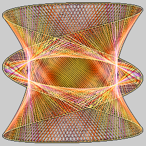
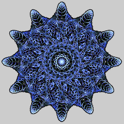

# Maurer Lines
Maurer lines extend the Maurer rose (see [maurer_rose](../rosecurve/rosecurve.md#maurer_lines)) with different types of curves, rendering methods, and coloring.

*Some information is still missing...*

## maurer_lines
Generalized string art

Type: 2D half-blur with 3D, Direct Color, and full-blur options  
Author: Gregg Helt (cozyg)  
Date: 30 Sep 2017  

 

Maurer_lines produces a shape reminiscent of string art, art made by hammering nails into a board in some shape and stretching string between them. The crossing lines frequently give a shaded three dimensional appearance, but this is just an illusion; only render submodes 15-18 will produce a true 3D result.

This is a complex variation with lots of parameters, so instead of summarizing all parameters in a table, there are tables for each group of parameters. Note that the parameter order in the variation is different in some cases than that listed here. Many of the parameter descriptions reference mathematical constructs such as kinds of curves and splines; this is just a summary and does not describe them in detail.

### Curve Definition
The curve is defined with the curve_mode and the a-h parameters, which are different for each type of curve as shown in the following table (parameters not mentioned are ignored for that curve).

| curve_mode | a-h |
| --- | --- |
| 0: circle | a: radius |
| 1: polygon | a: # vertices |
| 2: ellipse | a: horizontal radius b: vertical radius
| 3: rhodonea / rose | a: numerator b: denominator c: offset |
| 4: epitrochoid | a: fixed disk size b: rotating disk size c: distance from center |
| 5: hypotrochoid | a: fixed disk size b: rotating disk size c: distance from center |
| 6: Lissajous curve | a: vertical frequency b: horizontal frequency c: phase difference (radians) |
| 7: epispiral | a: numerator b: denominator c: offset |
| 8: supershape |
| 9: Starr curve |
| 10: Farris mystery curve |
| 11: wagon fanciful curve |
| 12: Fay butterfly |
| 13: rigge1 |
| 14: rigge2 |
| 15: rigged rhodonea plus |
| 16: rigged rhodonea minus |
| 17: super ellipse | a: horizontal size b: vertical size c: horizontal exponent d: vertical exponent |
| 18: super rhodonea |

### Maurer Lines Definition
The following parameters specify how the Maurer lines are defined.

| Parameter | Description |
| --- | --- |
| theta_step_size | Step size from one endpoint to the next along the rose curve, in degrees. Think of driving 360 nails along the curve; this is the number of nails between endpoints of each Maurer line. |
| initial_theta | Starting point, in degrees. Think of this as the nail to start with. |
| line_count | Number of Maurer lines to display (fewer will be visible when they overlap); increase the value if there are unwanted gaps in the result |
| irrationalize | Amount to make the step size irrational. Irrational step sizes will prevent the Maurer lines from returning to the starting position and, if line_count is large enough, fill the entire area. |
| cosets_mode | Method for including cosets in the result. (Cosets produce a parallel pattern of Maurer lines using the "unused nails".) 0: No cosets 1: Classic cosets 2: Closure cosets 3: Hybrid of classic and closure. |

### Render Options

Classic Maurer lines are lines connecting the endpoints, but other options are available by setting render_mode:
| render_mode | Description |
| --- | --- |
| 0: Default | Standard Maurer lines (same as Line) |
| 1: Line | A line segment connecting the endpoints |
| 2: Circle | A circle between the endpoints (the line, not drawn, is a diameter) |
| 3: Ellipse | An ellipse between the endpoints
| 4: Sine wave | A sine wave between the endpoints |
| 5: Quadratic Bèzier |
| 6: Cardinal spline swizzle1 |
| 7: Cardinal spline swizzle2 |
| 8: Cardinal spline swizzle3 |
| 9: Sequin circle spline |
| 10: Cubic hermite spline |
| 11: Cardinal spline |
| 12: Uniform Catmull-Rom spline |
| 13: Nonuniform Catmull-Rom spline |
| 14: Chordal Catmull-Rom spline |
| 15: Centripetal Catmull-Rom spline |
| 16: Kochanek-Bartels spline |
| 17: Cubic Hermite variation 1 |
| 18: Cubic Hermite variation 2 |
| 19: Cubic Hermite variation 3 |
| 20: Cubic Hermite variation 4 |
| 21: Cubic Hermite variation 5 |
| 22: Kochanek-Bartels spline swizzle1 |
| 23: Kochanek-Bartels spline swizzle2 |
| 24: Kochanek-Bartels spline swizzle3 |
| 25: Cubic Hermite tangent form2 |

The render_submode parameter specifies how to draw the Maurer lines. In the following table, "stroke" is the curve specified by render_mode, "line" is the straight line between the endpoints, and "curve" is the portion of the main curve between the endpoints. Most look the same when render_mode is Line, but are different with other options.
| render_submode | Description |
| --- | --- |
| 0: Default | Same as Stroke |
| 1: Stroke | Draw the stroke as specified |
| 2: Reflected stroke | Reflect the stroke across the line |
| 3: Both stroke | Combine stroke and reflected stroke |
| 4: Alternating stroke | Alternate normal and reflected strokes |
| 5: Fill to line | Fill the area between the stroke and the line |
| 6: Reflected fill to line | Fill the area between the reflected stroke and the line |
| 7: Both fill to line | Combine normal and reflected fill to line |
| 8: Alternating fill to line | Alternate normal and reflected fill to line |
| 9: Fill to curve | Fill the area between the stroke and the curve |
| 10: Reflected fill to curve | Fill the area between the reflected stroke and the curve |
| 11: Both fill to curve | Combine normal and reflected fill to curve |
| 12: Alternating fill to curve | Alternate normal and reflected fill to curve |
| 13: Fill between line and curve | Fill the area between the line and the curve (ignoring render_mode) |
| 14: Fill between line and curve swizzle | Like 13, but swizzle x and y |
| 15: Z stroke | Draw the stroke on the z-axis (makes the result 3D) |
| 16: Z reflected stroke | Draw the reflected stroke on z-axis (makes the result 3D) |
| 17: Z both stroke | Combine Z stroke and Z reflected stroke |
| 18: Z alternating stroke | Alternate Z stroke and Z reflected stroke |

The cubic Hermite render modes require computing a tangent; the tangent_submode parameter selects how this is done. This parameter is ignored for the other render modes. Note that the term "normal" is used in the mathematical sense of a line perpendicular to an object, not the English sense of "usual".

| tangent_submode | Description |
| --- | --- |
| 0: Default | Same as Tangent |
| 1: Tangent |
| 2: Unit tangent |
| 3: Unscaled tangent |
| 4: Unscaled unit tangent |
| 5: Normal vector |
| 6: Unit normal |
| 7: Unscaled normal |
| 8: Unscaled unit normal |
| 9: Rotation tangent |
| 10: Theta tangent |
| 11: Index tangent |
| 12: XY scale tangent |

The three render_modifier parameters allow additional modification of some render modes. Their meaning varies depending on the render mode. Details TBD.

### Coloring Options
Maurer_lines has an option to assign color to each point of the result according to one of several possible measures, specified by direct_color_measure. (The same options are used for filterx_measure.)

| direct_color_measure | Description |
| --- | --- |
| 0: None | Don't use direct color |
| 1: Line length (lines) |
| 2: Line angle (lines) |
| 3: Point angle (lines) |
| 4: Meta index | (requires meta mode; see below)
| 5: Z minmax (points) |
| 6: Z absolute minmax (points) |
| 7: Distance along lines (points) |
| 8: Distance from midline (points) |
| 9: Distance from nearest end (points) |
| 10: Speed at endpoint |
| 11: Current theta |

The following options specify how to convert the measure into a gradient index or color. Note that the color is always clamped to 0-1 after this processing, so setting color_low_threshold to 0 and color_high_threshold to 1 gives maximum range.

| Parameter | Description |
| --- | --- |
| direct_color_gradient | 0: Off (don't use direct color) 1: Colormap clamp (use gradient, clamp values at thresholds) 2: Colormap wrap (use gradient, wrap values to keep in thresholds) 3: Red-green (true color, red and green) 4: Red-blue (true color, red and blue) 5: Blue-green (true color, blue and green) |
| direct_color_thresholding | How to apply color_low_threshold and color_high_threshold 0: Percent 1: Value |
| color_low_threshold | Low color threshold |
| color_high_threshold | High color threshold |

### Filters
Filters are optional, but can be added to hide whole or partial lines based on different measures, the same ones as direct_color_measure. A new set of parameters is added to the interface for each filter, so when number_of_filters is 0, none of the filterx parameters will be visible. When there are two or more filters, they are processed in order, using the specified operator.

| Parameter | Description |
| --- | --- |
| number_of_filters | Number of filters, 0 for no filters |
| filterx_operator | Operator to apply before this filter 0: and 1: or 2: xor 3: a not b 4: b not a |
| filterx_mode | Mode for this filter 1: band pass value 2: band stop value 3: band pass percent 4: band stop percent |
| filterx_measure | The measure for this filter; see the direct_color_measure table above |
| filterx_low_threshold | Low threshold for this filter |
| filterx_high_threshold | High threshold for this filter |

### Other Modes
Maurer_lines has some other modes as described below. Meta mode generates a random index value (meta index) each iteration and uses that index in various ways. If meta_mode sets a parameter that is not used, it will have no effect.

| Parameter | Description |
| --- | --- |
| randomize | 0: Take theta value from the variation input (half-blur) 1: Generate a random theta value (ignore input, full blur) |
| diff_mode | 0: Normal blur/half-blur 1: Add input point to output point (no effect if variation amount is 1) |
| meta_mode | 0: Meta mode off 1: Meta index to theta_step_size 2: Meta index to parameter a 3: Meta index to parameter b 4: Meta index to parameter c 5: Meta index to parameter d 6: Meta index to parameter e 7: Meta index to parameter f 8: Meta index to initial_theta 9: Meta index to parameters a and b (min value for b is b parameter) 10: Meta index to render_modifier1 11: Meta index to render_modifier2 12: Meta index to render_modifier3 |
| meta_min_step | Minimum value of the meta index |
| meta_max_step | Maximum value of the meta index |
| meta_step_diff | Step size for the meta index |

### Display Options
The Maurer lines result has three components: the curve, the endpoints, and the line (or the "stroke" if the render_mode specifies some other shape). Display of each of these can be controlled individually. Note that there is no "show_line" to control the density of the line display; they will have whatever density is left over (1 - show_points - show_curve).

| Parameter | Description |
| --- | --- |
| show_points | Density of the endpoint display, from 0 (hide endpoints) to 1 (show only endpoints) |
| show_curve | Density of the curve display, from 0 (hide curve) to 1 (show only the curve) |
| line_thickness | Thickness of the displayed lines |
| point_thickness | Thickness of the displayed endpoints |
| curve_thickness | Thickness of the displayed curve |

## Resources
https://en.wikipedia.org/wiki/Maurer_rose  
https://mathworld.wolfram.com/MaurerRose.html  
http://archive.bridgesmathart.org/2016/bridges2016-445.pdf  
