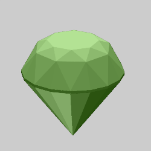

# Meshes
Variations that generate meshes, three dimensional shapes made from connected triangles. These are all blur variations that ignore their inputs. They are most useful for solid renders, though they work for normal flames as well.

The mesh variations can perform subdivision surface smoothing. This can be helpful for some meshes to create a smoother surface. But it deforms meshes that aren't designed to be smoothed. For example, smoothing an icosahedron will make it a sphere. This is done by first subdividing each triangle into four triangles, then performing Taubin smoothing on each triangle. This process is repeated the number of times specified by subdiv_level (set it to 0 to disable smoothing).

For each subdivision level, each triangle in the mesh is subdivided into four triangles and Taubin smoothing is done on each resulting triangle. Taubin smoothing is done with multiple passes, with two smoothing steps done on each pass. The first step uses the lambda parameter to smooth the mesh, but this also shrinks it. The second step uses the mu parameter (which should be a negative value) to counteract the shrinking. The subdivision surface smoothing parameters are summarized below:

| Parameter | Description |
| --- | --- |
| subdiv_level | The number of levels of subdivision to perform; it must be an integer between 0 (to disable smoothing) and 6. Note each level used will dramatically increase both render time and memory needed. |
| subdiv_smooth_passes | The number of Taubin smoothing passes to apply to each subdivision level; it must be an integer between 0 and 24. |
| subdiv_smooth_lambda | The lambda value used for the first step of each pass; it should be a positive number between 0 and 1. |
| subdiv_smooth_mu | The mu value used for the second step of tach pass; it should be a negative number between 0 and -1, and is usually a bit less than -lambda). |

## obj_mesh_primitive_wf
Use a predefined object as a 3D mesh.

Type: 3D mesh  
Author: Andreas Maschke (thargor6)   
Date: 29 Nov 2016  

| Parameter | Description |
| --- | --- |
| colormap_filename | The file containing a color map to apply to the mesh |
| displ_map_filename | The file containing the displacement map |
| primitive | The object to use: 0: Ball 1: Capsule 2: Cone 3: Diamond 4: Torus 5: Box 6: Gear (15 teeth) 7: Icosahedron 8: Tetrahedron 9: Octahedron 10: Dodecahedron 11: Cylinder with a hole 12: Icosidodecahedron 13: Cubeoctahedron 14: Gear (6 teeth) 15: Smooth gear (6 teeth) 16: Gear (8 teeth) 17: Smooth gear (8 teeth) 18: Gear (12 teeth) 19: Smooth gear (12 teeth) 20: Gear (16 teeth) 21: Smooth gear (16 teeth) 22: Gear (24 teeth) 23: Smooth gear (24 teeth) 24: Mandelbulb 25: Drop
| scale_x, scale_y, scale_z | Scale factors for x, y, and z |
| offset_x, offset_y, offset_z | Shift the mesh in the x, y, and z directions |
| subdiv_level, subdiv_smooth_passes, subdiv_smooth_lambda, subdiv_smooth_mu | Subdivision surface smoothing parameters; see the description above |
| blend_colormap | Whether to blend colormap colors with surrounding colors (color_mode 0 only) 0: Don't blend colors 1: Blend colors |
| displ_amount | Scaling for the displacement map; 0 to disable displacement |
| blend_displ_map | Whether to blend values from the displacement map 0: Don't blend values 1: Blend values |
| receive_only_shadows | If set to 1, and solid rendering is enabled, the mesh will be invisible but will show shadows that fall on it (hard shadows must be enabled to see any) |

## obj_mesh_wf
Load a 3D mesh from a file in Wavefront OBJ format.

Type: 3D mesh  
Author: Andreas Maschke (thargor6)   
Date: 29 Nov 2016  

| Parameter | Description |
| --- | --- |
| obj_filename | The file containing the mesh |
| colormap_filename | The file containing a color map to apply to the mesh |
| displ_map_filename | The file containing the displacement map |
| scale_x, scale_y, scale_z | Scale factors for x, y, and z |
| offset_x, offset_y, offset_z | Shift the mesh in the x, y, and z directions |
| subdiv_level, subdiv_smooth_passes, subdiv_smooth_lambda, subdiv_smooth_mu | Subdivision surface smoothing parameters; see the description above |
| blend_colormap | Whether to blend colormap colors with surrounding colors (color_mode 0 only) 0: Don't blend colors 1: Blend colors |
| displ_amount | Scaling for the displacement map; 0 to disable displacement |
| blend_displ_map | Whether to blend values from the displacement map 0: Don't blend values 1: Blend values |
| receive_only_shadows | If set to 1, and solid rendering is enabled, the mesh will be invisible but will show shadows that fall on it (hard shadows must be enabled to see any) |

## sattractor3D
Generate a 3D mesh from differential equations.

Type: 3D blur  
Author: Jesus Sosa  
Data: 21 Feb 2018

 

| Parameter | Description |
| --- | --- |
| xformula | The formula to use for dx for the attractor differential equation; it returns the value for dx, and can use "x", "y", "z", and "param_a" through "param_h" as well as constants and standard math functions. Changing presetId will overwrite it with the preset formula. |
| yformula | The formula to use for dy for the attractor differential equation |
| zformula | The formula to use for dz for the attractor differential equation |
| presetId | The preset to use; set to -1 to not use a preset |
| steps | Number of thousands of steps to use in the curve |
| radius | Thickness of the curve |
| stepTime | Delta time for computing the curve |
| facets | Number of sides in the attractor curve |
| start_x, start_y, start_z | Initial values for x, y, and z |
| warmup | Number of steps to skip before plotting the attractor |
| param_a - param_h | Value for param_a through param_h in the formulas |
| scale_x, scale_y, scale_z | Scale factors for x, y, and z |
| offset_x, offset_y, offset_z | Offset for the attractor curve |
| subdiv_level, subdiv_smooth_passes, subdiv_smooth_lambda, subdiv_smooth_mu | Not used |
| blend_colormap | Not used |
| displ_amount | Not used |
| blend_displ_map | Not used |
| receive_only_shadows | If set to 1, and solid rendering is enabled, the mesh will be invisible but will show shadows that fall on it (hard shadows must be enabled to see any) |

http://jwildfire.org/forum/viewtopic.php?f=23&t=2607  
https://github.com/thargor6/JWildfire/blob/master/src/org/jwildfire/create/tina/variation/plot/sattractor3d_wf_presets.txt  
