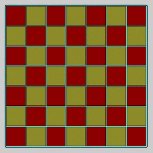

# Patterns
Variations that create different kinds of patterns.

## checkerboard_wf
Generate a checkerboard pattern

Type: 3D direct color blur  
Author: Andreas Maschke (thargor6)  
Date: 7 Oct 2016  

| Parameter | Description |
| --- | --- |
| position | Position of the checkerboard along its perpendicular axis |
| size | Width and height of the (square) checkerboard (assuming variation amount is 1) |
| axis | 0: Checkerboard on XY plane 1: Checkerboard on YZ plane 2: Checkerboard on ZX plane |
| checker_size | Size of each square (as a fraction of size) |
| displ_amount | Thickness of the checkerboard |
| checker_color1, checker_color2 | Gradient index of the squares (between 0 and 1) |
| side_color | Gradient index of the square borders (if present) |
| with_sides | 0: No borders on the squares 1: Add borders to the squares (displ_amount must be non-zero) |

## dc_perlin
Generate a pattern based on fractal Brownian motion (fBm), also known as Perlin noise.

Type: 2D direct color blur  
Author: Neil Slater (slobo777)  
Date: 14 Nov 2010  

| Parameter | Description |
| --- | --- |
| shape | The shape to use: 0: Square 1: Disk (filled-in circle) 2: Blur disk (brighter in center, like the blur variation) |
| map | Mapping from the noise function to the shape: 0: Flat 1: Spherical (like the spherical variation, creates small features in the center) 2: Half-spherical (like spherical, but with less distortion) 3: Quarter-spherical (between 1 and 2) 4: Bubble (like the bubble variation; the result is still 2D, but has a 3D appearance) 5: Exaggerated bubble (like bubble but the effect is stronger) |
| select_centre, select_range | Noise values outside the range of select_centre±select_range create holes (transparent areas) in the pattern; increase select_range to eliminate unwanted holes |
| centre | The center gradient index value to use, between 0 and 1; works with range to determine the gradient color to use |
| range | The range of gradient values on each side of centre to use; 0.5 to use the entire gradient; larger values will use the gradient multiple times |
| edge | 0 for normal; positive values increase the size and create a ragged edge |
| scale | Scale factor for the noise function; increase for higher frequency noise (smaller features that are closer together) |
| octaves | Number of octaves to use for fBm, between 1 and 5 |
| amps | Value to divide the amplitude of each octave by; use 2 for normal fBm noise, but change for different effects (normally greater than 1, but this is not enforced) |
| freqs | Value to multiply the frequency of each octave by; use 2 for normal fBm noise, but change for different effects (normally greater than 1, but this is not enforced) |
| z | The z value for computing the noise; changing it changes the specific pattern but not the general appearance of the noise |
| select_bailout | Limits the number of retries when the random point hits a hole controlled by the select_centre, select_range, and edge parameters; the default of 10 is usually fine, but it can be increased if faint patterns show in the holes (this will slow down the variation) |

[Apophysis 7X variation](https://www.deviantart.com/slobo777/art/dc-perlin-Apophysis-Plugin-186190256)  
[Dc_perlin description at Fractal Formulas](https://fractalformulas.wordpress.com/flame-variations/dc_perlin/)  
[Coherent Noise explanation](https://fractalformulas.wordpress.com/2019/08/19/coherent-noise/)  
[Wikipedia description of Perlin noise](https://en.wikipedia.org/wiki/Perlin_noise)  
[Roz Scripts (for Apophysis)](https://www.deviantart.com/rozrr/art/Roz-Scripts-321285804)  

## snowflake_wf
Generate a snowflake shape using a cellular automaton.

Type: 2D direct color blur  
Author: Andreas Maschke (thargor6)  
Date: 10 Jan 2021  

 

To animate snowflake growth, start with a low value for max_iter at the beginning of the animation and increase it as the animation progresses. [Samples (pdf)](snowflake-samples.pdf)

| Parameter | Description |
| --- | --- |
| buffer_size | Controls the number of cells (dots) in the generated snowflake |
| max_iter | Number of times to iterate snowflake generation; larger values make larger, more intricate patterns, but take longer and require a larger buffer_size value |
| bg_freeze_level | The base starting value for the cells |
| fg_freeze_speed | How fast cells next to frozen cells (with value at least 1) freeze |
| diffusion_speed | How fast cells not next to frozen cells freeze |
| diffusion_asymmetry | Controls the weighting for averaging cell values |
| rnd_bg_noise | Amount of noise added to base starting value for the cells; 0 for completely symmetrical snowflakes |
| threshold | Threshold value to display cells in final snowflake; if background dots appear, increase threshold to remove them |
| seed | The random number seed; different seeds will generate similar but different results |
| scale | Scale factor for the result |
| jitter | Controls the random offset of the dots creating the snowflake; 0 makes the dots line up perfectly, which can be distracting |
| dc_color | 0: Standard variation coloring; don't modify the gradient color index directly 1: Direct color; set the gradient color index according to the point intensity |
| dc_color_scale | Scale factor for the point intensity (most points will have intensity between the threshold parameter and 1) |
| dc_color_offset | Lowest color index to use (0 for leftmost gradient color) |

[A local cellular model for snow crystal growth](http://patarnott.com/pdf/SnowCrystalGrowth.pdf) (description of the algorithm)  
[Interactive online version](https://snowflake.overwhale.com/)  

## terrain3D
Generate a random terrain surface mesh.

Type: 3D mesh  
Author: Jesus Sosa  
Date: 14 Apr 2018  

| Parameter | Description |
| --- | --- |
| roughness | Surface roughness; 0.5 is average, smaller is smoother |
| z_exaggeration | Altitude scale; larger values exaggerate the altitude |
| Size (N PowersOf 2) | The number of cells per side used to generate the terrain, as a power of 2; for example a value of 5 would use 2^5=32 cells per side (for a total of 1024) |
| seed | The random number seed; changing this number will change the terrain generated |
| dc | 0: Use the transform color 1: Use direct color; the color of a point is based on its altitude |
| scale_x, scale_y, scale_z | Scale factors for x, y, and z |
| offset_x, offset_y, offset_z | Shift the mesh in the x, y, and z directions |
| subdiv_level | The number of levels of subdivision to perform; it must be an integer between 0 (to disable smoothing) and 6. Note each level used will dramatically increase both render time and memory needed. |
| subdiv_smooth_passes | The number of Taubin smoothing passes to apply to each subdivision level; it must be an integer between 0 and 24. |
| subdiv_smooth_lambda | The lambda value used for the first step of each pass; it should be a positive number between 0 and 1. |
| subdiv_smooth_mu | The mu value used for the second step of tach pass; it should be a negative number between 0 and -1, and is usually a bit less than -lambda). |
| blend_colormap | Not used |
| displ_amount | Not used |
| blend_displ_map | Not used |
| receive_only_shadows | If set to 1, and solid rendering is enabled, the mesh will be invisible but will show shadows that fall on it (hard shadows must be enabled to see any) |

[JWildfire forum post](https://jwildfire-forum.overwhale.com/viewtopic.php?f=23&t=2626)  

## wangtiles
Generate a (possibly repeating) pattern from a 12x8 set of Wang tiles.

Type: 3D blur  
Author: Jesus Sosa  
Date: 29 Apr 2018  

 

The core Wang tiling is always 12 wide and 8 high, so the tiles are elongated vertically. This is why the vertical pipes in the first example are thinner than the horizontal pipes. To use square tiles, set scale_x to 1.5 (and optionally square to 0 and offset_x to -0.25).

The wangtiles variation will also set z based on the color of the point, like [colorscale_wf](zmanip/zmanip.md#colorscale_wf). This is not a bump map for the tile, so it won't make the result an accurate 3D tiling.

| Parameter | Description |
| --- | --- |
| id | The id of the Wang tile set to use, from 0 to 104 ([pdf index](wangtiles-ids.pdf)) |
| seed | The random seed; changes the pattern of the tiles |
| square | 0: Make the overall wangtiles shape a rectangle 1: Make the overall wangtiles shape a square |
| scale_x, scale_y | Horizontal and vertical scale factors for the Wang tiles |
| scale_z | Scale factor for z colorscale setting; 0 to disable |
| offset_x, offset_y | Horizontal and vertical offsets for the Wang tiles |
| offset_z | Offset added to the z value of each point |
| tile_x | 0: Don't tile horizontally (space outside the 12x8 Wang tile set will be black) 1: Tile the Wang tile set horizontally |
| tile_y | 0: Don't tile vertically (space outside the 12x8 Wang tile set will be black) 1: Tile the Wang tile set vertically |
| reset_z | 0: Add the color index to existing z value 1: Override existing z value with the color index |

[Wang tile on Wikipedia](https://en.wikipedia.org/wiki/Wang_tile)  
[Source for tiles used in this variation (under Gallery)](http://www.cr31.co.uk/stagecast/wang/intro.html)  
