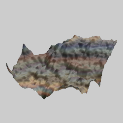

# Patterns
Variations that create different kinds of patterns.

## terrain3D
Generate a random terrain surface mesh.

Type: 3D mesh  
Author: Jesus Sosa  
Date: 14 Apr 2018  

| Parameter | Description |
| --- | --- |
| roughness | Surface roughness; 0.5 is average, smaller is smoother |
| z_exaggeration | Altitude scale; larger values exaggerate the altitude |
| Size (N PowersOf 2) | The number of cells per side used to generate the terrain, as a power of 2; for example a value of 5 would use 2^5=32 cells per side (for a total of 1024) |
| seed | The random number seed; changing this number will change the terrain generated |
| dc | 0: Use the transform color 1: Use direct color; the color of a point is based on its altitude |
| scale_x, scale_y, scale_z | Scale factors for x, y, and z |
| offset_x, offset_y, offset_z | Shift the mesh in the x, y, and z directions |
| subdiv_level | The number of levels of subdivision to perform; it must be an integer between 0 (to disable smoothing) and 6. Note each level used will dramatically increase both render time and memory needed. |
| subdiv_smooth_passes | The number of Taubin smoothing passes to apply to each subdivision level; it must be an integer between 0 and 24. |
| subdiv_smooth_lambda | The lambda value used for the first step of each pass; it should be a positive number between 0 and 1. |
| subdiv_smooth_mu | The mu value used for the second step of tach pass; it should be a negative number between 0 and -1, and is usually a bit less than -lambda). |
| blend_colormap | Not used |
| displ_amount | Not used |
| blend_displ_map | Not used |
| receive_only_shadows | If set to 1, and solid rendering is enabled, the mesh will be invisible but will show shadows that fall on it (hard shadows must be enabled to see any) |

[JWildfire forum post](https://jwildfire-forum.overwhale.com/viewtopic.php?f=23&t=2626)  
