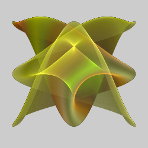
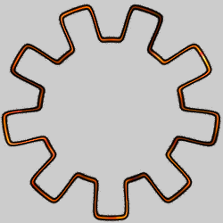
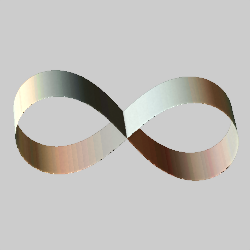
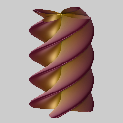

# Plotting variations
These variations are all blurs that plot formulas in two or three dimensions. They allow entering custom formulas, but also come with presets for ease of use.

## isosfplot3d_wf
Isosurface plot (plots points where the value of a function is near zero).

Type: 3D blur (DC and colormap options)  
Author: Andreas Maschke (thargor6)  
Date: 6 Jan 2017  

 

*Note: Colormaps do not work in JWildfire 5.5 and earlier.*

| Parameter | Description |
| --- | --- |
| formula | The formula to use; it can use "x", "y", "z", and "param_a" through "param_f" as well as constants and standard math functions. Changing preset_id will overwrite it with the preset formula. |
| colormap_filename | The file containing the colormap used with color_modes 0-2 |
| preset_id | The preset to use; set to -1 to not use a preset |
| xmin, xmax | The range for x in the iso formula; used to generate the plot |
| ymin, ymax | The range for y in the iso formula; used to generate the plot |
| zmin, zmax | The range for z in the iso formula; used to generate the plot |
| thickness | Thickness of the surface; specifically, how close to 0 the value needs to be to be in the isosurface |
| max_iter | Maximum times the variation will try to find a point in the isosurface |
| direct_color | 0: Don't use direct color 1: Use direct color |
| color_mode | The mode when using direct color 0: Use the specified colormap along x 1: Use the specified colormap along y 2: Use the specified colormap along z 3: Use the x value 4: Use the y value 5: Use the z value 6: Use x times y 7: Use y times z 8: Use z times x 9: Use x times y times z |
| blend_color | Whether to blend colormap colors with surrounding colors (color_mode 0 only) 0: Don't blend colors 1: Blend colors |
| param_a through param_f | Values that can be used by the formula to parameterize it; parameters not used in the formula are ignored |

[isosfplot3d_wf preset list](https://github.com/thargor6/JWildfire/blob/master/src/org/jwildfire/create/tina/variation/plot/isosfplot3d_wf_presets.txt)  

## parplot2d_wf
Parametric equation surface plot (2D surface plotted in three dimensions).

Type: 3D blur (but can be normal, DC and colormap options)  
Author: Andreas Maschke (thargor6)  
Date: 29 Nov 2016  

 

| Parameter | Description |
| --- | --- |
| xformula | The formula to use for x; it returns the value for x, and can use "u" and "v" (the parametric values) and "param_a" through "param_f" as well as constants and standard math functions. Changing preset_id will overwrite it with the preset formula. |
| yformula | The formula to use for y |
| zformula | The formula to use for z |
| colormap_filename | The file containing the colormap used with color_mode 0 |
| displ_map_filename | The file containing the displacement map |
| preset_id | The preset to use; set to -1 to not use a preset |
| umin, umax | The range for u, the first parametric value; used to generate the plot |
| vmin, vmax | The range for v, the second parametric value; used to generate the plot |
| direct_color | 0: Don't use direct color 1: Use direct color |
| color_mode | The mode when using direct color 0: Use the specified colormap 1: Use the u value 2: Use the v value 3: Use u times v |
| blend_color | Whether to blend colormap colors with surrounding colors (color_mode 0 only) 0: Don't blend colors 1: Blend colors |
| displ_amount | Scaling for the displacement map; 0 to disable displacement |
| blend_displ_map | Whether to blend values from the displacement map 0: Don't blend values 1: Blend values |
| solid | 1: Generate u and v randomly (normal operation; variation is a blur) 0: Set u and v from input x and y (makes this a normal variation, more difficult to use) |
| param_a through param_f | Values that can be used by the formula to parameterize it; parameters not used in the formula are ignored |

[parplot2d_wf preset list](https://github.com/thargor6/JWildfire/blob/master/src/org/jwildfire/create/tina/variation/plot/parplot2d_wf_presets.txt)  
[Color and Displacment Variables Helpful Hints](https://happy-stars.deviantart.com/art/Color-and-Displacement-Variables-HelpfulHints-697091366)

## polarplot2d_wf
Plot, in polar coordinates, rho in terms of theta, with 3D extrusion.

Type: 3D blur (DC and colormap options)  
Author: Rick Sidwell  
Date: 22 Apr 2020  

 

| Parameter | Description |
| --- | --- |
| formula | The formula to use; it returns the value for rho, and can use "t" (for theta) and "param_a" through "param_f" as well as constants and standard math functions. Changing preset_id will overwrite it with the preset formula. |
| colormap_filename | The file containing the colormap used with color_mode 0 |
| displ_map_filename | The file containing the displacement map |
| preset_id | The preset to use; set to -1 to not use a preset |
| tmin, tmax | The range for theta; used to generate the plot |
| rmin, rmax | The range for rho, used only with color_mode 2; it does not constrain the plot, but set these parameters to the range of the plot for maximum color distribution when using color_mode 2 |
| zmin, zmax | The range for z; the plot will be extruded to these values in the z direction; set both to 0 to disable extrusion |
| direct_color | 0: Don't use direct color 1: Use direct color |
| color_mode | The mode when using direct color 0: Use the specified colormap 1: Use the theta value 2: Use the rho value |
| blend_color | Whether to blend colormap colors with surrounding colors (color_mode 0 only) 0: Don't blend colors 1: Blend colors |
| displ_amount | Scaling for the displacement map; 0 to disable displacement |
| blend_displ_map | Whether to blend values from the displacement map 0: Don't blend values 1: Blend values |
| param_a through param_f | Values that can be used by the formula to parameterize it; parameters not used in the formula are ignored |

[polarplot2d_wf preset list](https://github.com/thargor6/JWildfire/blob/master/src/org/jwildfire/create/tina/variation/plot/polarplot2d_wf_presets.txt)  

## polarplot3d_wf
Plot rho in terms of theta and phi (spherical coordinates) or theta and (cylindrical coordinates).

Type: 3D blur (DC and colormap options)  
Author: Rick Sidwell  
Date: 22 Apr 2020  

 

| Parameter | Description |
| --- | --- |
| formula | The formula to use; it returns the value for rho, and can use "t" (for theta), "u" (for either phi or z) and "param_a" through "param_f" as well as constants and standard math functions. Changing preset_id will overwrite it with the preset formula. |
| colormap_filename | The file containing the colormap used with color_mode 0 |
| displ_map_filename | The file containing the displacement map |
| preset_id | The preset to use; set to -1 to not use a preset |
| tmin, tmax | The range for theta; used to generate the plot |
| umin, umax | The range for u, representing phi or z; used to generate the plot |
| rmin, rmax | The range for rho, used only with color_mode 2; it does not constrain the plot, but set these parameters to the range of the plot for maximum color distribution when using color_mode 2 |
| cylindrical | 0: Use spherical coordinates (u represents phi) 1: Use cylindrical coordinates (u represents z) |
| direct_color | 0: Don't use direct color 1: Use direct color |
| color_mode | The mode when using direct color 0: Use the specified colormap 1: Use the theta value 2: Use the u (for phi or z) value 3: use the rho value 4: Use a combination of theta and phi/z |
| blend_color | Whether to blend colormap colors with surrounding colors (color_mode 0 only) 0: Don't blend colors 1: Blend colors |
| displ_amount | Scaling for the displacement map; 0 to disable displacement |
| blend_displ_map | Whether to blend values from the displacement map 0: Don't blend values 1: Blend values |
| param_a through param_f | Values that can be used by the formula to parameterize it; parameters not used in the formula are ignored |

[polarplot3d_wf preset list](https://github.com/thargor6/JWildfire/blob/master/src/org/jwildfire/create/tina/variation/plot/polarplot3d_wf_presets.txt)  

## yplot2d_wf
Plot y in terms of x, with 3D extrusion.

Type: 3D blur (DC and colormap options)  
Author: Andreas Maschke (thargor6)  
Date: 29 Nov 2016  

 

| Parameter | Description |
| --- | --- |
| formula | The formula to use; it returns the value for y, and can use "x" and "param_a" through "param_f" as well as constants and standard math functions. Changing preset_id will overwrite it with the preset formula. |
| colormap_filename | The file containing the colormap used with color_mode 0 |
| displ_map_filename | The file containing the displacement map |
| preset_id | The preset to use; set to -1 to not use a preset |
| xmin, xmax | The range for x; used to generate the plot |
| ymin, ymax | The range for y, used only with color_mode 2; it does not constrain the plot, but set these parameters to the range of the plot for maximum color distribution when using color_mode 2 |
| zmin, zmax | The range for z; the plot will be extruded to these values in the z direction; set both to 0 to disable extrusion |
| direct_color | 0: Don't use direct color 1: Use direct color |
| color_mode | The mode when using direct color 0: Use the specified colormap 1: Use the x value 2: Use the y value |
| blend_color | Whether to blend colormap colors with surrounding colors (color_mode 0 only) 0: Don't blend colors 1: Blend colors |
| displ_amount | Scaling for the displacement map; 0 to disable displacement |
| blend_displ_map | Whether to blend values from the displacement map 0: Don't blend values 1: Blend values |
| param_a through param_f | Values that can be used by the formula to parameterize it; parameters not used in the formula are ignored |

[yplot2d_wf preset list](https://github.com/thargor6/JWildfire/blob/master/src/org/jwildfire/create/tina/variation/plot/yplot2d_wf_presets.txt)  
[Color and Displacment Variables Helpful Hints](https://happy-stars.deviantart.com/art/Color-and-Displacement-Variables-HelpfulHints-697091366)  

## yplot3d_wf
Plot y in terms of x and z.

Type: 3D blur (DC and colormap options)  
Author: Andreas Maschke (thargor6)  
Date: 29 Nov 2016  

 

| Parameter | Description |
| --- | --- |
| formula | The formula to use; it returns the value for y, and can use "x", "z", and "param_a" through "param_f" as well as constants and standard math functions. Changing preset_id will overwrite it with the preset formula. |
| colormap_filename | The file containing the colormap used with color_mode 0 |
| displ_map_filename | The file containing the displacement map |
| preset_id | The preset to use; set to -1 to not use a preset |
| xmin, xmax | The range for x; used to generate the plot |
| ymin, ymax | The range for y, used only with color_mode 2; it does not constrain the plot, but set these parameters to the range of the plot for maximum color distribution when using color_mode 2 |
| zmin, zmax | The range for z; used to generate the plot |
| direct_color | 0: Don't use direct color 1: Use direct color |
| color_mode | The mode when using direct color 0: Use the specified colormap 1: Use the x value 2: Use the y value |
| blend_color | Whether to blend colormap colors with surrounding colors (color_mode 0 only) 0: Don't blend colors 1: Blend colors |
| displ_amount | Scaling for the displacement map; 0 to disable displacement |
| blend_displ_map | Whether to blend values from the displacement map 0: Don't blend values 1: Blend values |
| param_a through param_f | Values that can be used by the formula to parameterize it; parameters not used in the formula are ignored |

[yplot3d_wf preset list](https://github.com/thargor6/JWildfire/blob/master/src/org/jwildfire/create/tina/variation/plot/yplot3d_wf_presets.txt)  
[Color and Displacment Variables Helpful Hints](https://happy-stars.deviantart.com/art/Color-and-Displacement-Variables-HelpfulHints-697091366)  
