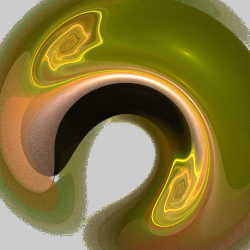
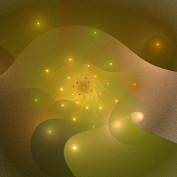

# Polar
Switch between polar or log-polar and rectangular coordinates.

https://en.wikipedia.org/wiki/Polar_coordinate_system  
http://mathworld.wolfram.com/PolarCoordinates.html  
https://en.wikipedia.org/wiki/Log-polar_coordinates  

## invpolar
Treat the rectangular coordinates (x,y) of a point as polar coordinates (ρ,θ) (the inverse of polar).

Type: 2D  
Author: Luca G (dark-beam)  
Date: 4 Oct 2018  

https://www.deviantart.com/dark-beam/art/Inverse-polar-766833707  

## polar
Treat the polar coordinates (ρ,θ) of a point as rectangular coordinates (x,y).

Type: 2D  
Author: Scott Draves  

 

https://www.jwfsanctuary.club/variation-information/polar/  
https://www.deviantart.com/fardareismai/art/Polinear-Examples-765766115  

## polar2
Treat the log-polar coordinates (ρ,θ) of a point as rectangular coordinates (x,y).

Type: 2D  
Author: Joel and Michael Faber  
Date: 7 Sep 2007  

There are also post_ and pre_ versions (post_polar2 and pre_polar2).

 

https://www.jwfsanctuary.club/variation-information/polar/  

## polar2_3D
Variant of polar2 with added 3D wave.

Type: 3D  
Author: Larry Berlin (aporev)  
Date: 27 Sep 2009  

| Parameter | Description |
| --- | --- |
| pwr | Controls the size of the 3D wave |
| freq | Frequency of the 3D wave |

https://www.deviantart.com/aporev/art/petal3D-plugin-139564066  

## pre_polar2_y
Flawed attempt at a pre version of polar2.

Type: 2D  
Author: Kenny Vaneetvelde (Raykoid666)  
Date: 17 Oct 2008  

Included here for completeness only; there are several flaws in the implementation.

https://www.deviantart.com/raykoid666/art/pre-plugin-pack-101004596  

## unpolar
Treat the rectangular coordinates (x,y) of a point as log-polar coordinates (ρ,θ) (the inverse of polar2).

Type: 2D  
Author: Michael Faber  
Date: 15 Mar 2009  

 

Note: The variation inexplicably scales the result down by 2π. The author undoubtedly had a reason for doing this, but it generally makes the result too small. So a tip for using unpolar: as a starting point, change the amount from 1 to 6.28 (a rough approximation of 2π).

http://pillemaster.deviantart.com/art/Foci-and-Unpolar-Tutorial-301184325  
http://pillemaster.deviantart.com/art/Circular-Flame-Tutorial-or-Unpolar-GlynnSim-271965226  
https://www.jwfsanctuary.club/variation-information/unpolar-and-foci/  
