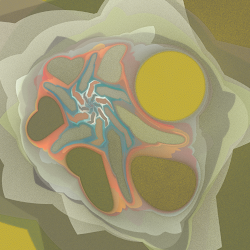
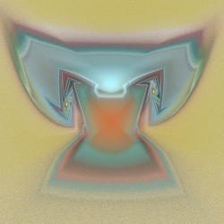
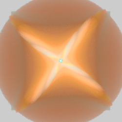
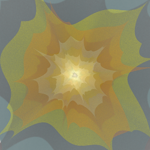
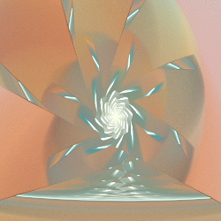

# Reshapers
Variations that reshape the input (for example, turn a circle into a square or other polygon).

## butterfly
Reshape circles centered at the orgin into butterfly shapes.

Type: 2D  
Author: Joel and Michael Faber  
Date: 21 Oct 2007  

## circlize
Reshape squares centered at the origin into circles.

Type: 2D  
Author: Joel and Michael Faber  
Date: 16 Sep 2007  

See circlize2.

| Parameter | Description |
| --- | --- |
| hole | Radius of a hole in the center of the result; 0 for no hole |

## circlize2
Reshape squares centered at the origin into circles (scaled to work better with other variations).

Type: 2D  
Author: Michael Faber  
Date: 4 Jan 2012

The result of circlize2 is slightly smaller than circlize, so it works better with squarize and squish.  

| Parameter | Description |
| --- | --- |
| hole | Radius of a hole in the center of the result; 0 for no hole |

https://www.deviantart.com/michaelfaber/art/The-Angle-Pack-277718538  

## ngon
Reshape circles centered at the origin into polygons, with an option for inversion.

Type: 2D  
Author: Neil Slater (slobo777) and Joel Faber  
Date: 16 Sep 2007  

Same as spherical when circle=1, corners=0, and power=2.

Same as linear when circle=1, corners=0, and power=0.

| Parameter | Description |
| --- | --- |
| circle | Specifies how the polygon should be rounded; also affects the size 1 is normal size; larger expands and smaller shrinks the result Sides will be straight when circle=corners; larger values make sides concave, smaller values make sides convex When 0, the convex parts touch in the middle, making a flower shape When the sign is opposite of corners, the convex parts pass through the middle
| corners | Defines the shape of the corners; shape will be normal when corners=circle, higher values make corners pointier, lower values diminish them 0 means no corners (sides makes no difference in this case) When the sign is the opposite of circle, the corners will go in instead of out |
| power | The power used when computing the factor 1 collapses the polygon to an outline >1 everts the flame (like spherical); 2 is normal size <1 works linearly, distorting but not everting the flame; 0 is normal size |
| sides | Number of sides of the polygon; integers 3 and greater make regular polygons; integers -5 or less make regular stars; other values make intermediate shapes. Can be any value except 0 |

https://web.archive.org/web/20090420224756/http:/slobo777.wikispaces.com/Variation+Idea (Wayback Machine)  
https://www.deviantart.com/f--l--a--r--k/art/nGon-Tutorial-96864899  
https://www.deviantart.com/satania/art/Tutorial-Portals-Flames-176482429  
https://www.deviantart.com/guagapunyaimel/art/Splits-Ngon-Tutorial-170779905  
https://www.deviantart.com/fractaldesire/art/Tutorial-Xaos-revealed-276483388  

## prepost_circlize
Circlize before and uncirclize after other variations, or vice versa.

Type: 2D  
Author: Rick Sidwell  

| Parameter | Description |
| --- | --- |
| n | Number of sides in the polygon |
| rotation | Rotation of the polygon, in degrees |
| reverse | 0: Pre-circlize and post-uncirclize 1: Pre-uncirclize and post-circlize

## squarize
Reshape circles centered at the orgin into squares.

Type: 2D  
Author: Michael Faber  
Date: 4 Jan 2012  

https://www.deviantart.com/michaelfaber/art/The-Angle-Pack-277718538  

## super_shape
Reshape (or create a shape) using the superformula.

Type: 2D (blur if rnd is 1)  
Author: cyberxaos  
Date: 21 Jun 2007  

| Parameter | Description |
| --- | --- |
| rnd | Proportion of blur to use 0: no blur; pure reshaping 1: all blur; input is ignored (result is similar to [shape](../halfblurs/halfblurs.md#shape)) Other values interpolate or extrapolate |
| m | Number of corners |
| n1, n2, n3 | Shaping variables |
| holes | Puts a hole in the center if less than 0. (Although the default is 1, it works best to use 0 for no hole and a negative value to add a hole.) |

https://en.wikipedia.org/wiki/Superformula  
http://paulbourke.net/geometry/supershape/  

## xheart
Reshape circles centered at the origin into hearts.

Type: 2D  
Author: Georg Kiehne (xyrus02)  
Date: 10 Oct 2009  

Xheart works by stretching circles into ellipses, then flipping the left half to make hearts.

| Parameter | Description |
| --- | --- |
| angle | The angle of the ellipses; 0 is 45°, which makes a typical heart, higher values rotate it clockwise (making a flatter heart), and lower values rotate it counter-clockwise (making a taller heart). |
| ratio | Controls the eccentricity of the ellipses (how much they are stretched); 0 makes very rounded hearts; larger values make them more pointy. |

https://web.archive.org/web/20121117024532/https://xyrus02.deviantart.com/art/XHeart-Plugin-139866412 (Wayback Machine)
