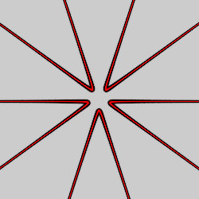

# Variations Based on the Rose Curve
The rose or rhodonea curve is shaped like a flower with petals, obtained by plotting a sine curve in polar coordinates. Its shape is determined by the frequency of the sine wave, denoted k. It is finite when k is rational, meaning it is a fraction of two integers kn/kd. The results of various combinations of numerator and denominator are shown in the chart below, created by [Jason Davies](https://commons.wikimedia.org/wiki/File:Rose-rhodonea-curve-7x9-chart-improved.svg). The full rose effect of non-integer values requires multiple cycles and many of the variations listed here plot only the first so won't produce the complete curve.

https://en.wikipedia.org/wiki/Rose_(mathematics)  
https://www.mathcurve.com/courbes2d.gb/rosace/rosace.shtml  

## epispiral
An inside-out rose curve, known as an epispiral curve.

Type: 2D half-blur  
Author: cyberxaos  
Date: 3 Aug 2007

Epispiral is a rose curve which is inverted on the unit circle (see spherical), so the "petals" point towards the origin and extend out to infinity. Some implementations spell the name with a capital 'E'.

| Parameter | Description |
| --- | --- |
| n | The frequency of the rose curve. Normally an integer; produces n inverted petals when odd, or 2n when even. Other values are allowed and produce intermediate results (but won't produce the entire curve). |
| thickness | When non-zero, it adds thickness. |
| holes | When n is even, every other petal is stretched towards the origin by this factor, touching the origin when 1, and looping to the other side when larger. The other petals are shrunk away from the origin. When n is odd, the effect is similar but the stretching and shrinking happens simultaneously to each petal. |

https://mathworld.wolfram.com/Epispiral.html  
https://www.mathcurve.com/courbes2d.gb/epi/epi.shtml  
http://www.deviantart.com/art/BD-s-2-New-Scripts-80636384  

## epispiral_wf
Alternate version of epispiral.

Type: 2D half-blur  
Author: Andreas Maschke (thorgor6)  
Date: 12 Jun 2011

Like epispiral, but with only one variable, and the result is half the size.

| Parameter | Description |
| --- | --- |
| waves | The frequency of the rose curve. Normally an integer; produces this many inverted petals when odd, or twice as many when even. Other values are allowed and produce intermediate results (but won't produce the entire curve). |

## flower
Filled-in rose curve; looks like a flower with petals.

Type: 2D half-blur  
Author: cyberxaos  

| Parameter | Description |
| --- | --- |
| holes | 1 is normal. Larger values both increase the flower size and add holes in the center. Smaller values (down to 0.5) shrink the flower size and, if petals is odd, grow new petals in the spaces between the main ones. |
| petals | The frequency of the rose curve. Normally an integer; produces this many petals when odd, or twice as many when even. Other values are allowed and produce intermediate results (but won't produce the entire curve). |

## maurer_rose
String art on a rose curve.

Type: 2D half-blur
Author: Gregg Helt (cozyg)
Date: 30 Sep 2017

 

| Parameter | Description |
| --- | --- |
| kn | Rose curve numerator |
| kd | Rose curve denominator |
| c | Rose curve offset (addition to rose curve equation) |
| line_offset_degrees | Step size from one endpoint to the next along the rose curve, in degrees. Think of driving 360 nails along the rose curve; this is the number of nails between endpoints of each Maurer line. |
| line_count | Number of Maurer lines to display (fewer will be visible when they overlap); increase the value if there are unwanted gaps in the result |
| show_lines | Relative density of the Maurer lines (0 to hide them) |
| show_points | Relative density of the endpoints (0 to hide them) |
| show_curve | Relative density of the rose curve (0 to hide it) |
| line_thickness | Thickness of the Maurer lines |
| point_thickness | Thickness of the endpoints |
| curve_thickness | Thickness of the rose curve |

## pRose3D
Rose curve with three dimensional shaping

Type: 3D half-blur  
Author: Larry Berlin (aporev)  
Date: 15 Oct 2009  

 

| Parameter | Description |
| --- | --- |
| l | Length of the petals |
| k | The frequency of the rose curve. Normally an integer; produces this many petals when odd, or twice as many when even. Other values are allowed and produce intermediate results (but won't produce the entire curve). |
| c | Rotation amount |
| z1 | Z scale for the main rose |
| z2 | Z scale for the reflection rose |
| refSc | Reflection scale relative to the main one |
| opt | 1 for shaping option 1, 2 for option 2, or between 1 and 2 to interpolate. Or use a negative value to make a reflection. |
| optSc | Option scale factor |
| opt3 | 0 for option set by opt, 1 for option 3, between 0 and 1 to interpolate. Or use a negative value to make a reflection. |
| transp | Density of the reflection from 0 (no density) to 1 (full density) |
| dist | Distance between main and reflection |
| wagsc | Waggle scale (radial effects) |
| crvsc | Curvature scale (called srvsc in JWildfire (typo)) |
| f | Frequency of wiggle curves (circumference effects) |
| wigsc | Wiggle scale (circumference effects) |
| offset | Wiggle offset |

https://www.deviantart.com/aporev/art/pRose3D-Plugin-140417044  

## rhodonea
Advanced rose curve

Type: 2D (can be half-blur or crop)  
Author: Gregg Helt (cozyg)  
Date: 24 May 2015  

 

| Parameter | Description |
| --- | --- |
| knumer | Rose curve numerator |
| kdenom | Rose curve denominator |
| inner_mode | Transform mode when input point is on or inside the curve: 0 - Curve only 1 - Spread mode 1 2 - Spread mode 2 3 - Spread mode 3 4 - Spread mode 4 5 - Mask inside the curve 6 - Mask outside the curve |
| outer_mode | Transform mode when input point is outside the curve (values same as inner_mode) |
| inner_spread | Spread amount for inner_modes 1-4 |
| outer_spread | Spread amount for outer_modes 1-4 |
| inner_spread_ratio | The x to y ratio for inner_spread; 1 for normal, larger to shrink x, smaller to expand x |
| outer_spread_ratio | The x to y ratio for outer_spread; 1 for normal, larger to expand x, smaller to shrink x |
| spread_split | Ratio between inner and outer spread; 1 to make them equal, larger to make outer spread larger |
| fill | Amount to thicken curve
| radial_offset | Rose curve offset (addition to rose curve equation) |
| cycles | Number of cycles to plot: 0 to calculate automatically; set manually if needed (may be fractional, for example 0.5 for half a cycle) |
| cycle_offset | Offset for input points, in radians |
| metacycles | Number of times to repeat the curve if cycles is 0 (calculated automatically) |
| metacycle_expansion | Amount to expand (or contract if negative) repeated closed cycles |

## rose_wf
Simple rose curve.

Type: 2D half-blur  
Author: Andreas Maschke (thargor6)  
Date: 12 Jun 2011

| Parameter | Description |
| --- | --- |
| amp | Amplitude of the rose curve. |
| waves | The frequency of the rose curve; must be an integer. Produces this many petals when odd, or twice as many when even. |
| filled | 0 for an outline, 1 for filled (like flower) |

https://mathworld.wolfram.com/Rose.html  
