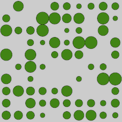
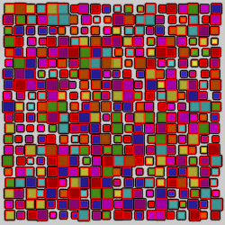
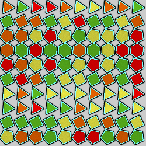
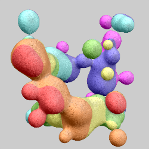
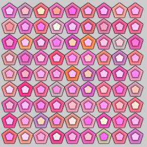
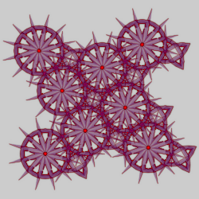
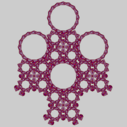
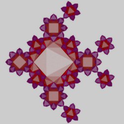

# Shape Groups
Variations that generate groups of shapes.

## circleRand
Random size circles in a grid.

Type: 2D blur  
Author: Alexey Ermushev (eralex61)  
Date: 17 Jun 2009  

| Parameter | Description |
| --- | --- |
| Sc | Overall scale for the circles |
| Dens | Circle density (0 to 1) |
| X, Y | Size of the grid; if Sc is 1, this will be the number of circles horizontally and vertically |
| Seed | Random number seed |

[Apophysis variation](https://www.deviantart.com/eralex61/art/Circles-Plugins-126273412)  

## gpattern
A grid pattern of polygons.

Type: 2D direct color blur  
Author: Jesus Sosa, inspired by a program by Lucia Tokárová  
Date: 15 May 2018  

 

| Parameter | Description |
| --- | --- |
| string | Type of polygons to use for each row as a comma-separated list of numbers (3 for triange, 4 for square, etc.); the list will be repeated to fill all the rows |
| seed | Random number seed |
| width, height | Width and height of the grid to use |
| lineheight | Controls the size (both width and height) of the polygons |
| angle | Angle to rotate each polygon, in degrees |
| randPos | Maximum amount to randomly move each polygon left to right |
| randSize | Maximum amount to randomly shrink or enlarge each polygon |
| fill | 0: Do not fill polygons (outline only if outline is 1) 1: Fill polygons |
| outline | 0: Omit polygon outlines 1: Draw polygon outlines |
| fill color | Start color (gradient index) for filling polygons, between 0 and 1 |
| fill color speed | Maximum amount to randomly vary fill color, between 0 (single color) and 1 (use full gradient) |
| outline color | Outline color (gradient index), between 0 and 1 |

## metaballs3d_wf
A group of metaballs, balls (solid spheres) that merge when close to each other to form blobs.

Type: 3D direct color blur  
Author: Andreas Maschke (thargor6)  
Date: 17 Dec 2018  

| Parameter | Description |
| --- | --- |
| colormap_filename | Name of image file for coloring the metaballs; only used when color_mode is 0, 1, or 2 |
| mb_mode | 0: Distribute metaballs uniformly 1: Distribute metaballs closer to the XZ plane 2: Distribute metaballs closer to the origin |
| mb_count | Number of metaballs to generate |
| mb_min_radius, mb_max_radius | Minimum and maximum values for the radius of influence for each metaball |
| mb_negative | Fraction (between 0 and 1) of the metaballs that will have a negative radius of influence; such metaballs are not visible, but interfere with merging of other metaballs to form more interesting shapes |
| mb_seed | Seed for the random numbers used to generate the metaballs |
| mb_sharpness | The threshold for determining whether a point is within a blob; small values make larger blobs and vice versa |
| border_size | Size of the border; each of xmin, xmax, ymin, ymax, zmin, and zmax is adjusted towards the origin by this amount, which is more convenient that adjusting all six boundary parameters individually |
| xmin, xmax, ymin, ymax, zmin, zmax | The boundaries the variation uses when placing the random metaballs |
| max_iter | Maximum tries for finding points within a blob; this keeps the variation from trying forever and hanging JWildfire |
| direct_color | 0: Don't use direct color (just standard variation coloring) 1: Use direct color according to color_mode |
| color_mode | 0: Use colormap on YZ plane 1: Use colormap on XZ plane 2: Use colormap on XY plans 3: Use gradient along the x axis 4: Use gradient along the y axis 5: Use gradient along the z axis 6: Use the gradient along the x and y axes combined 7: Use the gradient along the y and z axes combined 8: Use the gradient along the x and z axes combined 9: Use the gradient along the x, y, and z axes combined |
| blend_colormap | Whether to blend colormap colors with surrounding colors (color_modes 0-2 only) 0: Don't blend colors 1: Blend colors |

[Wikipedia article](https://en.wikipedia.org/wiki/Metaballs)  
[Description and examples by Paul Bourke](http://paulbourke.net/geometry/implicitsurf/index.html)  
[Metaball article by Ryan Geiss](http://www.geisswerks.com/ryan/BLOBS/blobs.html)   

## nsudoku
A 9x9 grid of nested polygons, with coloring based on sudoku.

Type: 2D direct color blur  
Author: Jesus Sosa  
Date: 19 Jun 2018  

| Parameter | Description |
| --- | --- |
| Level | Nesting level (1-9) |
| thickness | Thickness of outer polygons (0-1); innermost polygon is always filled |
| size | Polygon size (0.3-1.0) |
| angle | Polygon rotation angle |
| type | Number of sides for the polygons (3-6) |

[Coloring Sudokus blog post](https://fronkonstin.com/2018/06/01/coloring-sudokus/)  (the basis for this variation)

## taprats
Generate an Islamic style tiling (based on code from the "taprats" program).

Type: 2D direct color blur  
Authors: Jesus Sosa, Craig S. Kaplan, and Pierre Baillargeon  
Date: 29 May 2018  

  

| Parameter | Description |
| --- | --- |
| id | Tiling to use, 0 to 49 ([pdf index](taprats-id.pdf)) |
| style | Style to draw the pattern: 0: Line 1: Outline 2: Interlace 3: Emboss 4: Filled 5: Sketch |
| width | Width of segments; should be less than 0.1 (styles 1, 2, 3 only) |
| gap | Size of gap at segment crossing; should be less than 0.1 (style 3 only) |
| fill | 1 to fill polygons; 0 for outline only (styles 1, 2, 3, 4 only) |
| Rosette Q | Controls the "pointiness" of the star at the center of the rosette, between -1.0 and 0.9 (only used if Rosette(0/1) is 1) |
| Rosett S | 1: Omit the central star of the rosette 2: Show the central star (only used if Rosette(0/1) is 1) |
| Rosette(0/1) | 0: Decorate polygons with stars 1: Decorate polygons with rosettes |
| Star D | Controls the "pointiness" of the star, between 1.0 and 3.5 (only used if Rosette(0/1) is 0) |
| Star S | Number of "sub-stars", 1, 2, or 3; the result is limited by Star D; for example, if Star D is 2.9, only 2 sub-stars will be generated even if Star S is 3 (only used if Rosette(0/1) is 0) |
| Infer(0/1) | 0: Use only polygons from the chosen tiling 1: Infer other polygons between the ones from the tiling |

[Author's description of variation](https://jwildfire-forum.overwhale.com/viewtopic.php?f=23&t=2643)  
[Taprats program](http://taprats.sourceforge.net/) (on which this variation is based)  
