# Shapes
Variations that ignore the input and generate specific shapes. Often called "blurs" because they create a blur effect when used on the same transform with other variations.

## blur
Circle with a bright center.

Type: 2D blur  

[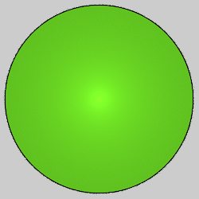](blur-1.flame)

## blur_circle
Circle with even coloring.

Type: 2D blur  
Author: Joel and Michael Faber  
Date: 15 Mar 2009  

Square blur followed by circlize. Same result as circleblur. An older version had a "hole" parameter which didn't work correctly and was later removed.

[Apophysis plugin](https://sourceforge.net/projects/apo-plugins/files/apo-plugins/80810/)   
[Source code](http://sourceforge.net/p/apo-plugins/code/HEAD/tree/)   
[Description at Fractal Formulas](https://fractalformulas.wordpress.com/flame-variations/blur/)   
[Variation information at JWildfire Sanctuary](https://www.jwfsanctuary.club/variation-information/blur/)   

## blur_heart
Creates a heart from two ellipses.

Type: 2D blur  
Author: Luca G (dark-beam)  
Date: 14 Nov 2011  

| Parameter | Description |
| --- | --- |
| p | Power: 1 will make a heart from two ellipses; smaller values make it more "curvey" and heart-like (to a point) |
| a | Shapes the ellipses; make it negative for the heart to be right-side-up |
| b | Shapes the ellipses; make it negative for a hollow heart |

Keep |a|≤|b| to keep the dimple below the zero point; if it goes below, the dimple will have some fill in it.

[Apophysis plugin](https://www.deviantart.com/dark-beam/art/Blur-heart-hearty-apoplugins-269015914)   
[Heart curve information](http://www.mathematische-basteleien.de/heart.htm)   
[Gnarly Blur_Heart Apophysis script](http://www.deviantart.com/art/BCs-BDs-Gnarly-Blur-Heart-Script-284934920)   

## blur3D / pre_blur3D
Three dimensional Gaussian blur.

Type: 3D blur  

[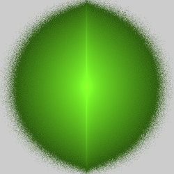](blur3D-1.flame)

## circleblur
Circle with even coloring.

Type: 2D blur  
Author: Anton Liasotskiy (zy0rg)  
Date: 9 Jan 2013  

[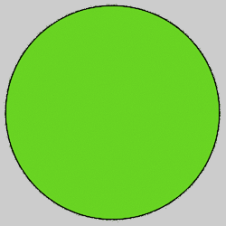](circleblur-1.flame)

[Apophysis plugin](http://zy0rg.deviantart.com/art/Blur-Package-347648919)   
[Description at Fractal Formulas](https://fractalformulas.wordpress.com/flame-variations/blur/)   
[Variation information at JWildfire Sanctuary](https://www.jwfsanctuary.club/variation-information/blur/)   

## gaussian_blur
Fuzzy circle with a bright center, made from a Gaussian distribution.

Type: 2D blur  

[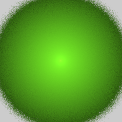](gaussian_blur-1.flame)

[Description at Fractal Formulas](https://fractalformulas.wordpress.com/flame-variations/blur/)   
[Variation information at JWildfire Sanctuary](https://www.jwfsanctuary.club/variation-information/blur/)   

## nBlur
Polygon shaped blur

Type: 2D blur  
Author: FractalDesire  
Date: 21 Dec 2010  

[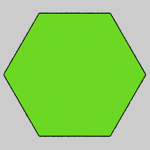](nblur-1.flame) [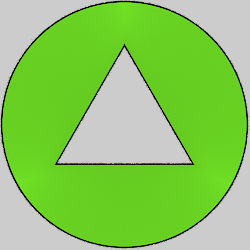](nblur-2.flame)

| Parameter | Description |
| --- | --- |
| numEdges | Specifies number of edges of the polygon. Must be an integer 3 or greater. |
| numStripes | Number of stripes from the center to each side. Must be an integer. Negative values reverse the solid areas and spaces. |
| ratioStripes | The stripe thickness, given as a ratio of solid to space. Valid values are between 0.0 (stripes are lines) and 2.0 (stripes touch each other). Default 1.0 makes the stripes and spaces the same width. |
| ratioHole | Size of the hole in the center of the polygon. Ranges from 0.0 (no hole) to 1.0 (hole is the size of the polygon, so only the edge is visible. |
| circumCircle | Set to 1 to put a circle around the shape. If ratioHole is 0.0, this just shows a circle; increase that to make a polygon hole in the circle. |
| adjustToLinear | If 0, the variation value is the distance from center to corner. If 1, it is the distance from the center to the rightmost (and leftmost) corner. This facilitates horizontal tiling using a separate linear transform. Move the triangle for that transform twice the variation amount of the nBlur transform, and set this parameter to 1 to make the tiled nBlurs just touch.|
| equalBlur | If 0, the center will be denser, possibly making it brighter (depending on the color). If 1, the brightness will be equalized, giving a flat appearance. |
| exactCalc | If 0, the calculation will be interpolated to make the variation run faster. This will sometimes result in faint lines between the center and corners of the polygon, depending on the other settings and the color. If 1, calculation will be exact, but may take longer.|
| highlightEdges | This parameter provides an alternative to exactCalc to reduce the faint lines that sometimes appear between the center and corners of the polygon. The default value is 1; reduce it to darken and increase it to lighten these lines. It can also be used to highlight these edges if desired for special effect. The exactCalc and circumCircle values must both be 0 for this to have any effect. Any value is allowed, but the lowest effective value is 0.1.|

[Apophysis plugin](https://www.deviantart.com/fractaldesire/art/nBlur-plugin-190401515)   
[nBlur blog post - Free Range Apophysis](http://freerangeapophysis.wordpress.com/2011/01/01/first-play-with-nblur/)   
[nBlur - a useful tool](http://zweezwyy.deviantart.com/art/nBlur-a-useful-tool-207495126)   
[Description at Fractal Formulas](https://fractalformulas.wordpress.com/flame-variations/nblur/)   

## obj_mesh_primitive_wf
Use a predefined object as a 3D mesh.

Type: 3D mesh  
Author: Andreas Maschke (thargor6)   
Date: 29 Nov 2016  

[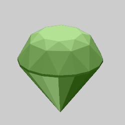](obj_mesh_primitive_wf-1.flame)

| Parameter | Description |
| --- | --- |
| colormap_filename | The file containing a color map to apply to the mesh |
| displ_map_filename | The file containing the displacement map |
| primitive | The object to use: 0: Ball 1: Capsule 2: Cone 3: Diamond 4: Torus 5: Box 6: Gear (15 teeth) 7: Icosahedron 8: Tetrahedron 9: Octahedron 10: Dodecahedron 11: Cylinder with a hole 12: Icosidodecahedron 13: Cubeoctahedron 14: Gear (6 teeth) 15: Smooth gear (6 teeth) 16: Gear (8 teeth) 17: Smooth gear (8 teeth) 18: Gear (12 teeth) 19: Smooth gear (12 teeth) 20: Gear (16 teeth) 21: Smooth gear (16 teeth) 22: Gear (24 teeth) 23: Smooth gear (24 teeth) 24: Mandelbulb 25: Drop
| scale_x, scale_y, scale_z | Scale factors for x, y, and z |
| offset_x, offset_y, offset_z | Shift the mesh in the x, y, and z directions |
| subdiv_level | The number of levels of subdivision to perform; it must be an integer between 0 (to disable smoothing) and 6. Note each level used will dramatically increase both render time and memory needed. |
| subdiv_smooth_passes | The number of Taubin smoothing passes to apply to each subdivision level; it must be an integer between 0 and 24. |
| subdiv_smooth_lambda | The lambda value used for the first step of each pass; it should be a positive number between 0 and 1. |
| subdiv_smooth_mu | The mu value used for the second step of each pass; it should be a negative number between 0 and -1, and is usually a bit less than -lambda). |
| blend_colormap | Whether to blend colormap colors with surrounding colors (color_mode 0 only) 0: Don't blend colors 1: Blend colors |
| displ_amount | Scaling for the displacement map; 0 to disable displacement |
| blend_displ_map | Whether to blend values from the displacement map 0: Don't blend values 1: Blend values |
| receive_only_shadows | If set to 1, and solid rendering is enabled, the mesh will be invisible but will show shadows that fall on it (hard shadows must be enabled to see any) |

[Working with Mesh Objects video tutorial](https://www.youtube.com/watch?v=j470dOB4ksM)  

## pie
A circle with wedges missing, like pieces of pie.

Type: 2D blur  
Author: Joel Faber  
Date: 16 Sep 2007  

[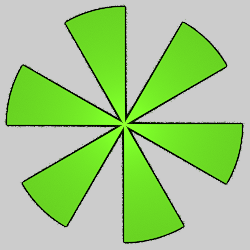](pie-1.flame)

| Parameter | Description |
| --- | --- |
| slices | The number of slices. Two slices will overlap if not an integer (some versions require this to be an integer). |
| rotation | Amount to rotate the shape, in radians. |
| thickness | The proportion of wedge to space, from 0 (wedges are lines) to 1 (no space). |

[Apophysis plugin](http://sourceforge.net/projects/apo-plugins/files/apo-plugins/80810/)  
[A Recipe for Plastic Pie](http://joelfaber.deviantart.com/art/A-Recipe-for-Plastic-Pie-35295850)  

## pie_fl
Fluid version of pie, allows fractional value for slices.

Type: 2D blur  
Author: Fred E (morphapoph)  
Date: 8 Sep 2010  

Same as pie, but relaxes the restriction that slices is an integer.

[Apophysis plugin](https://www.deviantart.com/morphapoph/art/Apo-Anim-friendly-Plugins-178559281)  

## pie3D
Three dimensional version of pie.

Type: 3D blur  
Author: Andreas Maschke (thargor6)  
Date: 21 Nov 2011

[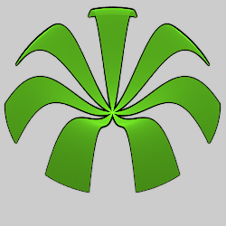](pie3D-1.flame)

| Parameter | Description |
| --- | --- |
| slices | The number of slices. Two slices will overlap if not an integer. |
| rotation | Amount to rotate the shape, in radians. |
| thickness | The proportion of wedge to space, from 0 (wedges are lines) to 1 (no space). |

## pre_blur
Pre version of gaussian_blur.

Type: 2D blur  

## primitives_wf
Blur with selectable two or three dimensional shape.

Type: 2D or 3D blur (depends on shape parameter)  
Author: Andreas Maschke (thargor6)  
Date: 12 Oct 2013  

[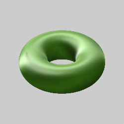](primitives_wf-1.flame)

| Parameter | Description |
| --- | --- |
| shape | Shape of primitive: 0 - Circle or Disk 1 - Sphere 2 - Cube 3 - Square 4 - Triangle 5 - Pyramid 6 - Torus |
| a | For Torus, the radius of the tube |
| b | For Torus, the radius of the hole |
| c | Not used at this time |
| filled | 0 for hollow, 1 for filled (triangles and pyramids are always filled) |

## sineblur
A circle with a shading effect.

Type: 2D blur  
Author: Anton Liasotskiy (zy0rg)  
Date: 9 Jan 2013  

[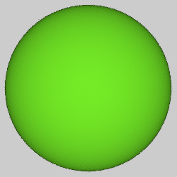](sineblur-1.flame)

| Parameter | Description |
| --- | --- |
| power | Controls the shading effect. |

The appearance is greatly influnced by the background; the default of 1 works well for dark backgrounds, but a somewhat higher value (like 20) is better for light backgrounds. Very high values will have low density in the center. Values less than 1 will produce a smaller circle with a fuzzy edge.

[Apophysis plugin](https://www.deviantart.com/zy0rg/art/Blur-Package-347648919)   
[Description at Fractal Formulas](https://fractalformulas.wordpress.com/flame-variations/blur/)   
[Variation information at JWildfire Sanctuary](https://www.jwfsanctuary.club/variation-information/blur/)   

## sphereblur
3D version of sineblur

Type: 3D blur  
Author: Anton Liasotskiy (zy0rg)  
Date: 9 Jan 2013  

| Parameter | Description |
| --- | --- |
| power | Controls the shading effect. |

[Apophysis plugin](http://zy0rg.deviantart.com/art/Sphereblur-687844594)   

## square
Square shaped blur

Type: 2D blur  
Author: Antonio Intieri (gygrazok)  

[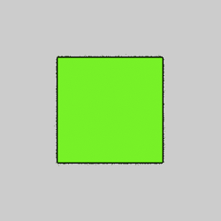](square-1.flame)

[Apophysis plugin](http://lu-kout.deviantart.com/art/Apophysis-Plugin-Pack-1-v0-4-59907275)   

## square3D
Cube shaped blur

Type: 3D blur  

[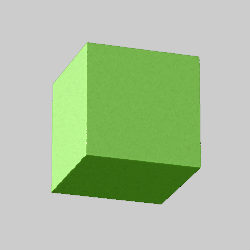](square3D-1.flame)

## starblur
Star shaped blur

Type: 2D blur  
Author: Anton Liasotskiy (zy0rg)  
Date: 9 Jan 2013  

[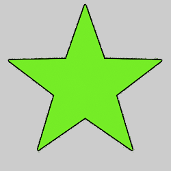](starblur-1.flame) [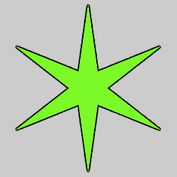](starblur-2.flame)

| Parameter | Description |
| --- | --- |
| power | Number of points |
| range | Proportional distance of the inner angles |

Negative values are allowed for both parameters, and can generate interesting shapes.

[Apophysis plugin](https://www.deviantart.com/zy0rg/art/Blur-Package-347648919)   

## superShape3d
General 3D shape generator using two superformula instances.

Type: 3D blur  
Name: David Young (Sc0t0ma)  
Date: 19 Oct 2008  

[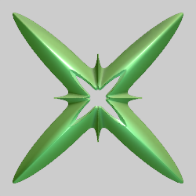](superShape3d-1.flame) [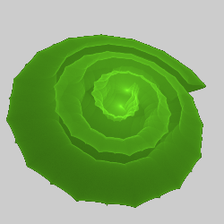](superShape3d-2.flame)

| Parameter | Description |
| --- | --- |
| rho | Upper bound for XY drawing; when m1 is an integer, the optimal value is 𝜋2 ≈ 9.8696; increase when m1 is fractional or spiral is non-zero |
| phi | Upper bound for YZ drawing; a typical value is 𝜋2/4 ≈ 2.4674, which fills a quarter of the shape; adjust as needed |
| m1 | Number of corners for the XY plane |
| m2 | Number of corners for the YZ plane |
| a1, b1 | Stretch or contract the XY plane shape |
| a2, b2 | Stretch or contract the YZ plane shape |
| n1_1, n2_1, n3_1 | Shaping variables for the XY plane |
| n1_2, n2_2, n3_2 | Shaping variables for the YZ plane |
| spiral | Set to a non-zero value to make 3D Archimedean spirals |
| toroidmap | 0: Map points to spherical coordinates (normal) 1: Map points to toroidal coordinates |

[Apophysis plugin](https://www.deviantart.com/sc0t0ma/art/SuperShape3d-101195889)  
[Description and examples by Paul Bourke](http://paulbourke.net/geometry/supershape/)
[Examples by Reza Ali](https://www.syedrezaali.com/3d-supershapes/)   

## triangle
Triangular blur (3D)

Type: 3D blur  
Author: Jesus Sosa  
Date: 7 May 2020

[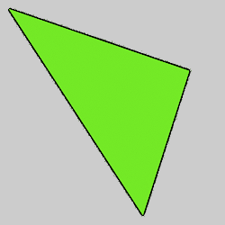](triangle-1.flame)

| Parameter | Description |
| --- | --- |
| x1, y1, z1 | Coordinates of the first vertex |
| x2, y2, z2 | Coordinates of the second vertex |
| x3, y3, z3 | Coordinates of the third vertex |

## waveblur_wf
Creates waves, like ripples in a pond.

Type: 3D blur  
Author: Andreas Maschke  
Date: 30 Jan 2015  

[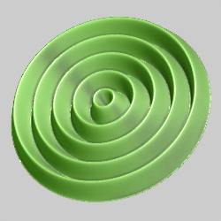](waveblur-1.flame)

| Parameter | Description |
| --- | --- |
| count | Number of waves |
| phase | Wave phase; negative values leave hole in center, positive values make waves overlap in center |
| amplitude_z | Z amplitude |
| damping_z | Damping factor for successive waves; positive values make waves further from center smaller |
| direct_color | 0 for normal color, 1 for direct color |
| color_scale | Scale for color if using direct color |
| color_offset | Color offset if using direct color |

## xheart_blur_wf
Heart shaped blur

Type: 2D blur  
Author: Andreas Maschke  
Date: 30 Aug 2014  

[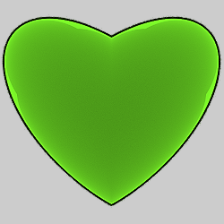](xheart_blur-1.flame)

Based on xheart (which is not a blur).

| Parameter | Description |
| --- | --- |
| angle | Angle of the lobes in radians (offset from π/4) |
| ratio | Stretch factor for the lobes |

## zblur
Gaussian blur for the z axis only (no effect on x or y).

Type: 3D blur
