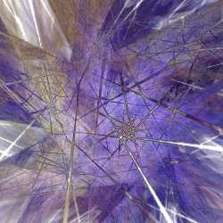

# Shredders
Variations that shred the plane in various ways.

## checks
Divides the flame into a checkerboard and shifts half of the squares up and left and the other half down and right.

Type: 2D  
Author: Keeps Spencer (gossamer-light)  
Date: 19 Nov 2007  

| Parameter | Description |
| --- | --- |
| x | Horizontal shift amount |
| y | Vertical shift amount |
| size | Size of the squares which checks divides the flame into |
| rnd | Amount of randomness to add (horizontal for half the squares, vertical for the rest) |

[Archive of Apophysis plugin](https://web.archive.org/web/20101229095529/https://xyrus02.deviantart.com/art/Checks-The-fixed-version-138967784) (Wayback Machine)

## shredded
Shreds the flame into strips in the x, y, and z directions and scrambles them.

Type: 3D  
Author: Brad Stefanov  
Date: 14 Sep 2019  

| Parameter | Description |
| --- | --- |
| x1 | Scale for x before shredding |
| x2 | Scale for x after shredding |
| x3 | Scale for x after scrambling |
| x_blur_amount | Amount of x blur to add if blur is 1 |
| y1 | Scale for y before shredding |
| y2 | Scale for y after shredding |
| y3 | Scale for y after scrambling |
| y_blur_amount | Amount of y blur to add if blur is 1 |
| z1 | Scale for z before shredding |
| z2 | Scale for z after shredding |
| z3 | Scale for z after scrambling |
| z_blur_amount | Amount of z blur to add if blur is 1 |
| type | Selects the type of shredding to perform; allowed values are 0, 1, and 2 |
| blur | 0: Don't add blur (ignore _blur_amount parameters) 1: Add blur; the amount is controlled by the _blur_amount parameters |

[JWildfire forum post](https://jwildfire-forum.overwhale.com/viewtopic.php?f=23&t=2789)  

## shredlin
Divides the plane into horizontal and vertical strips and shrinks them.

Type: 2D  
Author: Anton Liasotskiy (zy0rg)  
Date: 15 Jul 2011  

| Parameter | Description |
| --- | --- |
| xdistance | Width of vertical strips before shrinking |
| xwidth | Shrink factor for vertical strips; 1 for no shrinking, negative to reverse them |
| ydistance | Height of horizontal strips before shrinking |
| ywidth | Shrink factor for horizontal strips; 1 for no shrinking, negative to reverse them |

[Apophysis plugin](https://www.deviantart.com/zy0rg/art/ShredLin-228579947)  

## shredrad
Divides the plane into wedges and shrinks them

Type: 2D  
Author: Anton Liasotskiy (zy0rg)  
Date: 15 Jul 2011  

| Parameter | Description |
| --- | --- |
| n | Number of wedges |
| width | Shrink factor for each wedge; 1 for no shrinking, negative to reverse them |

[Apophysis plugin](https://www.deviantart.com/zy0rg/art/ShredRad-228572887)
