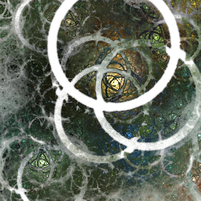

# Splitters
Variations that split the flame in various ways.

## circlesplit
Split the flame in a circle centered at the origin.

Type: 2D  
Author: Tatyana Zabanova (tatasz)  
Date: 27 Nov 2016  

| Parameter | Description |
| --- | --- |
| cs_radius | Radius of the outside of the splitting ring |
| cs_split | Width of the splitting ring; negative values are the same as zero; values larger than cs_radius are the same as increasing cs_radius |

[Apophysis plugin](https://www.deviantart.com/tatasz/art/Apophysis-Plugin-Pack-1-647321921)  
[Understanding circlesplit video tutorial](https://www.youtube.com/watch?v=iSOoS2BULmI)  

## circus
Scale the unit circle and the the rest of the flame separately.

Type: 2D  
Author: Michael Faber  
Date: 11 Sep 2011  

| Parameter | Description |
| --- | --- |
| scale | Amount to scale the flame; when less than 1, the unit circle is shrunk and the rest is expanded, leaving a ring in the middle; when more than 1, the opposite is done, causing overlap. |

[Apophysis plugin](https://www.deviantart.com/michaelfaber/art/The-Lost-Variations-258913970)  
[Understanding Circus video tutorial](https://www.youtube.com/watch?v=DNxQARCQfiI)  
[Mobius-SphericalN-Flux Apophysis script](https://www.deviantart.com/bpclarke/art/BC-BD-s-Mobius-SphericalN-Flux-263981120)  

## corners
Splits the plane along the x and y axes and stretches it as if tugging the corners.

Type: 2D  
Author: Whittaker Courtney  
Date: 7 Aug 2018  

| Parameter | Description |
| --- | --- |
| x | Horizontal split amount; negative values create overlap |
| y | Vertical split amount; negative values create overlap |
| mult x | Horizontal scale factor |
| mult y | Vertical scale factor |
| x power | Horizontal acceleration; 0.5 for none (same as splits) |
| y power | Vertical acceleration; 0.5 for none (same as splits) |
| xy power add | Amount added to both x and y power (adjusts both at the same time) |
| log mode (0/1) | 0: accelerate based on the square of x or y 1: accelerate based on the log of x or y |
| log base | Base to use for log mode (ignored if log mode is 0) |

[JWildfire forum post](https://jwildfire-forum.overwhale.com/viewtopic.php?f=23&t=2660)  

## separation
Splits the plane along the x and y axes, squishing or stretching the half planes.

Type: 2D  
Author: Michael Faber  
Date: 10 Aug 2008  

| Parameter | Description |
| --- | --- |
| x | Horizontal split amount; negative values are the same as positive |
| xinside | Controls horizontal movement of points further from the axis, from stretching if negative, squishing if between 0 and 1, and mirroring if larger than 1 |
| y | Vertical split amount; negative values are the same as positive |
| yinside | Controls vertical movement of points further from the axis, from stretching if negative, squishing if between 0 and 1, and mirroring if larger than 1 |

[Apophysis plugin](https://sourceforge.net/projects/apo-plugins/files/apo-plugins/80810/)  
[Separation-julian tutorial](https://www.deviantart.com/vickym72/art/Apophysis-Tutorial-168239040)  
[SJ Flower tutorial](https://www.deviantart.com/fractist/art/chaotica-SJflower-tutorial-by-fractist-654271587)  

## spligon
Divide the plane into wedges and move them apart and around, leaving a polygon in the center.

Type: 2D  
Author: Luca G (dark-beam)  
Date: 28 Sep 2018  

| Parameter | Description |
| --- | --- |
| sides | Number of wedges to split the plane into |
| r | Distance to move each wedge from the origin |
| i | Controls the distance to move the wedges around; (sides - 2) or (-2 - sides) to make them align perfectly with only a polygon at the center, -2 to only move wedges apart |

## splits
Splits the plane along the x and y axes, moving the half planes evenly.

Type: 2D  
Author: Michael Faber  
Date: 10 Aug 2008  

The original version has only x and y parameters. Some versions have additional shear parameters, which work differently depending on the version.

Don't confuse splits with the similarly named variation split.

| Parameter | Description |
| --- | --- |
| x | Horizontal split amount; negative values create overlap |
| y | Vertical split amount; negative values create overlap |
| lshear | Move the left half of the flame up or down |
| rshear | Move the right half of the flame up or down |
| ushear | Move the bottom half of the flame right or left |
| dshear | Move the top half of the flame right or left |

[Apophysis plugin](https://sourceforge.net/projects/apo-plugins/files/apo-plugins/80810/)  
[Variation information at JWildfire Sanctuary](https://www.jwfsanctuary.club/variation-information/splits/)  
[Description at Fractal Formulas](https://fractalformulas.wordpress.com/flame-variations/splits-and-splits3d/)  
[Splits-Crop tutorial](https://www.deviantart.com/guagapunyaimel/art/Splits-Crop-Tutorial-177103913)  
[Splits-Cylinder tutorial](https://www.deviantart.com/fiery-fire/art/Splits-Cylinder-Tuto-for-Apo-210366882)  
[Splits Elliptic tutorial](https://www.deviantart.com/satania/art/Tutorial-Splits-elliptic-150422119)  
[Elliptic Splits tutorial](https://www.deviantart.com/epogh/art/Smo-quick-Elliptic-Splits-Apo-Tutorial-288784010)  
[Splits-Ngon tutorial](https://www.deviantart.com/guagapunyaimel/art/Splits-Ngon-Tutorial-170779905)  
[Apophysis Base Forms pack](https://www.deviantart.com/tyrantwave/art/Apophysis-Base-Forms-Pack-103671251)  
[Splits Cylinders Apophysis script](https://www.deviantart.com/fractal-resources/art/BC-and-BDs-Split-Cylinders-Scr-115099842)  
[Samhain Splits JWildfire script](https://www.jwfsanctuary.club/downloads/scripts/michael-bourne/samhain-splits/)  

## splits3D
Splits the flame along the x, y, and z axes.

Type: 3D  
Author: Chris Johns (TyrantWave)  
Date: 24 Dec 2008  

| Parameter | Description |
| --- | --- |
| x | Horizontal split amount; negative values create overlap |
| y | Vertical split amount; negative values create overlap |
| z | Z axis split amount; negative values create overlap |

[Apophysis plugin](https://www.deviantart.com/tyrantwave/art/Splits3D-Plugin-107262795)  
[Description at Fractal Formulas](https://fractalformulas.wordpress.com/flame-variations/splits-and-splits3d/)  
