# Stamps
Variations that create colored stamps with interesting designs. They are all blur variations (they ignore their inputs) and by default use true color (they set specific red, green, and blue values) though there is an option to use the gradient (direct color).

## dc_acrilic
Create a pattern reminiscent of acrylic pour painting.

Type: 2D blur, true color or direct color  
Author: Jesus Sosa  
Date: 12 Feb 2019  

| Parameter | Description |
| --- | --- |
| Seed | Not used, but changing the value will change the time parameter to a random value |
| time | Changes the appearance of the result |
| zoom | Zooms in or out of the result (higher values zoom out) |
| Steps | Number of iterations to use when computing the pattern |
| p1, p2, p3, p4, p5, p6 | Adjust the appearance of the pattern |
| Red, Green, Blue Fac. | Factors for the red, green, and blue components of the colors; adjust these to tweak the colors |
| ColorOnly | 0: Normal operation (variation is a blur; input points are ignored) 1: Color only mode (variation is like linear, but colors the points) |
| Gradient | 0: True color (gradient is ignored) 1: Gradient true color (like true color, but colors are taken from the gradient) 2: Direct color (set the gradient index for coloring) |
| z_scale | Scale factor for adjusting the z value based on the color |
| z_offset | Amount to shift result up or down the z axis |
| reset_z | 0: Add color-based z value to the the z value from other variations on the transform 1: Ignore z value from other variations on the transform |

## dc_apollonian
Create a colorful pattern.

Type: 2D blur, true color or direct color  
Author: Jesus Sosa, based on code by Wyatt Flanders  
Date: 12 Feb 2019  

[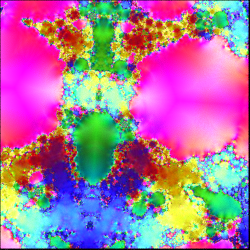](dc_apollonian-1.flame)

| Parameter | Description |
| --- | --- |
| seed | Not used, but changing the value will change the time parameter to a random value |
| time | Changes the appearance of the result |
| ColorOnly | 0: Normal operation (variation is a blur; input points are ignored) 1: Color only mode (variation is like linear, but colors the points) |
| Gradient | 0: True color (gradient is ignored) 1: Gradient true color (like true color, but colors are taken from the gradient) 2: Direct color (set the gradient index for coloring) |
| z_scale | Scale factor for adjusting the z value based on the color |
| z_offset | Amount to shift result up or down the z axis |
| reset_z | 0: Add color-based z value to the the z value from other variations on the transform 1: Ignore z value from other variations on the transform |

https://www.shadertoy.com/view/Xdcyzl  

## dc_booleans
Creates patterns based on boolean operators.

Type: 2D blur, true color or direct color  
Author: Jesus Sosa, based on code by Paul Ferris (dust) and Kirill (python273)  
Date: 29 Aug 2019  

[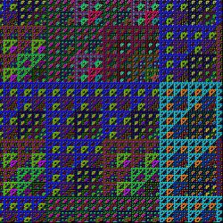](dc_booleans-1.flame)

| Parameter | Description |
| --- | --- |
| randomize | The random number seed used for generating the random pattern; should not be animated |
| ^/&/\| | The operation to use: 0: xor (^) 1: and (&) 2: or (\|) |
| zoom | Zooms in or out of the result (higher values zoom out) |
| ColorOnly | 0: Normal operation (variation is a blur; input points are ignored) 1: Color only mode (variation is like linear, but colors the points) |
| Gradient | 0: True color (gradient is ignored) 1: Gradient true color (like true color, but colors are taken from the gradient) 2: Direct color (set the gradient index for coloring) |
| z_scale | Scale factor for adjusting the z value based on the color |
| z_offset | Amount to shift result up or down the z axis |
| reset_z | 0: Add color-based z value to the the z value from other variations on the transform 1: Ignore z value from other variations on the transform |

https://www.shadertoy.com/view/4ldcW8  

## dc_butterflies
Creates butterfly patterns using a Nova fractal.

Type: 2D blur, true color or direct color  
Author: Jesus Sosa, based on code by Stéphane Guillitte (guil)  
Date: 20 Oct 2019  

[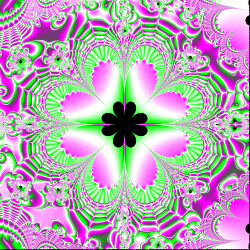](dc_butterflies-1.flame)

| Parameter | Description |
| --- | --- |
| seed | Not used, but changing the value will change the time parameter to a random value |
| time | Changes the appearance of the result |
| zoom | Zooms in or out of the result (higher values zoom out) |
| red, green, blue | Relative weights of red, green, and blue for coloring; the result is grayscale when they are all the same |
| ColorOnly | 0: Normal operation (variation is a blur; input points are ignored) 1: Color only mode (variation is like linear, but colors the points) |
| Gradient | 0: True color (gradient is ignored) 1: Gradient true color (like true color, but colors are taken from the gradient) 2: Direct color (set the gradient index for coloring) |
| z_scale | Scale factor for adjusting the z value based on the color |
| z_offset | Amount to shift result up or down the z axis |
| reset_z | 0: Add color-based z value to the the z value from other variations on the transform 1: Ignore z value from other variations on the transform |

https://www.shadertoy.com/view/Xd2GRh  

## dc_cairotiles
Create patterns from rotated squares in a grid.

Type: 2D blur, true color or direct color  
Author: Jesus Sosa, based on code by Edd Biddulph  
Date: 13 Feb 2019  

| Parameter | Description |
| --- | --- |
| zoom | Zooms in or out of the result (higher values zoom out) |
| seed | Not used, but changing the value will change the time parameter to a random value |
| time | Changes the appearance of the result |
| ColorOnly | 0: Normal operation (variation is a blur; input points are ignored) 1: Color only mode (variation is like linear, but colors the points) |
| Gradient | 0: True color (gradient is ignored) 1: Gradient true color (like true color, but colors are taken from the gradient) 2: Direct color (set the gradient index for coloring) |
| z_scale | Scale factor for adjusting the z value based on the color |
| z_offset | Amount to shift result up or down the z axis |
| reset_z | 0: Add color-based z value to the the z value from other variations on the transform 1: Ignore z value from other variations on the transform |

https://www.shadertoy.com/view/3tfGW7  

## dc_circlesblue
Create random bubbles.

Type: 2D blur, true color or direct color  
Author: Jesus Sosa, based on code by Inigo Quilez  
Date: 12 Feb 2019  

| Parameter | Description |
| --- | --- |
| Seed | Not used, but changing the value will change the time parameter to a random value |
| time | Changes the appearance of the result |
| zoom | Zooms in or out of the result (higher values zoom out) |
| Radius | Radius of the bubbles (some are further away, so appear smaller) |
| Bubles | Number of bubbles (some may not be visible, depending on zoom level) |
| ColorOnly | 0: Normal operation (variation is a blur; input points are ignored) 1: Color only mode (variation is like linear, but colors the points) |
| Gradient | 0: True color (gradient is ignored) 1: Gradient true color (like true color, but colors are taken from the gradient) 2: Direct color (set the gradient index for coloring) |
| z_scale | Scale factor for adjusting the z value based on the color |
| z_offset | Amount to shift result up or down the z axis |
| reset_z | 0: Add color-based z value to the the z value from other variations on the transform 1: Ignore z value from other variations on the transform |

https://www.shadertoy.com/view/4dl3zn  

## dc_circuits
Create a pattern reminiscent of a circuit board.

Type: 2D blur, true color or direct color  
Author: Jesus Sosa, based on code by Kali  
Date: 12 Feb 2019  

[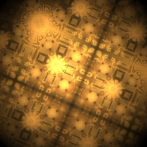](dc_circuits-1.flame)

| Parameter | Description |
| --- | --- |
| Seed | Not used, but changing the value will change the time parameter to a random value |
| time | Changes the appearance of the result |
| rate |
| intensity |
| focus |
| pulse |
| glow |
| loops | Number of times the generator function is executed; higher values produce more intricate results (but slow down rendering) |
| zoom | Zooms in or out of the result (higher values zoom out) |
| ColorOnly | 0: Normal operation (variation is a blur; input points are ignored) 1: Color only mode (variation is like linear, but colors the points) |
| Gradient | 0: True color (gradient is ignored) 1: Gradient true color (like true color, but colors are taken from the gradient) 2: Direct color (set the gradient index for coloring) |
| z_scale | Scale factor for adjusting the z value based on the color |
| z_offset | Amount to shift result up or down the z axis |
| reset_z | 0: Add color-based z value to the the z value from other variations on the transform 1: Ignore z value from other variations on the transform |

https://www.shadertoy.com/view/XlX3Rj  

## dc_code
Create a fractal picture, using arbitrary code.

Type: 2D blur, true color or direct color  
Author: Jesus Sosa  
Date: 22 May 2019  

[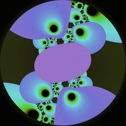](dc_code-1.flame)

| Parameter | Description |
| --- | --- |
| code | The Java code to execute; must be a definition for function getRGBColor, which is called for each iteration |
| randomize | The random number seed used for randomly generating the code; should not be animated |
| PanX, PanY | Moves the result left/right (PanX) or up/down (PanY) |
| zoom | Zooms in or out of the result (higher values zoom out) |
| ColorOnly | 0: Normal operation (variation is a blur; input points are ignored) 1: Color only mode (variation is like linear, but colors the points) |
| Gradient | 0: True color (gradient is ignored) 1: Gradient true color (like true color, but colors are taken from the gradient) 2: Direct color (set the gradient index for coloring) |
| z_scale | Scale factor for adjusting the z value based on the color |
| z_offset | Amount to shift result up or down the z axis |
| reset_z | 0: Add color-based z value to the the z value from other variations on the transform 1: Ignore z value from other variations on the transform |

## dc_ducks
Create a fractal "ducks" pattern.

Type: 2D blur, true color or direct color  
Author: Jesus Sosa, based on code by Cyberxaos  
Date: 13 Feb 2019  

[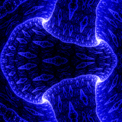](dc_ducks-1.flame)

| Parameter | Description |
| --- | --- |
| seed | Not used, but changing the value will change the time parameter to a random value |
| time | Changes the appearance of the result |
| zoom | Zooms in or out of the result (higher values zoom out) |
| ColorOnly | 0: Normal operation (variation is a blur; input points are ignored) 1: Color only mode (variation is like linear, but colors the points) |
| Gradient | 0: True color (gradient is ignored) 1: Gradient true color (like true color, but colors are taken from the gradient) 2: Direct color (set the gradient index for coloring) |
| z_scale | Scale factor for adjusting the z value based on the color |
| z_offset | Amount to shift result up or down the z axis |
| reset_z | 0: Add color-based z value to the the z value from other variations on the transform 1: Ignore z value from other variations on the transform |

https://www.shadertoy.com/view/4dXGWn

## dc_fingerprint
Create a pattern resembling a fingerprint.

Type: 2D blur, true color or direct color  
Author: Jesus Sosa, based on code by Diviaki  
Date: 13 Feb 2019  

[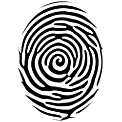](dc_fingerprint-1.flame)

| Parameter | Description |
| --- | --- |
| zoom | Zooms in or out of the result (higher values zoom out) |
| seed | Not used, but changing the value will change the time parameter to a random value |
| time | Changes the appearance of the result |
| width | Sets the width of the fingerprint "ridges" |
| ColorOnly | 0: Normal operation (variation is a blur; input points are ignored) 1: Color only mode (variation is like linear, but colors the points) |
| Gradient | 0: True color (gradient is ignored) 1: Gradient true color (like true color, but colors are taken from the gradient) 2: Direct color (set the gradient index for coloring) |
| z_scale | Scale factor for adjusting the z value based on the color |
| z_offset | Amount to shift result up or down the z axis |
| reset_z | 0: Add color-based z value to the the z value from other variations on the transform 1: Ignore z value from other variations on the transform |

https://www.shadertoy.com/view/4t3SWN  

## dc_fractaldots
Create a pattern from fractally arranged dots.

Type: 2D blur, true color or direct color  
Author: Jesus Sosa, based on code by Paulo Falcão  
Date: 13 Feb 2019  

[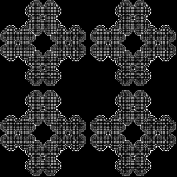](dc_fractaldots-1.flame)

| Parameter | Description |
| --- | --- |
| iterations | Number of iterations to perform; higher values make more intricate patterns, but slow down rendering |
| DotSize |
| MaxIterations | Maximum number of iterations; should be greater than iterations |
| complexity |
| pattern | Divisor for spacing for each iteration |
| spacing | Spacing amount for the first iteration |
| rotate1 | Overall rotation, in radians |
| rotate2 | Rotation for each iteration, in radians |
| zoom | Zooms in or out of the result (higher values zoom out) |
| ColorOnly | 0: Normal operation (variation is a blur; input points are ignored) 1: Color only mode (variation is like linear, but colors the points) |
| Gradient | 0: True color (gradient is ignored) 1: Gradient true color (like true color, but colors are taken from the gradient) 2: Direct color (set the gradient index for coloring) |
| z_scale | Scale factor for adjusting the z value based on the color |
| z_offset | Amount to shift result up or down the z axis |
| reset_z | 0: Add color-based z value to the the z value from other variations on the transform 1: Ignore z value from other variations on the transform |

https://www.shadertoy.com/view/tltSWs  

# dc_fractcolor
Generate a colorful fractal pattern.

Type: 2D blur, true color or direct color  
Author: Jesus Sosa, based on code by Robert Schütze (trirop) and tholzer  
Date: 13 Feb 2019  

[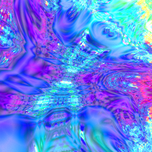](dc_fractcolor-1.flame)

| Parameter | Description |
| --- | --- |
| randomize | Not used, but changing the value will change the time, xPar, and yPar parameters to random values |
| time |
| xPar, yPar |
| Iters | Number of iterations to perform |
| zoom | Zooms in or out of the result (higher values zoom out) |
| ColorOnly | 0: Normal operation (variation is a blur; input points are ignored) 1: Color only mode (variation is like linear, but colors the points) |
| Gradient | 0: True color (gradient is ignored) 1: Gradient true color (like true color, but colors are taken from the gradient) 2: Direct color (set the gradient index for coloring) |
| z_scale | Scale factor for adjusting the z value based on the color |
| z_offset | Amount to shift result up or down the z axis |
| reset_z | 0: Add color-based z value to the the z value from other variations on the transform 1: Ignore z value from other variations on the transform |

https://www.shadertoy.com/view/MsK3zG  
http://glslsandbox.com/e#29611.0  

## dc_gabornoise
Generate a pattern resembling Gabor noise.

Type: 2D blur, true color or direct color  
Author: Jesus Sosa, based on code by Fabrice Neyret  
Date: 10 May 2019  

[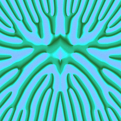](dc_gabornoise-1.flame)

| Parameter | Description |
| --- | --- |
| seed | Not used, but changing the value will change the time parameter to a random value |
| time |
| zoom | Zooms in or out of the result (higher values zoom out) |
| ColorOnly | 0: Normal operation (variation is a blur; input points are ignored) 1: Color only mode (variation is like linear, but colors the points) |
| Gradient | 0: True color (gradient is ignored) 1: Gradient true color (like true color, but colors are taken from the gradient) 2: Direct color (set the gradient index for coloring) |
| z_scale | Scale factor for adjusting the z value based on the color |
| z_offset | Amount to shift result up or down the z axis |
| reset_z | 0: Add color-based z value to the the z value from other variations on the transform 1: Ignore z value from other variations on the transform |

https://www.shadertoy.com/view/3slXDf

## dc_glypho
Generate a pattern based on rings of nested circles.

Type: 2D blur, true color or direct color  
Author: Jesus Sosa  
Date: 13 Feb 2019  

[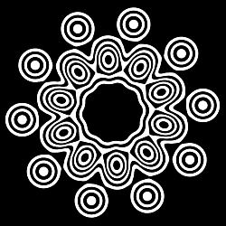](dc_glypho-1.flame)

| Parameter | Description |
| --- | --- |
| zoom | Zooms in or out of the result (higher values zoom out) |
| seed | Not used, but changing the value will change the time parameter to a random value |
| time | Changes the rotation of the rings of circles |
| f1 | Size of the nested circles
| f2 | Proportional width of the spaces between the circles, from 0 to 1 |
| f3 | Controls the number of circles in each nest
| ColorOnly | 0: Normal operation (variation is a blur; input points are ignored) 1: Color only mode (variation is like linear, but colors the points) |
| Gradient | 0: True color (gradient is ignored) 1: Gradient true color (like true color, but colors are taken from the gradient) 2: Direct color (set the gradient index for coloring) |
| z_scale | Scale factor for adjusting the z value based on the color |
| z_offset | Amount to shift result up or down the z axis |
| reset_z | 0: Add color-based z value to the the z value from other variations on the transform 1: Ignore z value from other variations on the transform |

## dc_grid3D
Generate a 2D image of a 3D grid.

Type: 2D blur, true color or direct color  
Author: Jesus Sosa, based on code by Kapsy and Kabuto  
Date: 13 Feb 2019  

| Parameter | Description |
| --- | --- |
| zoom | Zooms in or out of the result (higher values zoom out) |
| Seed | Not used, but changing the value will change the time parameter to a random value |
| time | Rotates the view |
| ColorOnly | 0: Normal operation (variation is a blur; input points are ignored) 1: Color only mode (variation is like linear, but colors the points) |
| Gradient | 0: True color (gradient is ignored) 1: Gradient true color (like true color, but colors are taken from the gradient) 2: Direct color (set the gradient index for coloring) |
| z_scale | Scale factor for adjusting the z value based on the color |
| z_offset | Amount to shift result up or down the z axis |
| reset_z | 0: Add color-based z value to the the z value from other variations on the transform 1: Ignore z value from other variations on the transform |

## dc_hexagons
Generate a hexagon grid pattern.

Type: 2D blur, true color or direct color  
Author: Jesus Sosa  
Date: 13 Feb 2019  

| Parameter | Description |
| --- | --- |
| shape | Overall stamp shape, 0 for square, 1 for circle |
| seed | Not used, but changing the value will change the time parameter to a random value |
| time | Controls the arrangement of the hexagons in the grid
| zoom | Zooms in or out of the result (higher values zoom out) |
| ColorOnly | 0: Normal operation (variation is a blur; input points are ignored) 1: Color only mode (variation is like linear, but colors the points) |
| Gradient | 0: True color (gradient is ignored) 1: Gradient true color (like true color, but colors are taken from the gradient) 2: Direct color (set the gradient index for coloring) |
| z_scale | Scale factor for adjusting the z value based on the color |
| z_offset | Amount to shift result up or down the z axis |
| reset_z | 0: Add color-based z value to the the z value from other variations on the transform 1: Ignore z value from other variations on the transform |

## dc_hoshi
Create a design based on fractal hoshi tiling.

Type: 2D blur, true color or direct color  
Author: Jesus Sosa  
Date: 12 Feb 2019  

[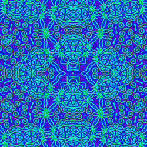](dc_hoshi-1.flame)

| Parameter | Description |
| --- | --- |
| Seed | Not used, but changing the value will change the time parameter to a random value |
| time | Controls the tiling rotation and coloring |
| Steps | Number of iterations to perform |
| Scale | Scale factor for each iteration |
| Translate | Translation amount for each iteration |
| ColorOnly | 0: Normal operation (variation is a blur; input points are ignored) 1: Color only mode (variation is like linear, but colors the points) |
| Gradient | 0: True color (gradient is ignored) 1: Gradient true color (like true color, but colors are taken from the gradient) 2: Direct color (set the gradient index for coloring) |
| z_scale | Scale factor for adjusting the z value based on the color |
| z_offset | Amount to shift result up or down the z axis |
| reset_z | 0: Add color-based z value to the the z value from other variations on the transform 1: Ignore z value from other variations on the transform |

## dc_hyperbolictile
Create a {3,8} hyperbolic tessellation mapped to a Poincaré disk.

Type: 2D blur, true color or direct color  
Author: Jesus Sosa  
Date: 13 Feb 2019  

| Parameter | Description |
| --- | --- |
| zoom | Zooms in or out of the result (higher values zoom out) |
| ColorOnly | 0: Normal operation (variation is a blur; input points are ignored) 1: Color only mode (variation is like linear, but colors the points) |
| Gradient | 0: True color (gradient is ignored) 1: Gradient true color (like true color, but colors are taken from the gradient) 2: Direct color (set the gradient index for coloring) |
| z_scale | Scale factor for adjusting the z value based on the color |
| z_offset | Amount to shift result up or down the z axis |
| reset_z | 0: Add color-based z value to the the z value from other variations on the transform 1: Ignore z value from other variations on the transform |

## dc_inversion
Create a fractal design based on circle inversion.

Type: 2D blur, true color or direct color  
Author: Jesus Sosa  
Date: 12 Feb 2019  

| Parameter | Description |
| --- | --- |
| seed | Not used, but changing the value will change the time parameter to a random value |
| time | Changes the appearance of the result |
| Iterations | Number of iterations to perform |
| ScaleX, ScaleY | Scale factors for x and y in each iteration |
| ColorOnly | 0: Normal operation (variation is a blur; input points are ignored) 1: Color only mode (variation is like linear, but colors the points) |
| Gradient | 0: True color (gradient is ignored) 1: Gradient true color (like true color, but colors are taken from the gradient) 2: Direct color (set the gradient index for coloring) |
| z_scale | Scale factor for adjusting the z value based on the color |
| z_offset | Amount to shift result up or down the z axis |
| reset_z | 0: Add color-based z value to the the z value from other variations on the transform 1: Ignore z value from other variations on the transform |

## dc_kaleidocomplex
Generate a kaleidoscopic pattern.

Type: 2D blur, true color or direct color  
Author: Jesus Sosa, based on code by bal-khan  
Date: 12 Feb 2019  

[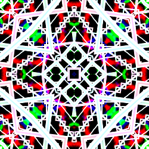](dc_kaleidocomplex-1.flame)

| Parameter | Description |
| --- | --- |
| Seed | Not used, but changing the value will change the time parameter to a random value |
| time | Changes the appearance of the result |
| iMax | Maximum number of iterations |
| Color |
| Red, Green, Blue Fac. | Factors for the red, green, and blue components of the colors; adjust these to tweak the colors |
| ColorOnly | 0: Normal operation (variation is a blur; input points are ignored) 1: Color only mode (variation is like linear, but colors the points) |
| Gradient | 0: True color (gradient is ignored) 1: Gradient true color (like true color, but colors are taken from the gradient) 2: Direct color (set the gradient index for coloring) |
| z_scale | Scale factor for adjusting the z value based on the color |
| z_offset | Amount to shift result up or down the z axis |
| reset_z | 0: Add color-based z value to the the z value from other variations on the transform 1: Ignore z value from other variations on the transform |

https://www.shadertoy.com/view/4slBW2  

## dc_kaleidoscopic
Generate a kaleidoscopic pattern.

Type: 2D blur, true color or direct color  
Author: Jesus Sosa, based on code by gPlatl and ackleyrc  
Date: 12 Feb 2019  

| Parameter | Description |
| --- | --- |
| Seed | Not used, but changing the value will change the time parameter to a random value |
| time | Kaleidoscope rotation (if Radial is 1) |
| Sides | Number of sides for the pattern, between 2 and 20 (if Radial is 1) |
| zoom | Scale factor before kaleidoscopic reflection, between 0 and 1 |
| P1 | Controls the base pattern, between 0 and 1 |
| Radial | 0: Show only the base pattern without kaleidoscopic symmetry 1: Reflect the base pattern radially, using Sides and time |
| ColorOnly | 0: Normal operation (variation is a blur; input points are ignored) 1: Color only mode (variation is like linear, but colors the points) |
| Gradient | 0: True color (gradient is ignored) 1: Gradient true color (like true color, but colors are taken from the gradient) 2: Direct color (set the gradient index for coloring) |
| z_scale | Scale factor for adjusting the z value based on the color |
| z_offset | Amount to shift result up or down the z axis |
| reset_z | 0: Add color-based z value to the the z value from other variations on the transform 1: Ignore z value from other variations on the transform |

https://www.shadertoy.com/view/4lXyWS  

## dc_kaliset
Generate a pattern using Kalisets.

Type: 2D blur, true color or direct color  
Author: Jesus Sosa, based on code by foran  
Date: 13 Feb 2019  

[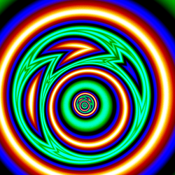](dc_kaliset-1.flame)

| Parameter | Description |
| --- | --- |
| Seed | Not used, but changing the value will change the time parameter to a random value |
| time | Changes the appearance of the result |
| zoom | Zooms in or out of the result (higher values zoom out) |
| N | Number of iterations |
| ShiftX, ShiftY | Amount pattern is shifted horizontally and vertically for each iteration |
| ColorOnly | 0: Normal operation (variation is a blur; input points are ignored) 1: Color only mode (variation is like linear, but colors the points) |
| Gradient | 0: True color (gradient is ignored) 1: Gradient true color (like true color, but colors are taken from the gradient) 2: Direct color (set the gradient index for coloring) |
| z_scale | Scale factor for adjusting the z value based on the color |
| z_offset | Amount to shift result up or down the z axis |
| reset_z | 0: Add color-based z value to the the z value from other variations on the transform 1: Ignore z value from other variations on the transform |

https://www.shadertoy.com/view/wtjXRR  
http://www.fractalforums.com/new-theories-and-research/very-simple-formula-for-fractal-patterns/  

## dc_kaliset2
Generate a pattern using kalisets.

Type: 2D blur, true color or direct color  
Author: Jesus Sosa, based on code by foran  
Date: 12 Feb 2019  

| Parameter | Description |
| --- | --- |
| Seed | Not used, but changing the value will change the time parameter to a random value |
| time | Changes the appearance of the result |
| zoom | Zooms in or out of the result (higher values zoom out) |
| N | Number of iterations |
| radio |
| ShiftX, ShiftY | Amount pattern is shifted horizontally and vertically for each iteration |
| Red, Green, Blue Fac. | Factors for the red, green, and blue components of the colors; adjust these to tweak the colors |
| ColorOnly | 0: Normal operation (variation is a blur; input points are ignored) 1: Color only mode (variation is like linear, but colors the points) |
| Gradient | 0: True color (gradient is ignored) 1: Gradient true color (like true color, but colors are taken from the gradient) 2: Direct color (set the gradient index for coloring) |
| z_scale | Scale factor for adjusting the z value based on the color |
| z_offset | Amount to shift result up or down the z axis |
| reset_z | 0: Add color-based z value to the the z value from other variations on the transform 1: Ignore z value from other variations on the transform |

https://www.shadertoy.com/view/wtjXRR  
http://www.fractalforums.com/new-theories-and-research/very-simple-formula-for-fractal-patterns/  

## dc_layers
Create a layered pattern of wavy circles.

Type: 2D blur, true color or direct color  
Author: Jesus Sosa  
Date: 13 Feb 2019  

[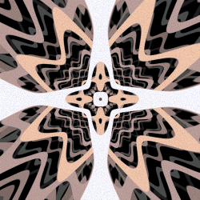](dc_layers-1.flame)

| Parameter | Description |
| --- | --- |
| N | Number of iterations |
| Amplitude |
| seed | Not used, but changing the value will change the time parameter to a random value |
| time | Changes the appearance of the result |
| zoom | Zooms in or out of the result (higher values zoom out) |
| ColorOnly | 0: Normal operation (variation is a blur; input points are ignored) 1: Color only mode (variation is like linear, but colors the points) |
| Gradient | 0: True color (gradient is ignored) 1: Gradient true color (like true color, but colors are taken from the gradient) 2: Direct color (set the gradient index for coloring) |
| z_scale | Scale factor for adjusting the z value based on the color |
| z_offset | Amount to shift result up or down the z axis |
| reset_z | 0: Add color-based z value to the the z value from other variations on the transform 1: Ignore z value from other variations on the transform |

## dc_mandala
Create a kaleidoscopic mandala pattern.

Type: 2D blur, true color or direct color  
Author: Jesus Sosa  
Date: 13 Feb 2019  

[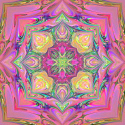](dc_mandala-1.flame)

| Parameter | Description |
| --- | --- |
| mX, mY | Adjusts the appearance of the mandala |
| scale | Zooms in or out of the mandala |
| sides | Symmetry order for the mandala |
| multiply |
| loops | Number of detail-adding iterations to perform |
| iR, iG, iB | When 1, inverts the red, green, or blue component of the result |
| ColorOnly | 0: Normal operation (variation is a blur; input points are ignored) 1: Color only mode (variation is like linear, but colors the points) |
| Gradient | 0: True color (gradient is ignored) 1: Gradient true color (like true color, but colors are taken from the gradient) 2: Direct color (set the gradient index for coloring) |
| z_scale | Scale factor for adjusting the z value based on the color |
| z_offset | Amount to shift result up or down the z axis |
| reset_z | 0: Add color-based z value to the the z value from other variations on the transform 1: Ignore z value from other variations on the transform |

## dc_mandbrot
Create a kaleidoscopic pattern based on the Mandelbrot set.

Type: 2D blur, true color or direct color  
Author: Jesus Sosa, based on code by Doğan Derya  
Date: 13 Feb 2019  

| Parameter | Description |
| --- | --- |
| nIters | Number of times to iterate the Mandelbrot set computation; integer between 10 and 1000 |
| N | Number of times to iterate the "fractalization" computation; integer between 2 and 10 |
| Complexity | Controls the "fractalization" computation; between 0 and 1 |
| seed | Not used, but changing the value will change the time parameter to a random value |
| time | Changes the appearance of the result |
| red, green, blue | Control coloring of the result |
| zoom | Zooms in or out of the result (higher values zoom out) |
| ColorOnly | 0: Normal operation (variation is a blur; input points are ignored) 1: Color only mode (variation is like linear, but colors the points) |
| Gradient | 0: True color (gradient is ignored) 1: Gradient true color (like true color, but colors are taken from the gradient) 2: Direct color (set the gradient index for coloring) |
| z_scale | Scale factor for adjusting the z value based on the color |
| z_offset | Amount to shift result up or down the z axis |
| reset_z | 0: Add color-based z value to the the z value from other variations on the transform 1: Ignore z value from other variations on the transform |

http://glslsandbox.com/e#52121.6  

## dc_mandelbox2D
Create a two dimensional Mandelbox pattern.

Type: 2D blur, true color or direct color  
Author: Jesus Sosa, based on code by stduhpf  
Date: 13 Feb 2019  

[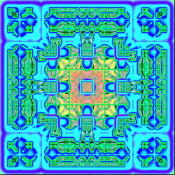](dc_mandelbox2D-1.flame)

| Parameter | Description |
| --- | --- |
| zoom | Zooms in or out of the result (higher values zoom out) |
| seed | Not used, but changing the value will change the time parameter to a random value |
| time | Changes the appearance of the result |
| ColorOnly | 0: Normal operation (variation is a blur; input points are ignored) 1: Color only mode (variation is like linear, but colors the points) |
| Gradient | 0: True color (gradient is ignored) 1: Gradient true color (like true color, but colors are taken from the gradient) 2: Direct color (set the gradient index for coloring) |
| z_scale | Scale factor for adjusting the z value based on the color |
| z_offset | Amount to shift result up or down the z axis |
| reset_z | 0: Add color-based z value to the the z value from other variations on the transform 1: Ignore z value from other variations on the transform |

https://www.shadertoy.com/view/llcXWN  

## dc_menger
Generate a Sierpiński carpet pattern (looks like the face of a Menger sponge).

Type: 2D blur, true color or direct color  
Author: Jesus Sosa  
Date: 13 Feb 2019  

[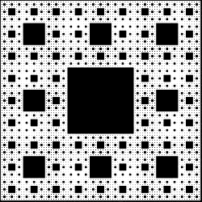](dc_menger-1.flame)

| Parameter | Description |
| --- | --- |
| zoom | Zooms in or out of the result (higher values zoom out) |
| Level | Number of levels; integer between 1 and 5 |
| ColorOnly | 0: Normal operation (variation is a blur; input points are ignored) 1: Color only mode (variation is like linear, but colors the points) |
| Gradient | 0: True color (gradient is ignored) 1: Gradient true color (like true color, but colors are taken from the gradient) 2: Direct color (set the gradient index for coloring) |
| z_scale | Scale factor for adjusting the z value based on the color |
| z_offset | Amount to shift result up or down the z axis |
| reset_z | 0: Add color-based z value to the the z value from other variations on the transform 1: Ignore z value from other variations on the transform |

## dc_moebiuslog
Create a spiraling pattern using log and a Möbius transform.

Type: 2D blur, true color or direct color  
Author: Jesus Sosa, based on code by Fabrice Neyret  
Date: 13 Feb 2019  

| Parameter | Description |
| --- | --- |
| zoom | Zooms in or out of the result (higher values zoom out) |
| seed | Not used, but changing the value will change the time parameter to a random value |
| time | Changes the appearance of the result |
| Log | Perform the log spiral operation if 1 |
| Moebius | Perform the Möbius transform if 1 |
| scale | Scale factor for the result |
| angle | Log spiraling angle (ignored if Log is 0) |
| ColorOnly | 0: Normal operation (variation is a blur; input points are ignored) 1: Color only mode (variation is like linear, but colors the points) |
| Gradient | 0: True color (gradient is ignored) 1: Gradient true color (like true color, but colors are taken from the gradient) 2: Direct color (set the gradient index for coloring) |
| z_scale | Scale factor for adjusting the z value based on the color |
| z_offset | Amount to shift result up or down the z axis |
| reset_z | 0: Add color-based z value to the the z value from other variations on the transform 1: Ignore z value from other variations on the transform |

https://www.shadertoy.com/view/4sGXDK  

## dc_pentatiles
Generate a pattern of tiled pentagons.

Type: 2D blur, true color or direct color  
Author: Jesus Sosa, based on code by Fabrice Neyret  
Date: 13 Feb 2019  

[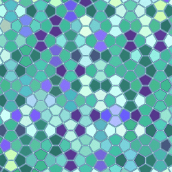](dc_pentatiles-1.flame)

| Parameter | Description |
| --- | --- |
| zoom | Zooms in or out of the result (higher values zoom out) |
| border | Put a border around the tiles if 1 |
| width | Width of the border if present (0.01 to 0.25) |
| ColorOnly | 0: Normal operation (variation is a blur; input points are ignored) 1: Color only mode (variation is like linear, but colors the points) |
| Gradient | 0: True color (gradient is ignored) 1: Gradient true color (like true color, but colors are taken from the gradient) 2: Direct color (set the gradient index for coloring) |
| z_scale | Scale factor for adjusting the z value based on the color |
| z_offset | Amount to shift result up or down the z axis |
| reset_z | 0: Add color-based z value to the the z value from other variations on the transform 1: Ignore z value from other variations on the transform |

https://www.shadertoy.com/view/ltBBzK  

## dc_poincaredisc
Generate a hyperbolic tiling mapped to a Poincaré disk.

Type: 2D blur, true color or direct color  
Author: Jesus Sosa  
Date: 12 Feb 2019  

| Parameter | Description |
| --- | --- |
| zoom | Zooms in or out of the result (higher values zoom out) |
| MaxIter | Number of times to iterate the tiling process |
| n | Number of sides for the tiles polygons |
| p | Number of polygons that meet at each vertex (1/n + 1/p must be less than 1/2) |
| checkers0 |
| checkers1 | Divide each polygon into n parts and alternate coloring of each; works best when n is even |
| checkers2 | Alternate coloring of tiles around each vertex; works best when p is even |
| ColorOnly | 0: Normal operation (variation is a blur; input points are ignored) 1: Color only mode (variation is like linear, but colors the points) |
| Gradient | 0: True color (gradient is ignored) 1: Gradient true color (like true color, but colors are taken from the gradient) 2: Direct color (set the gradient index for coloring) |
| z_scale | Scale factor for adjusting the z value based on the color |
| z_offset | Amount to shift result up or down the z axis |
| reset_z | 0: Add color-based z value to the the z value from other variations on the transform 1: Ignore z value from other variations on the transform |

## dc_quadtree
Create a graphical display of a random quadtree.

Type: 2D blur, true color or direct color  
Author: Jesus Sosa, based on code by Fabrice Neyret  
Date: 13 Feb 2019  

| Parameter | Description |
| --- | --- |
| zoom | Zooms in or out of the result (higher values zoom out) |
| seed | Not used, but changing the value will change the time parameter to a random value |
| time | Changes the appearance of the result |
| width | Controls width of line separating quadtree boxes, between 100 and 1000; higher values make thinner lines |
| Leves | Number of quadtree levels to draw |
| ColorOnly | 0: Normal operation (variation is a blur; input points are ignored) 1: Color only mode (variation is like linear, but colors the points) |
| Gradient | 0: True color (gradient is ignored) 1: Gradient true color (like true color, but colors are taken from the gradient) 2: Direct color (set the gradient index for coloring) |
| z_scale | Scale factor for adjusting the z value based on the color |
| z_offset | Amount to shift result up or down the z axis |
| reset_z | 0: Add color-based z value to the the z value from other variations on the transform 1: Ignore z value from other variations on the transform |

https://www.shadertoy.com/view/lljSDy

## dc_randomoctree
Create a graphical (2D) display of a random (3D) octree.

Type: 2D blur, true color or direct color  
Author: Jesus Sosa, based on code by abje  
Date: 13 Feb 2019  

[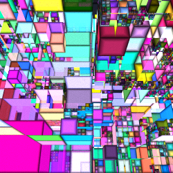](dc_randomoctree-1.flame)

| Parameter | Description |
| --- | --- |
| Seed | Not used, but changing the value will change the time parameter to a random value |
| time | Zooms and pans around the octree |
| Steps | Number of octree levels to draw |
| Rot. L-R, Rot. U-D | Left-right and up-down rotation |
| Grid | Show the grid used to place the octree boxes if 1 |
| Borders | Show borders and shading on the octree boxes if 1 |
| Black Borders | Use black to show the grid and borders if 1; use white if 0 |
| ColorOnly | 0: Normal operation (variation is a blur; input points are ignored) 1: Color only mode (variation is like linear, but colors the points) |
| Gradient | 0: True color (gradient is ignored) 1: Gradient true color (like true color, but colors are taken from the gradient) 2: Direct color (set the gradient index for coloring) |
| z_scale | Scale factor for adjusting the z value based on the color |
| z_offset | Amount to shift result up or down the z axis |
| reset_z | 0: Add color-based z value to the the z value from other variations on the transform 1: Ignore z value from other variations on the transform |

https://www.shadertoy.com/view/4sVfWw

## dc_rotations
Create a pattern using repeated rotations.

Type: 2D blur, true color or direct color  
Author: Jesus Sosa  
Date: 12 Feb 2019  

| Parameter | Description |
| --- | --- |
| levels | Number of iterations to perform |
| seed | Not used, but changing the value will change the time parameter to a random value |
| time | Changes the rotation angle and coloring |
| zoom | Zooms in or out of the result (higher values zoom out) |
| ColorOnly | 0: Normal operation (variation is a blur; input points are ignored) 1: Color only mode (variation is like linear, but colors the points) |
| Gradient | 0: True color (gradient is ignored) 1: Gradient true color (like true color, but colors are taken from the gradient) 2: Direct color (set the gradient index for coloring) |
| z_scale | Scale factor for adjusting the z value based on the color |
| z_offset | Amount to shift result up or down the z axis |
| reset_z | 0: Add color-based z value to the the z value from other variations on the transform 1: Ignore z value from other variations on the transform |

## dc_spacefold
Create a pattern using a space folding technique.

Type: 2D blur, true color or direct color  
Author: Jesus Sosa, based on code by FreeFull  
Date: 29 Aug 2019  

| Parameter | Description |
| --- | --- |
| randomize | Not used, but changing the value will change the time parameter to a random value |
| time | Changes the rotation for each fold |
| zoom | Zooms in or out of the result (higher values zoom out) |
| ColorOnly | 0: Normal operation (variation is a blur; input points are ignored) 1: Color only mode (variation is like linear, but colors the points) |
| Gradient | 0: True color (gradient is ignored) 1: Gradient true color (like true color, but colors are taken from the gradient) 2: Direct color (set the gradient index for coloring) |
| z_scale | Scale factor for adjusting the z value based on the color |
| z_offset | Amount to shift result up or down the z axis |
| reset_z | 0: Add color-based z value to the the z value from other variations on the transform 1: Ignore z value from other variations on the transform |

https://www.shadertoy.com/view/lsGSzW  

## dc_squares
Create a pattern of squares on a grid.

Type: 2D blur, true color or direct color  
Author: Jesus Sosa  
Date: 13 Feb 2019  

| Parameter | Description |
| --- | --- |
| Seed | Not used, but changing the value will change the time parameter to a random value |
| time | Zooms the pattern in or out (see Direction), and changes the coloring |
| N | Number of iterations to use when computing the pattern |
| Direction | 0: Increasing time zooms in 1: Increasing time zooms out |
| Red, Green, Blue Fac. | Factors for the red, green, and blue components of the colors; adjust these to tweak the colors |
| ColorOnly | 0: Normal operation (variation is a blur; input points are ignored) 1: Color only mode (variation is like linear, but colors the points) |
| Gradient | 0: True color (gradient is ignored) 1: Gradient true color (like true color, but colors are taken from the gradient) 2: Direct color (set the gradient index for coloring) |
| z_scale | Scale factor for adjusting the z value based on the color |
| z_offset | Amount to shift result up or down the z axis |
| reset_z | 0: Add color-based z value to the the z value from other variations on the transform 1: Ignore z value from other variations on the transform |

## dc_starsfield
Create a field of stars.

Type: 2D blur, true color or direct color  
Author: Jesus Sosa  
Date: 13 Feb 2019  

| Parameter | Description |
| --- | --- |
| Seed | Not used, but changing the value will change the time parameter to a random value |
| time | Rotates and moves through the star field |
| Z distance | Distance to the stars, between 2 and 150; larger values make the stars smaller and fainter |
| Glow | Amount of glow around each star, between 0 and 1 |
| ColorOnly | 0: Normal operation (variation is a blur; input points are ignored) 1: Color only mode (variation is like linear, but colors the points) |
| Gradient | 0: True color (gradient is ignored) 1: Gradient true color (like true color, but colors are taken from the gradient) 2: Direct color (set the gradient index for coloring) |
| z_scale | Scale factor for adjusting the z value based on the color |
| z_offset | Amount to shift result up or down the z axis |
| reset_z | 0: Add color-based z value to the the z value from other variations on the transform 1: Ignore z value from other variations on the transform |

## dc_sunflower
Create a pattern of spirals.

Type: 2D blur, true color or direct color  
Author: Jesus Sosa, based on code by Fabrice Neyret  
Date: 13 Feb 2019  

[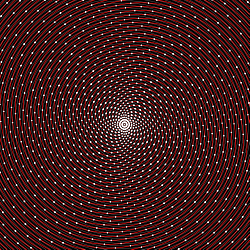](dc_sunflower-1.flame)

| Parameter | Description |
| --- | --- |
| zoom | Zooms in or out of the result (higher values zoom out) |
| seed | Not used, but changing the value will change the time parameter to a random value |
| time | Not used |
| step | Step size for the dots (a real sunflower uses 0.618) |
| N | Number of spirals |
| Polar | Draw gray circles connecting the dots at the same distance from the center if 1 |
| Dots | Draw white dots along the spirals if 1 |
| GridX, GridY | If GridX is 1, draw N red spirals connecting the dots If GridY is 1, draw N green spirals the opposite direction If both are 1, draw both red and green spirals If both are 0, draw 2N blue spirals
| ColorOnly | 0: Normal operation (variation is a blur; input points are ignored) 1: Color only mode (variation is like linear, but colors the points) |
| Gradient | 0: True color (gradient is ignored) 1: Gradient true color (like true color, but colors are taken from the gradient) 2: Direct color (set the gradient index for coloring) |
| z_scale | Scale factor for adjusting the z value based on the color |
| z_offset | Amount to shift result up or down the z axis |
| reset_z | 0: Add color-based z value to the the z value from other variations on the transform 1: Ignore z value from other variations on the transform |

https://www.shadertoy.com/view/MtGBDt  

## dc_tesla
Create a pattern resembling electrical arcing.

Type: 2D blur, true color or direct color  
Author: Jesus Sosa  
Date: 12 Feb 2019  

| Parameter | Description |
| --- | --- |
| levels | Number of levels (more levels add more detail) |
| thicknes | Not used |
| style | Controls the thickness of the electrical arc lines; higher values produce thicker lines |
| shift | Not used |
| seed | Not used, but changing the value will change the time parameter to a random value |
| time | Changes the appearance of the result |
| zoom | Zooms in or out of the result (higher values zoom out) |
| ColorOnly | 0: Normal operation (variation is a blur; input points are ignored) 1: Color only mode (variation is like linear, but colors the points) |
| Gradient | 0: True color (gradient is ignored) 1: Gradient true color (like true color, but colors are taken from the gradient) 2: Direct color (set the gradient index for coloring) |
| z_scale | Scale factor for adjusting the z value based on the color |
| z_offset | Amount to shift result up or down the z axis |
| reset_z | 0: Add color-based z value to the the z value from other variations on the transform 1: Ignore z value from other variations on the transform |

## dc_tree
Generate a tree shape.

Type: 2D blur, true color or direct color  
Author: Jesus Sosa, based on code by Wyatt Flanders  
Date: 12 Feb 2019  

[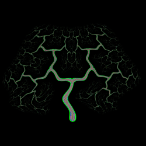](dc_tree-1.flame)

The tree is upside down by default; make zoom negative to flip it right side up.

| Parameter | Description |
| --- | --- |
| levels | Number of levels of branching |
| thicknes | Controls thickness of the branches; higher values produce thinner branches |
| style | Controls coloring of the branches; higher values produce more layers of color (and also make the branches thicker) |
| shift | Shifts the tree up or down |
| seed | Not used, but changing the value will change the time parameter to a random value |
| time | Makes the tree sway and changes coloring |
| zoom | Zooms in or out of the result (higher values zoom out) |
| ColorOnly | 0: Normal operation (variation is a blur; input points are ignored) 1: Color only mode (variation is like linear, but colors the points) |
| Gradient | 0: True color (gradient is ignored) 1: Gradient true color (like true color, but colors are taken from the gradient) 2: Direct color (set the gradient index for coloring) |
| z_scale | Scale factor for adjusting the z value based on the color |
| z_offset | Amount to shift result up or down the z axis |
| reset_z | 0: Add color-based z value to the the z value from other variations on the transform 1: Ignore z value from other variations on the transform |

https://www.shadertoy.com/view/wslGz7  

## dc_triantess
Construct a tiling using Wythoff construction.

Type: 2D blur, true color or direct color  
Author: Jesus Sosa  
Date: 12 Feb 2019  

[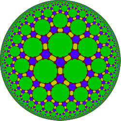](dc_triantess-1.flame)

| Parameter | Description |
| --- | --- |
| FaceA_-RGB FaceB_-RGB FaceC_-RGB Segment_-RGB Vertex_-RGB Background_RGB | Color values for the faces, segments, vertices, and background; each is a six digit hexadecimal number RRGGBB giving the red, green, and blue values. For example, FF0000 is red, 00FF00 is green, and 0000FF is blue. |
| zoom | Zooms in or out of the result (higher values zoom out) |
| CenterX, CenterY | Shifts the result left/right and up/down |
| Iterations | Number of times to iterate the construction |
| pParam, qParam, rParam | The Wythoff symbol numbers, representing the corners of the Schwartz triangle used in the construction |
| U, V, W | Barycentric coordinates of the generator point on the triangle |
| VRadius | Vertex radius (vertices only shown if Vertex is 1) |
| SRadius | Segment thickness (segments only show if Segments is 1) |
| RotAngle | Rotation angle of the result |
| Vertex | Show vertices if 1 (only visible if VRadius is not 0) |
| Segments | Show segments between faces if 1 (only visible if SRadius is not 0) |
| Faces | Color faces if 1 |
| ColorOnly | 0: Normal operation (variation is a blur; input points are ignored) 1: Color only mode (variation is like linear, but colors the points) |
| Gradient | 0: True color (gradient is ignored) 1: Gradient true color (like true color, but colors are taken from the gradient) 2: Direct color (set the gradient index for coloring) |
| z_scale | Scale factor for adjusting the z value based on the color |
| z_offset | Amount to shift result up or down the z axis |
| reset_z | 0: Add color-based z value to the the z value from other variations on the transform 1: Ignore z value from other variations on the transform |

https://en.wikipedia.org/wiki/Wythoff_symbol  

## dc_truchet
Generate a truchet tiling pattern.

Type: 2D blur, true color or direct color  
Author: Jesus Sosa, based on code by Patricio Gonzalez Vivo and Jen Lowe  
Date: 12 Feb 2019  

[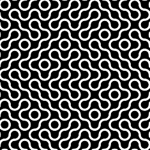](dc_truchet-1.flame)

| Parameter | Description |
| --- | --- |
| type | 0: Tiles are a black square with a white diagonal 1: Tiles are a black square with two white quarter circles 2: Tiles are half black, half white (split diagonally) |
| zoom | Zooms in or out of the result (higher values zoom out) |
| ColorOnly | 0: Normal operation (variation is a blur; input points are ignored) 1: Color only mode (variation is like linear, but colors the points) |
| Gradient | 0: True color (gradient is ignored) 1: Gradient true color (like true color, but colors are taken from the gradient) 2: Direct color (set the gradient index for coloring) |
| z_scale | Scale factor for adjusting the z value based on the color |
| z_offset | Amount to shift result up or down the z axis |
| reset_z | 0: Add color-based z value to the the z value from other variations on the transform 1: Ignore z value from other variations on the transform |

https://thebookofshaders.com/10/  
https://en.wikipedia.org/wiki/Truchet_tiles  

## dc_turbulence
Generate a turbulence noise pattern.

Type: 2D blur, true color or direct color  
Author: Jesus Sosa  
Date: 31 Oct 2018  

| Parameter | Description |
| --- | --- |
| seed | Not used, but changing the value will change the time parameter to a random value |
| time | Not used |
| zoom | Zooms in or out of the result (higher values zoom out) |
| Level | Number of iterations to use |
| ColorOnly | 0: Normal operation (variation is a blur; input points are ignored) 1: Color only mode (variation is like linear, but colors the points) |
| Gradient | 0: True color (gradient is ignored) 1: Gradient true color (like true color, but colors are taken from the gradient) 2: Direct color (set the gradient index for coloring) |
| z_scale | Scale factor for adjusting the z value based on the color |
| z_offset | Amount to shift result up or down the z axis |
| reset_z | 0: Add color-based z value to the the z value from other variations on the transform 1: Ignore z value from other variations on the transform |

## dc_voronoise
Generate a pattern based on a combination of Voronoi diagrams and noise.

Type: 2D blur, true color or direct color  
Author: Jesus Sosa, based on code by Inigo Quilez  
Date: 12 Feb 2019  

[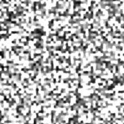](dc_voronoise-1.flame)

| Parameter | Description |
| --- | --- |
| zoom | Zooms in or out of the result (higher values zoom out) |
| pX | Proportion of Voronoi diagam to use, between 0 (no Voronoi) and 1 |
| pY | Proportion of noise to use, between 0 (no noise) and 1 |
| ColorOnly | 0: Normal operation (variation is a blur; input points are ignored) 1: Color only mode (variation is like linear, but colors the points) |
| Gradient | 0: True color (gradient is ignored) 1: Gradient true color (like true color, but colors are taken from the gradient) 2: Direct color (set the gradient index for coloring) |
| z_scale | Scale factor for adjusting the z value based on the color |
| z_offset | Amount to shift result up or down the z axis |
| reset_z | 0: Add color-based z value to the the z value from other variations on the transform 1: Ignore z value from other variations on the transform |

https://www.iquilezles.org/www/articles/voronoise/voronoise.htm  

## dc_vortex
Create a pattern from a train of vortices.

Type: 2D blur, true color or direct color  
Author: Jesus Sosa, based on code by dr2  
Date: 12 May 2020  

[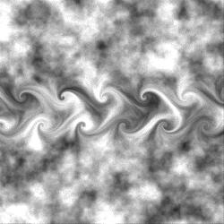](dc_vortex-1.flame)

| Parameter | Description |
| --- | --- |
| randomize | Not used, but changing the value will change the time parameter to a random value |
| time | Changes the appearance of the result |
| Flow strength | Number of times the vortex flow process is iterated; higher values produce stronger results; integer between 1 and 15 |
| Blending |
| zoom | Zooms in or out of the result (higher values zoom out) |
| ColorOnly | 0: Normal operation (variation is a blur; input points are ignored) 1: Color only mode (variation is like linear, but colors the points) |
| Gradient | 0: True color (gradient is ignored) 1: Gradient true color (like true color, but colors are taken from the gradient) 2: Direct color (set the gradient index for coloring) |
| z_scale | Scale factor for adjusting the z value based on the color |
| z_offset | Amount to shift result up or down the z axis |
| reset_z | 0: Add color-based z value to the the z value from other variations on the transform 1: Ignore z value from other variations on the transform |

https://www.shadertoy.com/view/MlS3Rh  

## dc_warping
Generate a texture using fBm warping.

Type: 2D blur, true color or direct color  
Author: Jesus Sosa, based on code by Inigo Quilez  
Date: 12 Feb 2019  

| Parameter | Description |
| --- | --- |
| randomize | Shifts the position of the texture; the shift is random but specific values of randomize will shift to the same place |
| zoom | Zooms in or out of the result (higher values zoom out) |
| ColorOnly | 0: Normal operation (variation is a blur; input points are ignored) 1: Color only mode (variation is like linear, but colors the points) |
| Gradient | 0: True color (gradient is ignored) 1: Gradient true color (like true color, but colors are taken from the gradient) 2: Direct color (set the gradient index for coloring) |
| z_scale | Scale factor for adjusting the z value based on the color |
| z_offset | Amount to shift result up or down the z axis |
| reset_z | 0: Add color-based z value to the the z value from other variations on the transform 1: Ignore z value from other variations on the transform |

https://www.shadertoy.com/view/MdSXzz  

## dc_worley
Create a pattern based on Worley (cellular) noise.

Type: 2D blur, true color or direct color  
Author: Jesus Sosa, based on code by Fabrice Neyret  
Date: 13 Feb 2019  

| Parameter | Description |
| --- | --- |
| zoom | Zooms in or out of the result (higher values zoom out) |
| seed | Not used, but changing the value will change the time parameter to a random value |
| time | Not used |
| ColorOnly | 0: Normal operation (variation is a blur; input points are ignored) 1: Color only mode (variation is like linear, but colors the points) |
| Gradient | 0: True color (gradient is ignored) 1: Gradient true color (like true color, but colors are taken from the gradient) 2: Direct color (set the gradient index for coloring) |
| z_scale | Scale factor for adjusting the z value based on the color |
| z_offset | Amount to shift result up or down the z axis |
| reset_z | 0: Add color-based z value to the the z value from other variations on the transform 1: Ignore z value from other variations on the transform |

https://www.shadertoy.com/view/4dKSDV  

## glsl_acrilic
Create a pattern reminiscent of acrylic pour painting.

Type: 2D blur, true color or direct color  
Author: Jesus Sosa  
Date: 31 Oct 2018  

| Parameter | Description |
| --- | --- |
| Density Pixels | Density of the computed pixels; has no real effect if it is large enough |
| Seed | Not used, but changing the value will change the time parameter to a random value |
| time | Changes the appearance of the result |
| Steps | Number of iterations to use when computing the pattern |
| p1, p2, p3, p4, p5, p6 | Adjust the appearance of the pattern |
| Red, Green, Blue Fac. | Factors for the red, green, and blue components of the colors; adjust these to tweak the colors |
| Gradient | 0: True color (gradient is ignored) 1: Direct color (set the gradient index for coloring) |

## glsl_apollonian
Create a colorful pattern.

Type: 2D blur, true color or direct color  
Author: Jesus Sosa, based on code by Wyatt Flanders  
Date: 31 Oct 2018  

| Parameter | Description |
| --- | --- |
| Density Pixels | Density of the computed pixels; has no real effect if it is large enough |
| Seed | Not used, but changing the value will change the time parameter to a random value |
| time | Changes the appearance of the result |
| Gradient | 0: True color (gradient is ignored) 1: Direct color (set the gradient index for coloring) |

https://www.shadertoy.com/view/Xdcyzl  

## glsl_circlesblue
Create random bubbles.

Type: 2D blur, true color or direct color  
Author: Jesus Sosa, based on code by Inigo Quilez  
Date: 31 Oct 2018  

| Parameter | Description |
| --- | --- |
| Density Pixels | Density of the computed pixels; has no real effect if it is large enough |
| Seed | Not used, but changing the value will change the time parameter to a random value |
| time | Changes the appearance of the result |
| Radiusy | Radius of the bubbles (some are further away, so appear smaller) |
| Bubles | Number of bubbles (some won't be visible) |
| Gradient | 0: True color (gradient is ignored) 1: Direct color (set the gradient index for coloring) |

https://www.shadertoy.com/view/4dl3zn  

## glsl_circuits
Create a pattern reminiscent of a circuit board.

Type: 2D blur, true color or direct color  
Author: Jesus Sosa, based on code by Kali  
Date: 31 Oct 2018  

[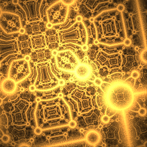](glsl_circuits-1.flame)

| Parameter | Description |
| --- | --- |
| Density Pixels | Density of the computed pixels; has no real effect if it is large enough |
| time | Changes the appearance of the result |
| rate |
| intensity |
| focus |
| pulse |
| glow |
| loops | Number of times the generator function is executed; higher values produce more intricate results (but slow down rendering) |
| zoom | Zooms in or out of the result (higher values zoom out) |
| Gradient | 0: True color (gradient is ignored) 1: Direct color (set the gradient index for coloring) |

https://www.shadertoy.com/view/XlX3Rj  

## glsl_code
Create a fractal picture, using arbitrary code.

Type: 2D blur, true color or direct color  
Author: Jesus Sosa  
Date: 31 Oct 2018  

[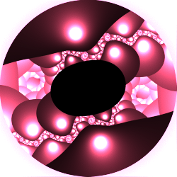](glsl_code-1.flame)

| Parameter | Description |
| --- | --- |
| code | The Java code to execute; must be a definition for function getRGBColor, which is called for each iteration |
| ResolutionX, ResolutionY | X and y resolution; has no real effect if it is large enough |
| zoom | Zooms in or out of the result (higher values zoom out) |
| Gradient | 0: True color (gradient is ignored) 1: Direct color (set the gradient index for coloring) |

## glsl_fractaldots
Create a pattern from fractally arranged dots.

Type: 2D blur, true color or direct color  
Author: Jesus Sosa, based on code by Paulo Falcão  
Date: 31 Oct 2018  

| Parameter | Description |
| --- | --- |
| Density Pixels | Density of the computed pixels; has no real effect if it is large enough |
| iterations | Number of iterations to perform; higher values make more intricate patterns, but slow down rendering |
| DotSize |
| MaxIterations | Maximum number of iterations; should be greater than iterations |
| complexity |
| pattern | Divisor for spacing for each iteration |
| spacing | Spacing amount for the first iteration |
| rotate1 | Overall rotation, in radians |
| rotate2 | Rotation for each iteration, in radians |
| zoom | Zooms in or out of the result (higher values zoom out) |
| Gradient | 0: True color (gradient is ignored) 1: Direct color (set the gradient index for coloring) |

https://www.shadertoy.com/view/tltSWs  

## glsl_grid3D
Generate a 2D image of a 3D grid.

Type: 2D blur, true color  
Author: Jesus Sosa, based on code by Kapsy and Kabuto  
Date: 31 Oct 2018  

| Parameter | Description |
| --- | --- |
| Density Pixels | Density of the computed pixels; has no real effect if it is large enough |
| Seed | Not used, but changing the value will change the time parameter to a random value |
| time | Changes the appearance of the result |

## glsl_hoshi
Create a design based on fractal hoshi tiling.

Type: 2D blur, true color or direct color  
Author: Jesus Sosa  
Date: 31 Oct 2018  

[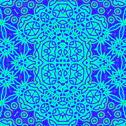](glsl_hoshi-1.flame)

| Parameter | Description |
| --- | --- |
| Density Pixels | Density of the computed pixels; has no real effect if it is large enough |
| Seed | Not used, but changing the value will change the time parameter to a random value |
| time | Changes the appearance of the result |
| Steps | Number of iterations to perform |
| Scale | Scale factor for each iteration |
| Translate | Translation amount for each iteration |
| Gradient | 0: True color (gradient is ignored) 1: Direct color (set the gradient index for coloring) |

## glsl_hyperbolictile
Create a {3,8} hyperbolic tessellation mapped to a Poincaré disk.

Type: 2D blur, true color or direct color  
Author: Jesus Sosa  
Date: 31 Oct 2018  

[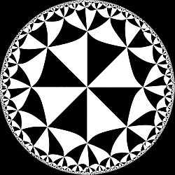](glsl_hyperbolictile-1.flame)

| Parameter | Description |
| --- | --- |
| Density Pixels | Density of the computed pixels; has no real effect if it is large enough |
| Gradient | 0: True color (gradient is ignored) 1: Direct color (set the gradient index for coloring) |

## glsl_kaleidocomplex
Generate a kaleidoscopic pattern.

Type: 2D blur, true color or direct color  
Author: Jesus Sosa, based on code by bal-khan  
Date: 31 Oct 2018  

[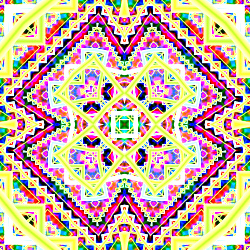](glsl_kaleidocomplex-1.flame)

| Parameter | Description |
| --- | --- |
| Density Pixels | Density of the computed pixels; has no real effect if it is large enough |
| Seed | Not used, but changing the value will change the time parameter to a random value |
| time | Changes the appearance of the result |
| iMax | Maximum number of iterations |
| Color |
| Red, Green, Blue Fac. | Factors for the red, green, and blue components of the colors; adjust these to tweak the colors |
| Gradient | 0: True color (gradient is ignored) 1: Direct color (set the gradient index for coloring) |

https://www.shadertoy.com/view/4slBW2  

## glsl_kaleidoscopic
Generate a kaleidoscopic pattern.

Type: 2D blur, true color or direct color  
Author: Jesus Sosa, based on code by gPlatl and ackleyrc  
Date: 31 Oct 2018  

[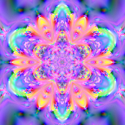](glsl_kaleidoscopic-1.flame)

| Parameter | Description |
| --- | --- |
| Density Pixels | Density of the computed pixels; has no real effect if it is large enough |
| Seed | Not used, but changing the value will change the time parameter to a random value |
| time | Kaleidoscope rotation (if Radial is 1) |
| Sides | Number of sides for the pattern, between 2 and 20 (if Radial is 1) |
| zoom | Scale factor before kaleidoscopic reflection, between 0 and 1 |
| P1 | Controls the base pattern, between 0 and 1 |
| Radial | 0: Show only the base pattern without kaleidoscopic symmetry 1: Reflect the base pattern radially, using Sides and time |
| Gradient | 0: True color (gradient is ignored) 1: Direct color (set the gradient index for coloring) |

https://www.shadertoy.com/view/4lXyWS  

## glsl_kaliset
Generate a pattern using Kalisets.

Type: 2D blur, true color or direct color  
Author: Jesus Sosa, based on code by foran  
Date: 31 Oct 2018  

| Parameter | Description |
| --- | --- |
| Density Pixels | Density of the computed pixels; has no real effect if it is large enough |
| Seed | Not used, but changing the value will change the time parameter to a random value |
| time | Changes the appearance of the result |
| N | Number of iterations |
| ShiftX, ShiftY | Amount pattern is shifted horizontally and vertically for each iteration |
| Gradient | 0: True color (gradient is ignored) 1: Direct color (set the gradient index for coloring) |

https://www.shadertoy.com/view/wtjXRR  
http://www.fractalforums.com/new-theories-and-research/very-simple-formula-for-fractal-patterns/  

## glsl_kaliset2
Generate a pattern using kalisets.

Type: 2D blur, true color or direct color  
Author: Jesus Sosa, based on code by foran  
Date: 31 Oct 2018  

| Parameter | Description |
| --- | --- |
| Density Pixels | Density of the computed pixels; has no real effect if it is large enough |
| Seed | Not used, but changing the value will change the time parameter to a random value |
| time | Changes the appearance of the result |
| N | Number of iterations |
| radio |
| ShiftX, ShiftY | Amount pattern is shifted horizontally and vertically for each iteration |
| Red, Green, Blue Fac. | Factors for the red, green, and blue components of the colors; adjust these to tweak the colors |
| Gradient | 0: True color (gradient is ignored) 1: Direct color (set the gradient index for coloring) |

https://www.shadertoy.com/view/wtjXRR  
http://www.fractalforums.com/new-theories-and-research/very-simple-formula-for-fractal-patterns/  

## glsl_mandala
Create a kaleidoscopic mandala pattern.

Type: 2D blur, true color or direct color  
Author: Jesus Sosa  
Date: 31 Oct 2018  

[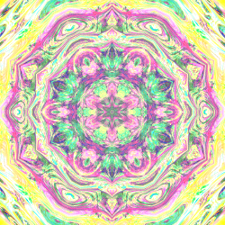](glsl_mandala-1.flame)

| Parameter | Description |
| --- | --- |
| Density Pixels | Density of the computed pixels; has no real effect if it is large enough |
| mX, mY | Adjusts the appearance of the mandala |
| scale | Zooms in or out of the mandala |
| sides | Symmetry order for the mandala |
| multiply |
| loops | Number of detail-adding iterations to perform |
| iR, iG, iB | When 1, inverts the red, green, or blue component of the result |
| Gradient | 0: True color (gradient is ignored) 1: Direct color (set the gradient index for coloring) |

## glsl_mandelbox2D
Create a two dimensional Mandelbox pattern.

Type: 2D blur, true color or direct color  
Author: Jesus Sosa, based on code by stduhpf  
Date: 31 Oct 2018  

| Parameter | Description |
| --- | --- |
| Density Pixels | Density of the computed pixels; has no real effect if it is large enough |
| seed | Not used, but changing the value will change the time parameter to a random value |
| time | Changes the appearance of the result |
| Gradient | 0: True color (gradient is ignored) 1: Direct color (set the gradient index for coloring) |

https://www.shadertoy.com/view/llcXWN  

## glsl_randomoctree
Create a graphical (2D) display of a random (3D) octree.

Type: 2D blur, true color or direct color  
Author: Jesus Sosa, based on code by abje  
Date: 31 Oct 2018  

[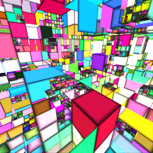](glsl_randomoctree-1.flame)

| Parameter | Description |
| --- | --- |
| Density Pixels | Density of the computed pixels; has no real effect if it is large enough |
| Seed | Not used, but changing the value will change the time parameter to a random value |
| time | Zooms and pans around the octree |
| Steps | Number of octree levels to draw |
| Rot. L-R, Rot. U-D | Left-right and up-down rotation |
| Grid | Show the grid used to place the octree boxes if 1 |
| Borders | Show borders and shading on the octree boxes if 1 |
| Black Borders | Use black to show the grid and borders if 1; use white if 0 |
| Gradient | 0: True color (gradient is ignored) 1: Direct color (set the gradient index for coloring) |

https://www.shadertoy.com/view/4sVfWw

## glsl_squares
Create a pattern of squares on a grid.

Type: 2D blur, true color or direct color  
Author: Jesus Sosa  
Date: 31 Oct 2018  

| Parameter | Description |
| --- | --- |
| Density Pixels | Density of the computed pixels; has no real effect if it is large enough |
| Seed | Not used, but changing the value will change the time parameter to a random value |
| time | Zooms the pattern in or out (see Direction), and changes the coloring |
| N | Number of iterations to use when computing the pattern |
| Direction | 0: Increasing time zooms in 1: Increasing time zooms out |
| Red, Green, Blue Fac. | Factors for the red, green, and blue components of the colors; adjust these to tweak the colors |
| Gradient | 0: True color (gradient is ignored) 1: Direct color (set the gradient index for coloring) |

## glsl_starsfield
Create a field of stars.

Type: 2D blur, true color or direct color  
Author: Jesus Sosa  
Date: 31 Oct 2018  

[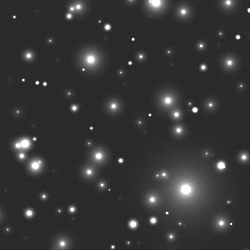](glsl_starsfield-1.flame)

| Parameter | Description |
| --- | --- |
| Density Pixels | Density of the computed pixels; has no real effect if it is large enough |
| Seed | Not used, but changing the value will change the time parameter to a random value |
| time | Rotates and moves through the star field |
| Z distance | Distance to the stars, between 2 and 150; larger values make the stars smaller and fainter |
| Glow | Amount of glow around each star, between 0 and 1 |
| Gradient | 0: True color (gradient is ignored) 1: Direct color (set the gradient index for coloring) |
