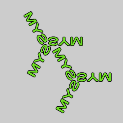

# Symmetry
Variations that create multiple copies with various symmetrical variations.

The examples for these variations show the letters "SYM" with the variation applied once to show the essence of each. All have parameters that will change the results.

# post_axis_symmetry_wf
Mirror the flame across the x, y, or z axis, with rotation.

Type: 3D  
Author: Andreas Maschke (thargor6)  
Date: 12 Oct 2015  

| Parameter | Description |
| --- | --- |
| axis | 0: Mirror across x axis 1: Mirror across y axis 2: Mirror across z axis |
| centre_x, centre_y, centre_z | Center point for mirror |
| rotation | Angle to rotate flame before mirroring, in degrees |
| x1colorshift, y1colorshift, z1colorshift | Amount to shift the gradient index for the unmirrored flame for x, y, or z mirrors |
| x2colorshift, y2colorshift, z2colorshift | Amount to shift the gradient index for the mirrored flame for x, y, or z mirrors |

# post_mirror_wf
Mirror the flame across the x, y, and/or z axes.

Type: 3D  
Author: Andreas Maschke (thargor6)  
Date: 8 Dec 2011  

| Parameter | Description |
| --- | --- |
| xaxis | 1 to mirror flame across x axis or 0 to skip |
| yaxis | 1 to mirror flame across y axis or 0 to skip |
| zaxis | 1 to mirror flame across z axis or 0 to skip |
| xshift | Amount to shift x mirror left (negative to shift right) |
| yshift | Amount to shift y mirror up (negative to shift down) |
| zshift | Amount to shift z mirror away (towards negative z) |
| xscale, yscale | Horizontal and vertical scale factors for mirrored instances; 1 for same size as original |
| xcolorshift | Amount to shift gradient index for x mirrors (0 to 1, 0 for none) |
| ycolorshift | Amount to shift gradient index for y mirrors (0 to 1, 0 for none) |
| zcolorshift | Amount to shift gradient index for z mirrors (0 to 1, 0 for none) |

# post_point_symmetry_wf
Rotational symmetry of any order around an arbitrary point.

Type: 2D  
Author: Andreas Maschke (thargor6)  
Date: 12 Oct 2015  

| Parameter | Description |
| --- | --- |
| centre_x, centre_y | Center point for the rotation |
| order | Number of rotational copies; must be a positive integer |
| colorshift | Amount to shift gradient index for each copy |

## sym_bg1
Make two identical copies of the flame.

Type: 2D  
Author: Jesus Sosa  
Date: 5 May 2021  

To make the copies overlap, set stepx=-1 and stepy=0. Then adjust the parameters to achieve the desired positioning.

Sym_bg1 and sym_ng1 do the same thing, except the parameters work differently.

| Parameter | Description |
| --- | --- |
| stepx | Horizontal shift amount |
| stepy | Vertical shift amount |

## sym_bg2
Make two copies of the flame, the original and a horizontal reflection.

Type: 2D  
Author: Jesus Sosa  
Date: 5 May 2021  

To make the copies overlap, set stepx=-1 and stepy=-1. Then adjust the parameters to achieve the desired positioning.

Sym_bg2, sym_bg5, sym_ng2, and sym_ng7 do the same thing, except the parameters work differently.

| Parameter | Description |
| --- | --- |
| stepx | Horizontal shift amount |
| stepy | Vertical shift amount |

## sym_bg3
Make two copies of the flame, the original and a 180° rotation.

Type: 2D  
Author: Jesus Sosa  
Date: 5 May 2021  

To make the copies overlap, set stepx=-2 and stepy=-1. Then adjust the parameters to achieve the desired positioning.

| Parameter | Description |
| --- | --- |
| stepx | Horizontal shift amount |
| stepy | Vertical shift amount |

## sym_bg4
Make two copies of the flame, the original and a vertical reflection.

Type: 2D  
Author: Jesus Sosa  
Date: 5 May 2021  

To make the copies overlap, set stepx=-2 and stepy=-1. Then adjust the parameters to achieve the desired positioning.

| Parameter | Description |
| --- | --- |
| stepx | Horizontal shift amount |
| stepy | Vertical shift amount |

## sym_bg5
Make two copies of the flame, the original and a horizontal reflection.

Type: 2D  
Author: Jesus Sosa  
Date: 5 May 2021  

To make the copies overlap, set stepx=0 and stepy=-1. Then adjust the parameters to achieve the desired positioning.

Sym_bg2, sym_bg5, sym_ng2, and sym_ng7 do the same thing, except the parameters work differently.

| Parameter | Description |
| --- | --- |
| stepx | Horizontal shift amount |
| stepy | Vertical shift amount |

## sym_bg6
Make four copies of the flame, the original, a vertical reflection, a horizontal reflection, and a 180° rotation.

Type: 2D  
Author: Jesus Sosa  
Date: 5 May 2021  

To make the copies overlap horizontally, set stepx=-2. Set stepy=0 to maximize the vertical overlap, though it won't be complete (use sym_bg7 if this is needed). Then adjust the parameters to achieve the desired positioning.

Sym_bg6, sym_bg7, sym_ng4, sym_ng5, and sym_ng9 do the same thing, except the parameters work differently (sym_ng4 is the most flexible).

| Parameter | Description |
| --- | --- |
| stepx | Horizontal shift amount |
| stepy | Vertical shift amount |

## sym_bg7
Make four copies of the flame, the original, a vertical reflection, a horizontal reflection, and a 180° rotation.

Type: 2D  
Author: Jesus Sosa  
Date: 5 May 2021  

To make the copies overlap, set stepx=0 and stepy=0. Then adjust the parameters to achieve the desired positioning.

Sym_bg6, sym_bg7, sym_ng4, sym_ng5, and sym_ng9 do the same thing, except the parameters work differently (sym_ng4 is the most flexible).

| Parameter | Description |
| --- | --- |
| stepx | Horizontal shift amount |
| stepy | Vertical shift amount |

## sym_ng1
Make two identical copies of the flame.

Type: 2D  
Author: Jesus Sosa  
Date: 5 May 2021  

To make the copies overlap, set stepx=0 and stepy=0. Then adjust the parameters to achieve the desired positioning.

Sym_bg1 and sym_ng1 do the same thing, except the parameters work differently.

| Parameter | Description |
| --- | --- |
| stepx | Horizontal shift amount |
| stepy | Vertical shift amount |

## sym_ng2
Make two copies of the flame, the original and a horizontal reflection.

Type: 2D  
Author: Jesus Sosa  
Date: 5 May 2021  

To make the copies overlap, set stepx=0 and stepy=0. Then adjust the parameters to achieve the desired positioning.

Sym_bg2, sym_bg5, sym_ng2, and sym_ng7 do the same thing, except the parameters work differently.

| Parameter | Description |
| --- | --- |
| stepx | Horizontal shift amount |
| stepy | Vertical shift amount |

## sym_ng3
Make two copies of the flame, the original and a 180° rotation.

Type: 2D  
Author: Jesus Sosa  
Date: 5 May 2021  

To make the copies overlap, set sepx=0, sepy=0, and step=0. Then adjust the parameters to achieve the desired positioning.

Sym_bg3 and sym_ng3 do the same thing, except the parameters are different.

| Parameter | Description |
| --- | --- |
| sepx | Horizontal shift amount |
| sepy | Vertical shift amount |
| step | Diagonal shift amount |

## sym_ng4
Make four copies of the flame, the original, a vertical reflection, a horizontal reflection, and a 180° rotation.

Type: 2D  
Author: Jesus Sosa  
Date: 5 May 2021  

To make the copies overlap, set sepx=-2, sepy=1, stepx=-2, and stepy=-1. Then adjust the parameters to achieve the desired positioning.

Sym_bg6, sym_bg7, sym_ng4, sym_ng5, and sym_ng9 do the same thing, except the parameters work differently (sym_ng4 is the most flexible).

| Parameter | Description |
| --- | --- |
| sepx | Horizontal shift amount for the vertical reflections |
| sepy | Vertical shift amount for the horizontal reflections |
| stepx | Horizontal shift amount for the rotations |
| stepy | Vertical shift amount for the rotations |

## sym_ng5
Make four copies of the flame, the original, a vertical reflection, a horizontal reflection, and a 180° rotation.

Type: 2D  
Author: Jesus Sosa  
Date: 5 May 2021  

To make the copies overlap, set sepx=-1, sepy=0, and stepx=-2. Then adjust the parameters to achieve the desired positioning.

Sym_bg6, sym_bg7, sym_ng4, sym_ng5, and sym_ng9 do the same thing, except the parameters work differently (sym_ng4 is the most flexible).

| Parameter | Description |
| --- | --- |
| sepx | Horizontal shift amount for the vertical reflections |
| sepy | Vertical shift amount for the horizontal reflections |
| stepx | Horizontal shift amount for the rotations |

## sym_ng6
Make four copies of the flame, two of the original and two horizontal reflections.

Type: 2D  
Author: Jesus Sosa  
Date: 5 May 2021  

To make the copies overlap, set sepy=0, stepx=0, and stepy=0. Then adjust the parameters to achieve the desired positioning.

| Parameter | Description |
| --- | --- |
| sepy | Vertical shift amount for the identical copies |
| stepx | Horizontal shift amount for the reflected copies |
| stepy | Vertical shift amount for the reflected copies |

## sym_ng7
Make two copies of the flame, the original and a horizontal reflection.

Type: 2D  
Author: Jesus Sosa  
Date: 5 May 2021  

To make the copies overlap, set stepx=0 and stepy=0. Then adjust the parameters to achieve the desired positioning.

Sym_bg2, sym_bg5, sym_ng2, and sym_ng7 do the same thing, except the parameters work differently.

| Parameter | Description |
| --- | --- |
| stepx | Horizontal shift amount |
| stepy | Vertical shift amount |

## sym_ng8
Make eight copies of the flame, two each of the original, a vertical reflection, a horizontal reflection, and a 180° rotation.

Type: 2D  
Author: Jesus Sosa  
Date: 5 May 2021  

To make the copies overlap, set sepx=2, sepy=0, skewx=0, and skewy=0. Then adjust the parameters to achieve the desired positioning.

Sym_ng8 is like sym_bg6, sym_bg7, sym_ng4, sym_ng5, and sym_ng9 when skewx and skewy are 0. Change skewx and skewy to separate all eight copies.

| Parameter | Description |
| --- | --- |
| sepx | Horizontal shift amount for the identical copies |
| sepy | Vertical shift amount for the identical copies |
| skewx | Horizontal shift amount for the other copies |
| skewy | Vertical shift amount for the other copies |

## sym_ng9
Make four copies of the flame, the original, a vertical reflection, a horizontal reflection, and a 180° rotation.

Type: 2D  
Author: Jesus Sosa  
Date: 5 May 2021  

To make the copies overlap, set sepx=0 and sepy=0. Then adjust the parameters to achieve the desired positioning.

Sym_bg6, sym_bg7, sym_ng4, sym_ng5, and sym_ng9 do the same thing, except the parameters work differently (sym_ng4 is the most flexible).

| Parameter | Description |
| --- | --- |
| sepx | Horizontal shift amount |
| sepy | Vertical shift amount |

## sym_ng10
Make four copies of the flame at 90° angles from each other.

Type: 2D  
Author: Jesus Sosa  
Date: 5 May 2021  

To make the copies overlap, set space=0, spacex=0 and spacey=0. Then adjust the parameters to achieve the desired positioning.

| Parameter | Description |
| --- | --- |
| space | Radial shift amount |
| spacex | Horizontal shift amount |
| spacey | Vertical shift amount |

## sym_ng11
Make eight copies of the flame, four at 90° angles from each other, and reflections of each of these.

Type: 2D  
Author: Jesus Sosa  
Date: 5 May 2021  

To make the copies overlap, set all parameters to 0. Then adjust the parameters to achieve the desired positioning.

Sym_ng11 and sym_ng12 do the same thing, except the parameters work differently (sym_ng11 is the most flexible).

| Parameter | Description |
| --- | --- |
| space | Radial shift amount |
| spacex | Horizontal shift amount |
| spacey | Vertical shift amount |
| stepx | Horizontal spacing between the rotations and their reflections |
| stepy | Vertical spacing between the rotations and their reflections |

## sym_ng12
Make eight copies of the flame, four at 90° angles from each other, and reflections of each of these.

Type: 2D  
Author: Jesus Sosa  
Date: 5 May 2021  

To make the copies overlap, set all parameters to 0. Then adjust the parameters to achieve the desired positioning.

Sym_ng11 and sym_ng12 do the same thing, except the parameters work differently (sym_ng11 is the most flexible).

| Parameter | Description |
| --- | --- |
| space | Radial shift amount |
| spacex | Horizontal shift amount |
| spacey | Vertical shift amount |

## sym_ng13
Make six copies of the flame, two each at 120° angles from each other, all with a horizonal reflection.

Type: 2D  
Author: Jesus Sosa  
Date: 5 May 2021  

To make the copies overlap, set all parameters to 0. Then adjust the parameters to achieve the desired positioning.

| Parameter | Description |
| --- | --- |
| radius | Radial shift amount |
| stepx | Horizontal shift amount |
| stepy | Vertical shift amount |

## sym_ng14
Make twelve copies of the flame, two each at 120° angles from each other, plus horizontal reflections of each.

Type: 2D  
Author: Jesus Sosa  
Date: 5 May 2021  

To make the copies overlap, set all parameters to 0. Then adjust the parameters to achieve the desired positioning.

| Parameter | Description |
| --- | --- |
| radius | Radial shift amount |
| stepx | Horizontal shift amount |
| stepy | Vertical shift amount |

## sym_ng15
Make twelve copies of the flame, two each at 120° angles from each other, plus horizontal reflections of each.

Type: 2D  
Author: Jesus Sosa  
Date: 5 May 2021  

To make the copies overlap, set all parameters to 0. Then adjust the parameters to achieve the desired positioning.

Sym_ng14 and sym_ng15 are similar, but rotated 30° from each other. Each makes three "arms"; sym_ng14 has one arm horizontal and sym_ng15 has one arm vertical.

| Parameter | Description |
| --- | --- |
| radius | Radial shift amount |
| stepx | Horizontal shift amount |
| stepy | Vertical shift amount |

## sym_ng16
Make twelve copies of the flame, two each at 60° angles from each other.

Type: 2D  
Author: Jesus Sosa  
Date: 5 May 2021  

To make the copies overlap, set all parameters to 0. Then adjust the parameters to achieve the desired positioning.

| Parameter | Description |
| --- | --- |
| radius | Radial shift amount |
| stepx | Horizontal shift amount |
| stepy | Vertical shift amount |

## sym_ng17
Make 24 copies of the flame, two each at 60° angles from each other, plus horizontal reflections of each.

Type: 2D  
Author: Jesus Sosa  
Date: 5 May 2021  

To make the copies overlap, set all parameters to 0. Then adjust the parameters to achieve the desired positioning.

| Parameter | Description |
| --- | --- |
| radius | Radial shift amount |
| stepx | Horizontal shift amount |
| stepy | Vertical shift amount |
