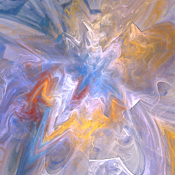
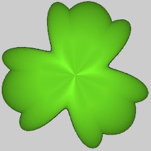
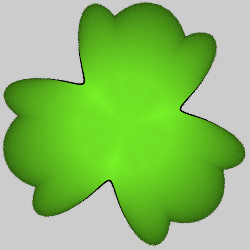
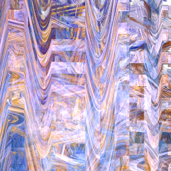

# Synth
Variations that emulate a number of other variations, adding wavy effects using a technique from audio synthesizers.

## synth v1
The first version of synth is still available, but superceded by synth V2. It doesn't have as many options, but works the same as the later version, so see its description below for details.

Type: 2D; blur with mode 2  
Author: Neil Slater  
Date: 24 Sep 2008  

https://www.deviantart.com/slobo777/art/Apo-plugin-Synth-98877432

## synth v2
Combo variation (emulates several others) with added wave functions.

Type: 2D; blur with modes 2, 3, 4, 12, and 13  
Author: Neil Slater  
Date: 7 Jul 2009  

Synth is complicated because it has so many parameters. Understanding the basic structure of the variation is helpful. Synth is divided into a main module and five waveform modules, named 'b' through 'f'. The main module takes the input point and transforms it like a typical variation; the mode parameter determines how it works. The waveform modules each generate a waveform based on the input point and the mode and apply it to the output of the previous module (module b uses parameter a as the input). The outputs of the main module and the final waveform module is then combined to produce the final output.

### Main module
The main module applies a variation to the input point; some match other variations, some are unique to synth. Parameter mode specifies the variation to use; the others modify it.

| Parameter | Description |
| --- | --- |
| a | The starting value for the waveform (normally 1) |
| mode | The variation to use (see next table) |
| power | A parameter for the variation; it was the power for spherical and blur, but has other meanings for other modes (not used by all modes) |
| mix | How much of the waveforms to mix in; 1 is normal, 0 ignores the waveforms |
| smooth | 0 to disable and 1 to enable smoothing (not used by all modes) |

The following table describes the modes.

| Mode/Direction | Example | Description |
| --- | --- | --- |
| 0: spherical radial multiply |  | Reflects the plane across the unit circle, like the spherical variation. Power adjusts the effect; -2 to match the spherical variation, 0 to act like linear. Smooth distorts the waveform if enabled.
| 1: bubble radial multiply |  | Maps the plane to a sphere, like the bubble variation but not 3D even in 3D flame programs. Power is not used. Smooth distorts the waveform if enabled.
| 2: blur (v1) radial multiply |  | A circle or disc; included for compatibility with synth version 1. Mode 3 works better (but power works differently). Power adjusts the effect: -1 is a circle (not filled in); higher values fill in towards the center, lower values fill in away from the center (inside-out disc). Smooth decreases the waveform effects away from the unit circle.
| 3: blur (v2) radial multiply |  | A circle or disc; improved version of mode 2. Power adjusts the effect: 0 is a circle (not filled in); lower values fill in towards the center, higher values fill in away from the center (inside-out disc). -1 is similar to sineblur. Smooth helps smooth out distortions if enabled.
| 4: zigzag blur vertical multiply |  | A horizontal line or bar; the waveforms will turn it into a zigzag shape. Useful for visualing the waveforms. Power controls the thickness; 0 is the thinnest, increasing or decreasing it thickens it into a bar. Smooth distorts the thickness if enabled; this is sometimes attractive.
| 5: raw circle radial multiply |  | Pass the input (like linear) to be multiplied by the waveforms radially. With a single waveform enabled, the effect is similar to blob. Power is not used. Smooth applies smoothing if enabled.
| 6: raw x horizontal multiply |  | Pass the input (like linear) to be multiplied by the waveforms horizontally. Power is not used. Smooth applies smoothing if enabled.
| 7: raw y vertical multiply |  | Pass the input (like linear) to be multiplied by the waveforms vertically. Power is not used. Smooth applies smoothing if enabled.
| 8: raw x and y horizontal and vertical multiply |  | Pass the input (like linear) to be multiplied by the waveforms both horizontally and vertically. Power is not used. Smooth applies smoothing if enabled.
| 9: shift x horizontal add |  | Pass the input (like linear) to be added to the waveforms horizontally. Power and smooth are not used.
| 10: shift y vertical add |  | Pass the input (like linear) to be added to the waveforms vertically. Power and smooth are not used.
| 11: shift x and y horizontal and vertical add |  | Pass the input (like linear) to be added to the waveforms horizontally and vertically. Power and smooth are not used.
| 12: blur ring radial multiply |   | A circle. Power controls the thickness; 0 is the thinnest, increasing or decreasing it thickens it into a ring. Smooth distorts the thickness if enabled; this is sometimes attractive.
| 13: blur ring 2 radial multiply |   | A circle with a different intensity distribution than mode 12. Power controls the thickness; 0 is the thinnest, positive values thicken it towards the inside, negative values thicken it towards the outside. Smooth is not used.
| 14: shift rotate circular add |  | Modify the input by power and add the waveform to rotate it, giving a swirling effect. Power modifies the input: 1 is like linear, -1 is like spherical Smooth is not used.

| Example | Mode, Direction, and Description |
| --- | --- |
|  | 0: spherical, radial, multiply Reflects the plane across the unit circle, like the spherical variation. Power adjusts the effect; -2 to match the spherical variation, 0 to act like linear. Smooth distorts the waveform if enabled.
|  | 1: bubble, radial, multiply Maps the plane to a sphere, like the bubble variation but not 3D even in 3D flame programs. Power is not used. Smooth distorts the waveform if enabled.
|  | 2: blur (v1), radial, multiply A circle or disc; included for compatibility with synth version 1. Mode 3 works better (but power works differently). Power adjusts the effect: -1 is a circle (not filled in); higher values fill in towards the center, lower values fill in away from the center (inside-out disc). Smooth decreases the waveform effects away from the unit circle.
|  | 3: blur (v2), radial, multiply A circle or disc; improved version of mode 2. Power adjusts the effect: 0 is a circle (not filled in); lower values fill in towards the center, higher values fill in away from the center (inside-out disc). -1 is similar to sineblur. Smooth helps smooth out distortions if enabled.
|  | 4: zigzag blur, vertical, multiply A horizontal line or bar; the waveforms will turn it into a zigzag shape. Useful for visualing the waveforms. Power controls the thickness; 0 is the thinnest, increasing or decreasing it thickens it into a bar. Smooth distorts the thickness if enabled; this is sometimes attractive.
|  | 5: raw circle, radial, multiply Pass the input (like linear) to be multiplied by the waveforms radially. With a single waveform enabled, the effect is similar to blob. Power is not used. Smooth applies smoothing if enabled.
|  | 6: raw x, horizontal, multiply Pass the input (like linear) to be multiplied by the waveforms horizontally. Power is not used. Smooth applies smoothing if enabled.
|  | 7: raw y, vertical, multiply Pass the input (like linear) to be multiplied by the waveforms vertically. Power is not used. Smooth applies smoothing if enabled.
|  | 8: raw x and y, horizontal and vertical, multiply Pass the input (like linear) to be multiplied by the waveforms both horizontally and vertically. Power is not used. Smooth applies smoothing if enabled.
|  | 9: shift x, horizontal, add Pass the input (like linear) to be added to the waveforms horizontally. Power and smooth are not used.
|  | 10: shift y, vertical, add Pass the input (like linear) to be added to the waveforms vertically. Power and smooth are not used.
|  | 11: shift x and y, horizontal and vertical, add Pass the input (like linear) to be added to the waveforms horizontally and vertically. Power and smooth are not used.
|   | 12: blur ring, radial, multiply A circle. Power controls the thickness; 0 is the thinnest, increasing or decreasing it thickens it into a ring. Smooth distorts the thickness if enabled; this is sometimes attractive.
|  | 13: blur ring 2, radial, multiply A circle with a different intensity distribution than mode 12. Power controls the thickness; 0 is the thinnest, positive values thicken it towards the inside, negative values thicken it towards the outside. Smooth is not used.
|  | 14: shift rotate, circular, add Modify the input by power and add the waveform to rotate it, giving a swirling effect. Power modifies the input: 1 is like linear, -1 is like spherical Smooth is not used.

### Waveform modules (modules b, c, d, e, and f)
The five waveform modules are invoked in sequence, and, if enabled, apply a waveform. The parameters for each are the same.

| Parameter | Description |
| --- | --- |
| b, c, d, e, f | Amplitude of the waveform for the given module; 0 to disable the module |
| x_type | Shape of the wave 0: sine 1: cosine 2: square 3: sawtooth 4: triangle 5: concave 6: convex 7: ngon (x_freq is the number of sides) 8: inverse ngon |
| x_freq | Frequency of the wave (1 repeats once around the circle if radial, or once per unit if horizontal or vertical); fractional values are allowed, but create a discontinuity |
| x_skew | Skew effect, between -1 and 1; 0 for normal, -1 for just the left half, 1 for just the right half |
| x_phs | Phase of the wave in radians; 0 for normal |
| x_layer | How this waveform combines with the input: 0: add 1: multiply 2: maximum 3: minimum |

### Using synth

### Resources
https://www.deviantart.com/slobo777/art/Synth-V2-128594088  
http://jwildfire.org/forum/viewtopic.php?f=11&t=1219  
https://www.deviantart.com/slobo777/art/Apophysis-Synth-Pack-106698622  
https://www.deviantart.com/anystasia/art/The-Beginnings-Tutorial-131305834  
https://www.dropbox.com/sh/bt7se699hhfcx8v/AACGi-yoJllws_A1Lf2XJzvza/JWILDFIRE%20JULIA%20N_S%20SCARY%20SYNTH%20TUTORIAL.ppsx?dl=0   
https://www.youtube.com/watch?v=QRwUowpLx1Y  
https://www.deviantart.com/fractal-resources/art/BC-and-BDs-Synth-Gardens-2-107145254  
https://www.deviantart.com/fractal-resources/art/BD-s-Curled-Synth-Script-105586976  
https://www.deviantart.com/fractal-resources/art/BD-s-3D-Curled-Synth-106005764  
http://jwildfire.org/forum/viewtopic.php?f=17&t=1861  
https://www.deviantart.com/zweezwyy/art/Simply-Synthfull-128453759  
http://jwildfire.org/forum/viewtopic.php?f=17&t=2087  
http://jwildfire.org/forum/viewtopic.php?f=17&t=2604  
http://jwildfire.org/forum/viewtopic.php?f=17&t=2584  
