# Waves
Variations that add waves to x, y, and/or z. There are a lot of different variants on this theme, differing in the parameters available and how they are applied.

See also [blob](../blob/blob.md) and [synth](../synth/synth.md).

## auger
Wave effect that gets stronger further from the origin.

Type: 2D  
Author: Georg Kiehne (xyrus02)  
Date: 20 Oct 2009

| Parameter | Description |
| --- | --- |
| freq | Frequency of the waves |
| weight | Weighting factor of the wave effect |
| sym | Symmetry; controls the horizontal effect 0: No horizontal effect (only vertical) 1: Equal horizontal and vertical effect Other values: interpolate or extrapolate |
| scale | Scale of wave function at the origin |

http://xyrus-02.deviantart.com/art/auger-140948430 (defunct)  
https://sourceforge.net/p/apo-plugins/code/HEAD/tree/personal/georgkiehne/  

## vibration
Add sine waves in two arbitrary directions

Type: 2D  
Author: Jessica Darling (FarDareisMai)  
Date: 9 Aug 2011  

[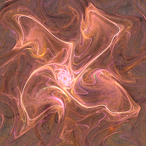](vibration-1.flame)

Same as waves2 when dir=0, angle=π/2, phase=0, dir2=π/2, angle2=π/2, and phase2=0, with freq=waves2_freqx\*2π, amp=waves2_scalex, freq2=waves2_freqy\*2π, and amp2=waves2_scaley.

| Parameter | Description |
| --- | --- |
| dir | Direction of wave 1 axis in radians; 0 for x-axis, π/2≈1.5708 for y-axis |
| angle | Angle of wave 1 in relation to the axis in radians; π/2≈1.5708 for perpendicular to axis |
| freq | Frequency of wave 1 (scaled by 2π compared to waves2) |
| amp | Amplitude of wave 1 |
| phase | Phase of wave 1 |
| dir2 | Direction of wave 2 axis in radians; 0 for x-axis, π/2≈1.5708 for y-axis |
| angle2 | Angle of wave 2 in relation to the axis in radians; π/2≈1.5708 for perpendicular to axis |
| freq2 | Frequency of wave 2 (scaled by 2π compared to waves2) |
| amp2 | Amplitude of wave 2 |
| phase2 | Phase of wave 1 |

https://www.deviantart.com/fardareismai/art/Apo-Plugins-Vibration-1-and-2-252001851  

## vibration2
Add sine waves in two arbitrary directions with modulation

Type: 2D  
Author: Jessica Darling (FarDareisMai)  
Date: 9 Aug 2011  

Vibration2 is vibration with the ability to modulate the direction, angle, frequency, and amplitude of each wave with a sine wave. The first ten parameters are the same as vibration. Vibration2 is the same as vibration when dm, tm, fm, am, d2m, t2m, f2m, and a2m are all 0 (no modulation).

| Parameter | Description |
| --- | --- |
| dir | Direction of wave 1 axis in radians; 0 for x-axis, π/2≈1.5708 for y-axis |
| angle | Angle of wave 1 in relation to the axis in radians; π/2≈1.5708 for perpendicular to axis |
| freq | Frequency of wave 1 (scaled by 2π compared to waves2) |
| amp | Amplitude of wave 1 |
| phase | Phase of wave 1 |
| dir2 | Direction of wave 2 axis in radians; 0 for x-axis, π/2≈1.5708 for y-axis |
| angle2 | Angle of wave 2 in relation to the axis in radians; π/2≈1.5708 for perpendicular to axis |
| freq2 | Frequency of wave 2 (scaled by 2π compared to waves2) |
| amp2 | Amplitude of wave 2 |
| phase2 | Phase of wave 1 |
| dm | Amount to modulate the direction of wave 1 |
| dmfreq | Modulation frequency for wave 1 direction |
| tm | Amount to modulate the angle of wave 1 |
| tmfreq | Modulation frequency for wave 1 angle |
| fm | Amount to modulate the frequency of wave 1 |
| fmfreq | Modulation frequency for wave 1 frequency |
| am | Amount to modulate the amplitude of wave 1 |
| amfreq | Modulation frequency for wave 1 amplitude |
| d2m | Amount to modulate the direction of wave 2 |
| dm2freq | Modulation frequency for wave 2 direction |
| t2m | Amount to modulate the angle of wave 2 |
| tm2freq | Modulation frequency for wave 2 angle |
| f2m | Amount to modulate the frequency of wave 2 |
| fm2freq | Modulation frequency for wave 2 frequency |
| a2m | Amount to modulate the amplitude of wave 2 |
| am2freq | Modulation frequency for wave 2 amplitude |

https://www.deviantart.com/fardareismai/art/Apo-Plugins-Vibration-1-and-2-252001851  
https://www.youtube.com/watch?v=SXg1cdZCMcw  

## waves
Add sine waves to x and y (dependent variation).

Type: 2D  
Author: Scott Draves  
Date: March 2004  

Waves is an older "dependent variation" that depends on the affine coefficients of the transform instead of parameters. Of course, changing the affine coefficients affects the flame too, making dependent variations more difficult to use than the newer "parametric variations" that use parameters, such as waves2.

| Parameter | Description |
| --- | --- |
| b, Y1, or c10 | Scale for horizontal waves |
| c, O1, or c20 | Changes horizontal frequency (inverse square relation) |
| e, Y2, or c11 | Scale for vertical waves |
| f, O2, or c21 | Changes vertical frequency (inverse square relation) |

## waves2
Add sine waves to x and y (some versions include z).

Type: 2D  
Author: Scott Draves  
Date: 3 Oct 2008

Same as linear when scalex and scaley are 0. For versions with scalez, same as linear3D when scalex, scaley, and scalez are 0.

| Parameter | Description |
| --- | --- |
| scalex | Scale for horizontal waves |
| scaley | Scale for vertical waves |
| scalez | (Not in all versions) Scale for waves in z direction |
| freqx | Frequency for horizontal waves |
| freqy | Frequency for vertical waves |
| freqz | (Not in all versions) Frequency for waves in z direction |

https://www.deviantart.com/satania/art/Tutorial-Gnarls-163590105  
https://www.deviantart.com/tyrantwave/art/Apophysis-Base-Forms-Pack-103671251  
https://www.deviantart.com/drummerboy08/art/Comprehensive-Gnarl-Tutorial-147402781  

## waves2_3D
Add sine waves to x and y with 3D addition

Type: 3D  
Author: Larry Berlin (aporev)  
Date: 28 Sep 2009  

[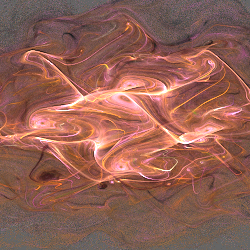](waves2_3D-1.flame)

| Parameter | Description |
| --- | --- |
| freq | Frequency for waves |
| scale | Scale for waves |

https://www.deviantart.com/aporev/art/3D-Plugins-Collection-One-138514007

## waves2_radial
Add sine waves to x and y outside a circle centered at the origin.

Type: 2D  
Author: Tatyana Zabanova (tatasz)  
Date: 27 Nov 2016  

[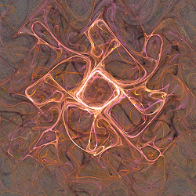](waves2_radial-1.flame)

| Parameter | Description |
| --- | --- |
| scalex | Scale for horizontal waves |
| scaley | Scale for vertical waves |
| freqx | Frequency for horizontal waves |
| freqy | Frequency for vertical waves |
| null | Radius of circle where waves are not applied |
| distance | Radius of transition circle where waves are partially applied; should be greater than null |

https://www.deviantart.com/tatasz/art/Apophysis-Plugin-Pack-1-647321921  

## waves22
Add sine waves to x and y with power option.

Type: 2D  
Author: Tatyana Zabanova (tatasz)  
Date: 21 Jan 2019  

[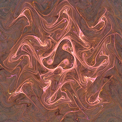](waves22-1.flame)

Same as waves2 when modex and modey are 0 and powerx and powery are 1.

| Parameter | Description |
| --- | --- |
| scalex | Scale for horizontal waves |
| scaley | Scale for vertical waves |
| freqx | Frequency for horizontal waves |
| freqy | Frequency for vertical waves |
| modex | 0 for normal (horizontal waves range from -scalex to scalex) 1 for positive (waves range from 0 to scalex) |
| modey | Same as modex, but for vertical wave |
| powerx | Power for horizontal waves; integer only (fractions ignored) |
| powery | Power for vertical waves; integer only (fractions ignored) |

https://www.deviantart.com/tatasz/art/Weird-Waves-Plugin-Pack-1-783560564  

## waves23
Add triangular "waves" to x and y.

Type: 2D  
Author: Tatyana Zabanova (tatasz)  
Date: 21 Jan 2019  

[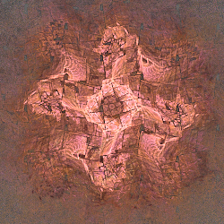](waves23-1.flame)

| Parameter | Description |
| --- | --- |
| scalex | Scale for horizontal waves |
| scaley | Scale for vertical waves |
| freqx | Frequency for horizontal waves |
| freqy | Frequency for vertical waves |

https://www.deviantart.com/tatasz/art/Weird-Waves-Plugin-Pack-1-783560564  

## waves2b
Add sine waves to x and y with scaling based on distance from center

Type: 2D  
Author: Luca G (dark-beam)  
Date: 27 May 2014  

 

| Parameter | Description |
| --- | --- |
| freqx | Frequency for horizontal waves |
| freqy | Frequency for vertical waves |
| pwx | Power for horizontal waves; ideal range is 0.3 to 2.0, but any value is allowed. 1.0: Normal 0 to 0.0001: Use Jacobi Elliptic function sn(x,k) -0.0001 to 0: Use Bessel J1 function |
| pwy | Power for vertical waves; ideal range is 0.3 to 2.0, but any value is allowed. 1.0: Normal 0 to 0.0001: Use Jacobi Elliptic function sn(y,k) -0.0001 to 0: Use Bessel J1 function |
| scalex | Scale for horizontal waves near center |
| scaleinfx | Scale for horizontal waves away from center |
| scaley | Scale for vertical waves near center |
| scaleinfy | Scale for vertical waves away from center |
| unity | Distance for "near center" (scalex/scaley) and "away from center" (scaleinfx and scaleinfy) |
| jacok | The value for k in the Jacobi Elliptic function sn(x,k) and/or sn(y,k) when pwx or pwy is between 0 and 0.0001. |

https://www.deviantart.com/dark-beam/art/Waves2b-456744888  

## waves3
Add modulated sine waves to x and y

Type: 2D  
Author: Tatyana Zabanova (tatasz)  
Date: 21 Jan 2019  

[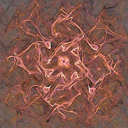](waves3-1.flame)

| Parameter | Description |
| --- | --- |
| scalex | Scale for horizontal waves |
| scaley | Scale for vertical waves |
| freqx | Frequency for horizontal waves |
| freqy | Frequency for vertical waves |
| sx_freq | Frequency of the sine wave that modulates the horizontal wave |
| sy_freq | Frequency of the sine wave that modulates the vertical wave |

https://www.deviantart.com/tatasz/art/Weird-Waves-Plugin-Pack-1-783560564  

## waves4
Add sine waves to x and y with fracturing of horizontal wave

Type: 2D  
Author: Tatyana Zabanova (tatasz)  
Date: 21 Jan 2019  

[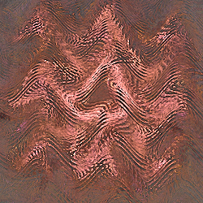](waves4-1.flame)

| Parameter | Description |
| --- | --- |
| scalex | Scale for horizontal waves |
| scaley | Scale for vertical waves |
| freqx | Frequency for horizontal waves |
| freqy | Frequency for vertical waves |
| cont | 0: Fracture with continuous diagonal lines 1: Fracture in steps (restricted to positive y (bottom half) only) |
| yfact | Fracture amount for horizontal wave; 0 for none |

https://www.deviantart.com/tatasz/art/Weird-Waves-Plugin-Pack-1-783560564  

## waves42
Add sine waves to x and y with fracturing of horizontal wave

Type: 2D  
Author: Tatyana Zabanova (tatasz)  
Date: 21 Jan 2019  

| Parameter | Description |
| --- | --- |
| scalex | Scale for horizontal waves |
| scaley | Scale for vertical waves |
| freqx | Frequency for horizontal waves |
| freqy | Frequency for vertical waves |
| cont | 0: Fracture with continuous diagonal lines 1: Fracture in steps (sometimes restricted to positive y (bottom half) only) |
| yfact | Fracture amount for horizontal wave; 0 for none |
| freqx2 | Frequency for fracturing (0.159155 is same as waves4) |

https://www.deviantart.com/tatasz/art/Weird-Waves-Plugin-Pack-1-783560564  

## wavesD2 / waves2_wf
Add damped sine or cosine waves to x and y.

Type: 2D  
Author: Andreas Maschke (thargor6)  
Date: 25 Dec 2011  

[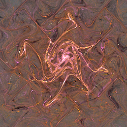](waves2_wf-1.flame)

| Parameter | Description |
| --- | --- |
| scalex | Scale for horizontal waves |
| scaley | Scale for vertical waves |
| freqx | Frequency for horizontal waves |
| freqy | Frequency for vertical waves |
| use_cos_x | 0 for sine or 1 for cosine horizontal waves |
| use_cos_y | 0 for sine or 1 for cosine vertical waves |
| dampx | Dampening factor for horizontal waves; 0 for normal, negative to attenuate, positive to amplify |
| dampy | Dampening factor for horizontal waves; 0 for normal, negative to attenuate, positive to amplify |

## wavesD3 / waves3_wf
Add damped squared sine or cosine waves to x and y

Type: 2D  
Author: Andreas Maschke (thargor6)  
Date: 10 Feb 2012  

[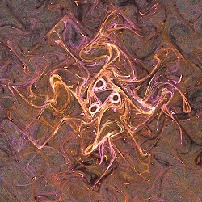](waves3_wf-1.flame)

| Parameter | Description |
| --- | --- |
| scalex | Scale for horizontal waves |
| scaley | Scale for vertical waves |
| freqx | Frequency for horizontal waves |
| freqy | Frequency for vertical waves |
| use_cos_x | 0 for sine or 1 for cosine horizontal waves |
| use_cos_y | 0 for sine or 1 for cosine vertical waves |
| dampx | Dampening factor for horizontal waves; 0 for normal, negative to attenuate, positive to amplify |
| dampy | Dampening factor for horizontal waves; 0 for normal, negative to attenuate, positive to amplify |

## wavesD4 / waves4_wf
Add damped cubed sine or cosine waves to x and y

Type: 2D  
Author: Andreas Maschke (thargor6)  
Date: 10 Feb 2012  

| Parameter | Description |
| --- | --- |
| scalex | Scale for horizontal waves |
| scaley | Scale for vertical waves |
| freqx | Frequency for horizontal waves |
| freqy | Frequency for vertical waves |
| use_cos_x | 0 for sin\*cos\*sin or 1 for cos\*sin\*cos horizontal waves |
| use_cos_y | 0 for sin\*cos\*sin or 1 for cos\*sin\*cos vertical waves |
| dampx | Dampening factor for horizontal waves; 0 for normal, negative to attenuate, positive to amplify |
| dampy | Dampening factor for horizontal waves; 0 for normal, negative to attenuate, positive to amplify |

## wavesn
Add damped waves to polynomial Julia set (aka julian).

Type: 2D  
Author: George Kiehne (Xyrus-02)  
Date: 12 Sep 2009  

[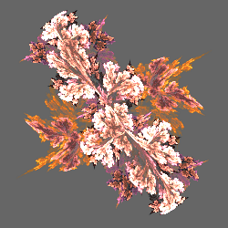](wavesn-1.flame) [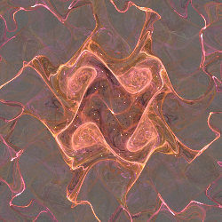](wavesn-2.flame)

| Parameter | Description |
| --- | --- |
| freqx | Frequency for horizontal waves |
| freqy | Frequency for vertical waves |
| scalex | Scale for horizontal waves |
| scaley | Scale for vertical waves |
| incx | Horizontal scale change amount |
| incy | Vertical scale change amount |
| power | Julia power (see [julian](../julia/julia.md#julian)) |

http://xyrus-02.deviantart.com/art/wavesn-136822863 (defunct)  
https://sourceforge.net/p/apo-plugins/code/HEAD/tree/personal/georgkiehne/  
