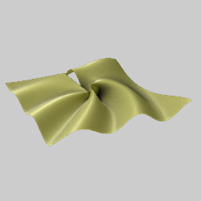
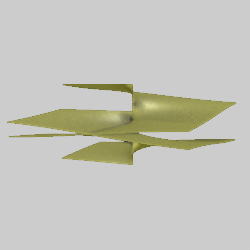

# Z Manipulation
Variations that manipulate only the z coordinate. All of these must be used with another variation to process x and y (even if linear to simply copy it).

## colorscale_wf
Set a point's z coordinate to its color index. (Compare dc_ztransl.)

Type: 3D (normally sets z only)  
Author: Andreas Maschke (thargor6)  
Date: 14 Jan 2012  

The color index is between 0 and 1, so colorscale_wf sets z to a value between 0 and scale_z times the variation amount. Unlike the other Z manipulation variations, colorscale_wf can set the x and y coordinates by setting scale_x and scale_y to non-zero values.

There is also post_colorscale_wf, which does the same thing but as a post_ variation.

| Parameter | Description |
| --- | --- |
| scale_x, scale_y | Scale factors for x and y; normally 0, so only the z coordinate is affected |
| scale_z | Scale factor for z |
| offset_z | Offset for z |
| reset_z | 0: Add the color index to existing z value 1: Override existing z value with the color index |
| sides | 0: Step z to the color index (normal operation) 1: Set z to a random value between 0 and the color index (fill in the extrusion) |

[Understanding Colorscale video](https://www.youtube.com/watch?v=9zNrC01etc8)  

## dc_ztransl
Set a point's z coordinate to its color index. (Compare colorscale_wf.)

Type: 3D  
Author: Georg Kiehne (xyrus02)  
Date: 28 May 2011  

Unlike the other Z manipulation variations, dc_ztransl copies the x and y coordinates like linear.

There are also post_dc_ztransl and pre_dc_ztransl, which do the same thing but as post_ and pre_ variations.

| Parameter | Description |
| --- | --- |
| x0 | The color index (0 to 1) corresponding to a z scale value of 0 |
| x1 | The color index (0 to 1) corresponding to a z scale value of factor |
| factor | The factor for scaling z |
| overwrite | 0: Add the color index to existing z value 1: Override existing z value with the color index |
| clamp | 0: allow the z factor to be the full range 1: clamp the z factor to be between 0 and 1 |

[Apophysis plugin](https://web.archive.org/web/20120820095720/http://xyrus02.deviantart.com/art/DC-ZTransl-plugins-for-Apo7X-210719008) (Wayback machine)  
[Source code](https://sourceforge.net/p/apo-plugins/code/HEAD/tree/personal/georgkiehne/)  

## extrude
Extrude the other variations on the transform by stretching the z coordinate.

Type: 3D (sets z only)  
Author: Georg Kiehne (xyrus02)  
Date: 26 Jul 2010  

| Parameter | Description |
| --- | --- |
| root_face | Density of the extruded face compared to the rest, from 0 (root face has no extra density) to 1 (only the root face) |

[Archive of Apophysis plugin](https://web.archive.org/web/20101229055847/https://xyrus02.deviantart.com/art/Extrude-Plugin-for-Apophysis-172778628) (Wayback Machine)  

## flatten / zclear
Flatten the other variations on the transform by setting the z coordinate to 0.

Type: 3D (sets z only)  
Author: Georg Kiehne (xyrus02)  
Date: 28 Jul 2013  

## inflateZ_1
Set z to tilt the plane forward, basing z mostly on y, but with some distortion.

Type: 3D (sets z only)  
Author: Larry Berlin (aporev)  
Date: 28 Sep 2009  

[Apophysis plugin](https://www.deviantart.com/aporev/art/3D-Plugins-Collection-One-138514007)  

## inflateZ_2
Set z to tilt the plane diagonally.

Type: 3D (sets z only)  
Author: Larry Berlin (aporev)  
Date: 28 Sep 2009  

[Apophysis plugin](https://www.deviantart.com/aporev/art/3D-Plugins-Collection-One-138514007)  

## inflateZ_3
Warp z to give a strong three dimensional effect.

Type: 3D (sets z only)  
Author: Larry Berlin (aporev)  
Date: 28 Sep 2009  

[Apophysis plugin](https://www.deviantart.com/aporev/art/3D-Plugins-Collection-One-138514007)  

## inflateZ_4
Set z to create interleaved helix shapes.

Type: 3D (sets z only)  
Author: Larry Berlin (aporev)  
Date: 28 Sep 2009  

[Apophysis plugin](https://www.deviantart.com/aporev/art/3D-Plugins-Collection-One-138514007)  

## inflateZ_5
Set z to give a gentle three dimensional wave shape.

Type: 3D (sets z only)  
Author: Larry Berlin (aporev)  
Date: 28 Sep 2009  

[Apophysis plugin](https://www.deviantart.com/aporev/art/3D-Plugins-Collection-One-138514007)  

## inflateZ_6
Set z to give a rolling shape.

Type: 3D (sets z only)  
Author: Larry Berlin (aporev)  
Date: 28 Sep 2009  

[Apophysis plugin](https://www.deviantart.com/aporev/art/3D-Plugins-Collection-One-138514007)  

## post_bumpmap_wf
Set z from an external bumpmap image.

Type: 3D (sets z only)  
Author: Andreas Maschke (thargor6)  
Date: 28 Feb 2012

| Parameter | Description |
| --- | --- |
| image_filename | Filename for the bumpmap image; it must exist with the same name whenever the flame is loaded |
| inlined_image | The bumpmap image, selected from a file like image_filename but the image itself is stored in the flame, making the flame larger but more portable |
| scale_x | Horizontal scaling factor for bumpmap |
| scale_y | Vertical scaling factor for bumpmap |
| scale_z | Scale for mapping the bumpmap value to z |
| offset_x | Horizontal offset for bumpmap |
| offset_y | Vertical offset for bumpmap |
| offset_z | Offset for mapping the bumpmap value to z |
| reset_z | 0: Add bumpmap to existing z value 1: Override existing z value with bumpmap |

[Bumpmap image](gray-and-black-marble-slab-1451474.jpg) used for above example, from [pexels.com](https://www.pexels.com/).

## zcone
Add the x-y distance of each point to z, thus transforming the plane into a cone.

Type: 3D (sets z only)  

## zscale
Multiply the z value by the variation amount.

Type: 3D (sets z only)  

Pre_zscale and post_zscale_wf also exist to scale z before or after the other variations.

## ztranslate
Add the variation amount to z, translating points up or down the z axis.

Type: 3D (sets z only)  

Pre_ztranslate and post_ztranslate_wf also exist to translate z before or after the other variations.
